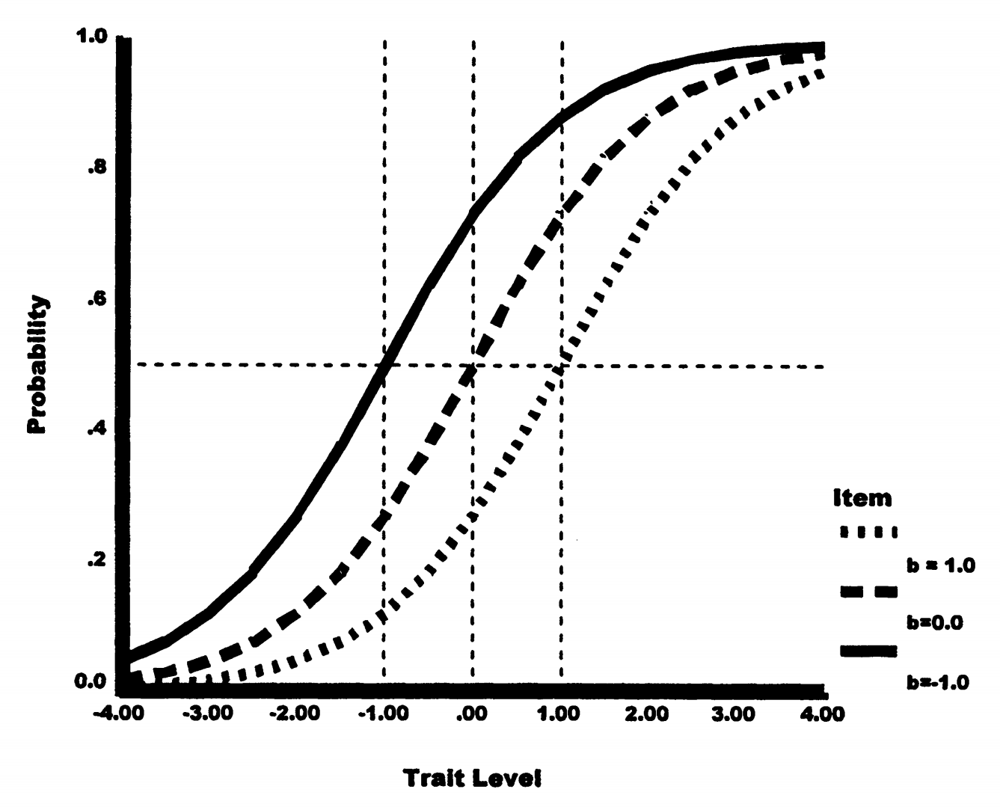
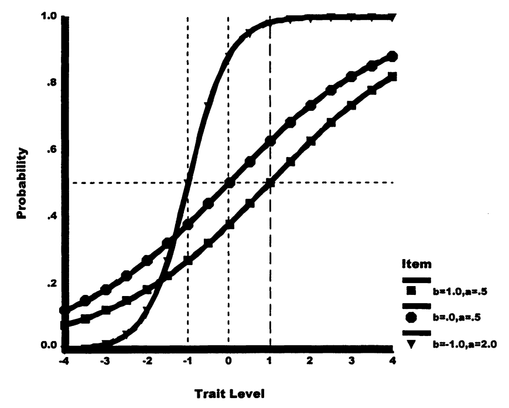
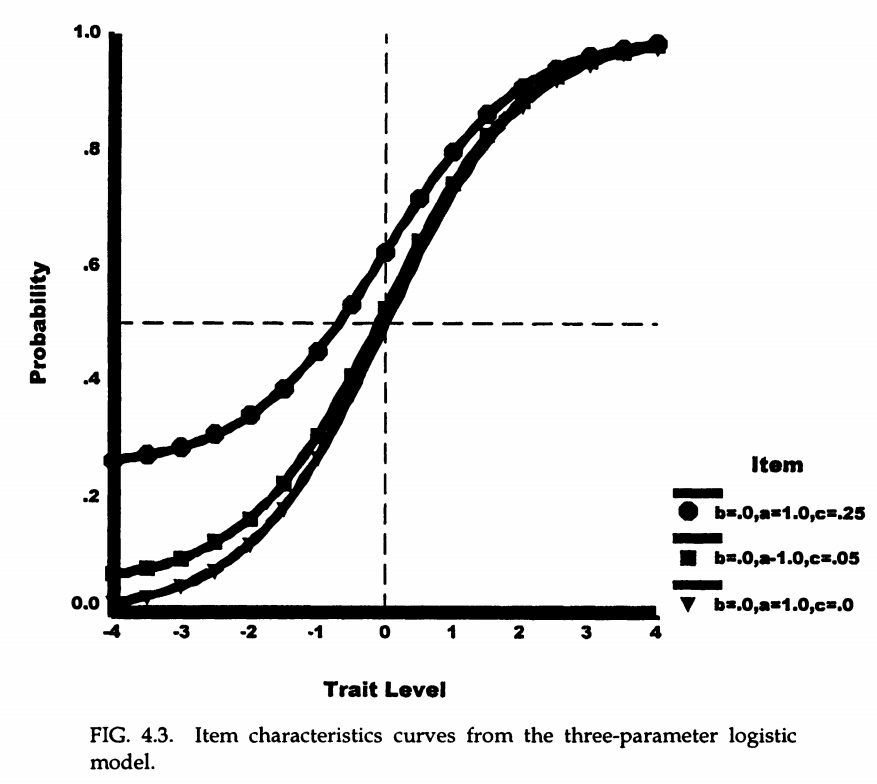
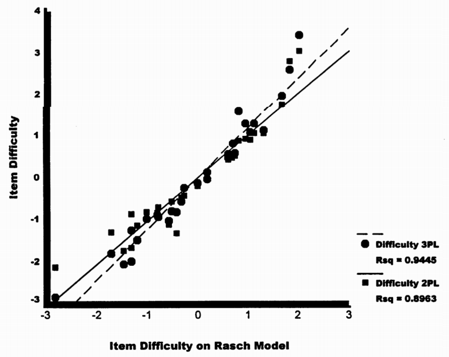
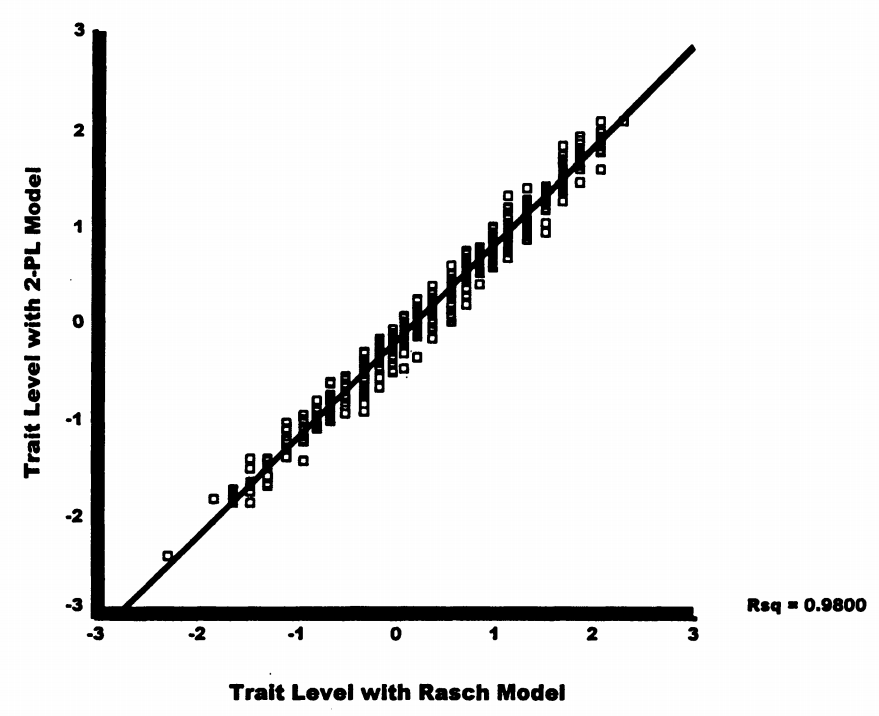

# 2. 传统逻辑模型

## 2.1 逻辑分布的基础

逻辑IRT模型基于逻辑分布，该分布以简单表达式给出反应概率。

**为什么使用逻辑分布？**
我们需要一个函数，能把任意范围的数值（-∞到+∞）转换成概率（0到1）。逻辑函数正好满足这个需求！

核心公式：如果 \(w_{is}\) 表示模型中个体和项目参数的组合，则概率表示如下：

\[
P(X_{is} = 1|w_{is}) = \frac{\exp(w_{is})}{1 + \exp(w_{is})} \tag{4.1}
\]

其中：

- \(\exp(w_{is})\)（也写作 \(e^{w_{is}}\)）是自然对数底（2.718...）的 \(w_{is}\) 次幂
- 成功概率通过对 \(w_{is}\) 取反对数计算

**理解这个公式：**

当 \(w_{is} = 0\) 时：

\[
P = \frac{e^0}{1 + e^0} = \frac{1}{2} = 0.5
\]

当 \(w_{is} = 2\) 时：

\[
P = \frac{e^2}{1 + e^2} = \frac{7.39}{8.39} \approx 0.88
\]

当 \(w_{is} = -2\) 时：

\[
P = \frac{e^{-2}}{1 + e^{-2}} = \frac{0.135}{1.135} \approx 0.12
\]

**关键洞察：**

- \(w_{is}\) 越大，概率越接近1
- \(w_{is}\) 越小，概率越接近0
- \(w_{is} = 0\) 时，概率正好是0.5
- 这创造了一个平滑的S形曲线！

## 2.2 一参数逻辑模型（1PL）或Rasch模型

### 2.2.1 模型的形式化表达

Rasch模型预测个体s在项目i上成功的概率：

\[
P(X_{is} = 1|\theta_s,\beta_i) = \frac{\exp(\theta_s - \beta_i)}{1 + \exp(\theta_s - \beta_i)} \tag{4.2}
\]

关键理解：

- 公式4.2的logit，\(\theta_s - \beta_i\)，是特质水平与项目难度的简单差异
- 这个差异替代了公式4.1中的 \(w_{is}\)
- Rasch模型也被称为一参数逻辑（1PL）模型，因为它只包含一个项目参数（难度）

**直观理解Rasch模型：**

想象一个跳高比赛：

- \(\theta_s\) = 运动员的跳高能力（比如能跳1.8米）
- \(\beta_i\) = 横杆的高度（比如设在1.5米）
- \(\theta_s - \beta_i\) = 能力超出难度的程度（1.8 - 1.5 = 0.3米）
- 超出越多，成功概率越大！

**具体计算示例：**

学生能力 \(\theta_s = 1.0\)，题目难度 \(\beta_i = 0.5\)：

\[
P = \frac{\exp(1.0 - 0.5)}{1 + \exp(1.0 - 0.5)} = \frac{\exp(0.5)}{1 + \exp(0.5)} = \frac{1.65}{2.65} \approx 0.62
\]

这个学生有62%的概率答对这道题！

### 2.2.2 模型的另一种表达形式

1PL模型也可以用常数项目区分度值 \(\alpha\) 来表示：

\[
P(X_{is} = 1|\theta_s,\beta_i) = \frac{\exp(\alpha(\theta_s - \beta_i))}{1 + \exp(\alpha(\theta_s - \beta_i))} \tag{4.3}
\]

两种形式的区别：

- 公式4.3：项目区分度的常数值是自由估计的
- 公式4.2：常数项目区分度的值被假定为1.0

**区分度α的作用像什么？**

想象两个温度计：

- α = 1：标准温度计，温度变化1度，显示变化1度
- α = 2：敏感温度计，温度变化1度，显示变化2度
- α = 0.5：迟钝温度计，温度变化1度，显示只变化0.5度

在IRT中，α决定了能力差异在概率上的体现程度。

重要说明

对常数的量尺选择（1.0或自由估计）对模型中其他参数有影响（将在第6章讨论）。

但在所有参数适当量尺化的情况下，公式4.2和4.3给出完全相同的预测。

### 2.2.3 项目特征曲线（ICC）



图4.1显示了Rasch模型中三个项目的项目特征曲线（ICCs）。

## 2.3 Rasch模型ICC的关键特征：

1. **S形曲线**：
   概率随着每个项目的特质水平逐渐增加。

   **为什么是S形？**

   - 能力很低时，即使再降低，答对概率也接近0
   - 能力很高时，即使再提高，答对概率也接近1
   - 中间部分变化最快，形成S形
2. **平行曲线**：

   - 项目仅在难度上有所不同
   - 曲线斜率相等
   - 曲线收敛但不相交

   **类比理解：**

   就像三条相同形状的滑梯，只是起始高度不同
3. **拐点特性**：

   - ICC 的拐点（变化率从加速增加转为减速增加的点）发生在通过项目的概率为 .50 时
   - 参考线从等于项目难度的特质水平开始，在概率 .50 处穿过 ICC

   **实际意义：**

   当学生能力正好等于题目难度时，答对概率恰好是50%
4. **解释性**：

   - 特质水平可解释为项目难度的阈值水平
   - 表示个体通过或失败的几率相等
   - 例如：对于难度为 1.00 的项目，特质水平为 1.00 的个体通过该项目的概率为 .50

### 2.3.1 参数估计实例

**表4.2：抽象推理测验的Rasch模型项目参数估计**

| 项目 | β | σ_β |
| --- | --- | --- |
| 1 | -2.826 | .172 |
| 2 | -.176 | .081 |
| 3 | -1.479 | .104 |
| ... | ... | ... |
| 22 | 1.809 | .086 |
| 25 | 2.008 | .090 |
| 30 | .841 | .076 |

-2 log Likelihood = 25924.52

**解读这个表格：**

- β是项目难度的估计值
- σ_β是标准误（估计的不确定性）
- 负值表示容易的题目，正值表示困难的题目
- 项目1（β = -2.826）非常容易
- 项目25（β = 2.008）非常困难

观察结果：

- 项目难度范围从-2.826到2.008
- 项目难度的标准误在各项目间有所不同
- 一般而言，极端项目难度的标准误更大

**为什么极端项目的标准误更大？**

想象估计一座山的高度：

- 如果很多人都能爬上去，我们能准确知道它的难度
- 如果几乎没人能爬上去，我们对它的真实难度了解有限
- 信息越少，估计越不确定！

标准误的使用

标准误可用于设定项目难度估计值周围的置信区间。

例如，项目1的95%置信区间约为：-2.826 ± 1.96 × 0.172 = [-3.163, -2.489]

**实际意义：** 我们有95%的把握，这道题的真实难度在-3.163到-2.489之间

## 2.4 二参数逻辑模型（2PL）

### 2.4.1 为什么需要2PL模型？

现实中，不是所有题目都同样有效地区分学生能力：

- 有些题目很敏感（高区分度）→ 能很好地区分不同能力的学生
- 有些题目区分效果差（低区分度）→ 对能力变化不敏感

**具体例子：**

考虑两道题：

1. "计算 2+2 = ?" （区分度低：几乎所有人都会）
2. "解方程 x² + 3x - 4 = 0" （区分度高：能区分会解方程和不会的学生）

即使调整难度，第一题仍然无法很好地区分学生能力！

### 2.4.2 表达式

2PL模型增加了项目区分度参数 \(\alpha_i\)：

\[
P(X_{is} = 1|\theta_s,\beta_i,\alpha_i) = \frac{\exp[\alpha_i(\theta_s - \beta_i)]}{1 + \exp[\alpha_i(\theta_s - \beta_i)]} \tag{4.4}
\]

**与Rasch模型的关键区别：**

比较公式4.4与公式4.3：

- 项目区分度参数带有下标 \(\alpha_i\)
- 这表示项目区分度的**差异**
- 因此，2PL模型适用于项目与潜在特质关系不均等的测量

### 2.4.3 区分度参数的作用

区分度参数 \(\alpha_i\) 的含义：

- \(\alpha > 1\)：陡峭的 ICC，对能力变化敏感
- \(\alpha = 1\)：标准斜率（等同于 Rasch）
- \(\alpha < 1\)：平缓的 ICC，对能力变化不敏感
- \(\alpha < 0\)：负区分度（通常表示题目有问题）

**形象比喻：**

想象不同坡度的山坡：

- \(\alpha = 2\)：陡峭山坡，水平移动一点，高度变化很大
- \(\alpha = 1\)：标准山坡，45度角
- \(\alpha = 0.5\)：缓坡，需要走很远才能爬高一点
- \(\alpha < 0\)：下坡！（能力越高反而答错概率越大，说明题目有问题）

### 2.4.4 项目特征曲线比较



图4.2显示了2PL模型下三个项目的项目特征曲线。

**2PL模型下不同参数组合的ICC曲线比较**

- 项目间的 **难度参数 b 不同**，分别为 -1.0, 0.0, 1.0；
- 项目1 和 2 拥有 **相同的区分度参数 α = 0.5**，但难度不同；
- 项目2 和 3 拥有 **相同的难度参数 b = 0**，但区分度不同；
- 项目2 的ICC与项目1和3相交，说明它们分别在不同 θ 水平下的概率排序发生了反转；
- 在2PL模型中，**无论α取值如何，项目难度参数b所对应的θ值处，答对概率始终为0.50**

**交叉的意义：**

曲线相交意味着：

- 对低能力学生，某题可能更容易
- 对高能力学生，另一题可能更容易
- 这在Rasch模型中不可能发生（平行线不相交）！

### 2.4.5 参数估计对比

**表4.3：Rasch模型与2PL模型参数估计比较**

| 项目 | Rasch β | 2PL α | 2PL β |
| --- | --- | --- | --- |
| 1 | -2.826 | 1.578 | -2.118 |
| 22 | 1.809 | 0.476 | 2.815 |
| ... | ... | ... | ... |

-2 log Likelihood (2PL) = 25659.39

**重要发现：**

**区分度差异显著**：范围从0.476到2.154

- 这表明常数项目区分度假设可能不适合数据

**难度估计的变化**：

- 2PL模型项目难度与Rasch模型不同
- 随着项目区分度减小，项目难度变得更加极端
- 例如：项目22（最低区分度0.476）在2PL中的难度(2.815)比Rasch中(1.809)更极端

### 2.4.6 解释：为什么低区分度导致极端难度？

当区分度很低时，ICC曲线很平缓。为了在θ=β处达到P=0.5，需要更极端的β值来补偿低斜率。

**解释：**

在拐点处（θ=β），ICC的斜率为：

\[
\frac{\partial P}{\partial \theta}\bigg|_{\theta=\beta} = \frac{\alpha}{4}
\]

斜率越小（α越小），曲线越平缓，需要更极端的位置才能区分不同能力的个体。

**直观理解：**

想象两个跷跷板：

1. 标准跷跷板（α=1）：支点在中间，平衡点明确
2. 超长跷跷板（α=0.5）：同样要达到平衡，支点需要移到更极端的位置

这就是为什么低区分度的题目，其难度参数会被"推"到更极端的值！

## 2.5 三参数逻辑模型（3PL）

### 2.5.1 引入猜测参数的必要性

考虑一个现实问题：在4选1的选择题中，即使完全不会，随机猜也有25%的概率答对。如何在模型中考虑这种猜测因素？

**真实场景：**

标准化考试（如SAT、GRE）中：

- 学生面对不会的题目时会猜测
- 完全随机猜测有1/4的成功率
- 但聪明的猜测（排除明显错误选项）成功率更高
- 忽略这个因素会低估低能力学生的实际得分

### 2.5.2 表达式

3PL模型通过添加下渐近线参数 \(\gamma_i\) 来适应猜测：

\[
P(X_{is} = 1|\theta_s,\beta_i,\alpha_i,\gamma_i) = \gamma_i + (1-\gamma_i)\frac{\exp[\alpha_i(\theta_s - \beta_i)]}{1 + \exp[\alpha_i(\theta_s - \beta_i)]} \tag{4.5}
\]

**模型的直观理解：**

这可以理解为两个过程的组合：

1. 以概率 \(\gamma_i\) 直接猜对
2. 以概率 \((1-\gamma_i)\) 真正知道答案，然后根据能力水平决定是否答对

实际上：

\[
P(\text{答对}) = P(\text{猜对}) + P(\text{不猜}) \times P(\text{知道答案|不猜})
\]

**举例说明：**

假设 \(\gamma = 0.2\)（20%猜对概率），学生真实能力对应60%的答对概率：

\[
P(\text{最终答对}) = 0.2 + 0.8 \times 0.6 = 0.2 + 0.48 = 0.68
\]

即使原本只有60%把握，考虑猜测后有68%的概率答对！

### 2.5.3 猜测参数的特点

**关于 \(\gamma_i\) 的重要事实：**

1. \(\gamma_i\) = 项目i的下渐近线
2. 表示能力极低时的答对概率
3. 通常不等于随机猜测概率（1/选项数）

**为什么 \(\gamma_i\) ≠ 1/选项数？**

- 系统性猜测策略：考生能排除明显错误的选项
- 部分知识：即使不完全确定，也有一定倾向
- 选项吸引力差异：某些干扰项设计得更有迷惑性

**实例：**

考虑题目："美国首都是哪里？"

A. 纽约 B. 华盛顿 C. 洛杉矶 D. 芝加哥

即使不确定，很多人会在A和B之间猜测，实际猜对概率可能是40%而非25%！

### 2.5.4 项目特征曲线



图4.3显示了三个难度和区分度相同但下渐近线不同的项目。

**关键特征：**

- 即使在最低特质水平，项目成功概率也大于零
- 对于 \(\gamma_i = 0.25\) 的项目，即使能力极低，成功概率至少为0.25

### 2.5.5 参数含义的变化

重要变化

在 3PL 模型中，\(\beta_i\) 的含义发生了根本变化！

- 不再是 \(P = 0.5\) 对应的能力值
- 而是 **拐点**（曲线变化率最大处）所对应的能力值
- 此时的概率为：\(P = \gamma_i + \dfrac{1 - \gamma_i}{2}\)

**推导过程如下：**

在 3PL 模型中，项目特征曲线为：

\[
P(\theta) = \gamma_i + (1 - \gamma_i) \cdot \frac{1}{1 + e^{-a_i(\theta - \beta_i)}}
\]

令内部 logistic 函数部分记作：

\[
L(\theta) = \frac{1}{1 + e^{-a_i(\theta - \beta_i)}}
\]

我们知道 \(L(\theta)\) 的拐点在 \(\theta = \beta_i\) 处，其值为：

\[
L(\beta_i) = \frac{1}{1 + e^0} = \frac{1}{2}
\]

所以：

\[
P(\beta_i) = \gamma_i + (1 - \gamma_i) \cdot \frac{1}{2} = \gamma_i + \frac{1 - \gamma_i}{2}
\]

即：

\[
P(\beta_i) = \frac{1 + \gamma_i}{2}
\]

这说明：在 3PL 模型中，\(\beta_i\) 不再表示 \(P = 0.5\)，而是表示曲线**拐点处**的能力水平，对应的答对概率高于 0.5，具体取决于 \(\gamma_i\)（猜测参数）的大小。

**计算示例：**

若 \(\gamma_i = 0.2\)，则在 \(\theta = \beta_i\) 时：

\[
P = 0.2 + \frac{0.8}{2} = 0.2 + 0.4 = 0.6
\]

这意味着项目难度对应的不是50%的通过率，而是60%的通过率！

**为什么这很重要？**

在解释3PL模型的结果时，不能简单地说"难度为1.0意味着能力为1.0的学生有50%概率答对"，而要考虑猜测参数的影响！

### 2.5.6 参数估计实例

**表4.4：抽象推理测验的3PL项目参数估计**

| 项目 | α | β | γ |
| --- | --- | --- | --- |
| 1 | 1.286 | -2.807 | .192 |
| 2 | 1.203 | .136 | .162 |
| ... | ... | ... | ... |
| 22 | 1.150 | 2.609 | .170 |
| 25 | .728 | 3.461 | .128 |

-2 log Likelihood = 25650.60

**观察结果：**

- 下渐近线估计值略高于零，范围从.095到.226
- 大多数低于0.25（四选一的随机猜测概率）
- 由于下渐近线变化，项目难度和区分度估计与2PL模型有所不同

**实际解释：**

这些结果表明：

- 即使是最难的题目，也有约10-20%的猜对概率
- 猜测参数普遍低于理论值0.25，说明干扰选项设计有效
- 不同题目的猜测难度不同，反映了题目特性

估计问题

为每个项目估计唯一下渐近线的3PL模型可能导致估计问题（见第8章）。

为避免此类问题，通常为所有项目或类似项目组估计共同下渐近线。

**原因：** 猜测参数难以准确估计，需要大量低能力被试的数据

## 2.6 模型选择：哪种模型最合适？

### 2.6.1 选择标准

确定最佳模型可以应用几个标准：

**1. 项目在评分中的权重**

- 需要平等权重 → Rasch模型
- 允许不同权重 → 2PL或3PL模型

**实际考虑：**

- 标准化测验：通常每题1分，适合Rasch
- 诊断性评估：重要题目应有更大权重，适合2PL

**2. 量表属性要求**

- 需要最强的量表属性证明 → Rasch模型
- 更关注拟合度 → 2PL或3PL模型

**解释：**
Rasch模型满足"特定客观性"：

- 任意两个人的能力比较与使用哪些题目无关
- 任意两道题的难度比较与哪些人作答无关

**3. 对数据的拟合度**

- 使用统计检验比较模型
- 似然比检验、AIC、BIC等

**4. 估计参数的目的**

- 理解项目特性 → 考虑参数的可解释性
- 精确能力估计 → 选择拟合最好的模型

### 2.6.2 似然比检验

似然比检验用于比较嵌套模型。

**什么是嵌套模型？**

- Rasch是2PL的特例（所有α=1）
- 2PL是3PL的特例（所有γ=0）
- 简单模型"嵌套"在复杂模型中

**检验原理：**

在最大似然估计中，数据对数似然的-2倍值表示数据偏离模型的程度。

**为什么是-2倍对数？**

这样构造的统计量近似服从卡方分布，便于进行假设检验！

**检验统计量：**

\[
\chi^2 = -2 \log L_{\text{简单}} - (-2 \log L_{\text{复杂}})
\]

自由度 = 复杂模型增加的参数数量

**实例：2PL vs Rasch**

```text
Rasch模型：
- 参数数：30个难度参数
- -2logL = 25924.52

2PL模型：
- 参数数：30个难度 + 30个区分度 = 60个
- -2logL = 25659.39

检验统计量：
χ² = 25924.52 - 25659.39 = 265.13
df = 60 - 30 = 30

结论：p < 0.001，2PL显著优于Rasch
```

**解释：**
巨大的卡方值（265.13）表明允许区分度变化显著改善了模型拟合！

**实例：3PL vs 2PL**

```text
χ² = 25659.39 - 25650.60 = 8.79
df = 30
结论：p > 0.05，3PL未显著优于2PL
```

**解释：**
较小的改善（8.79）不足以证明增加30个猜测参数是值得的。

### 2.6.3 参数估计的比较



图4.4展示了不同模型间项目难度估计的差异。

**解读：**

- 每个点代表一个项目在 Rasch 与 2PL/3PL 模型下的 β 对比
- 越接近对角线 y=x，表示模型估计一致
- 图中可见：2PL 模型（方块）相对于 Rasch 有更多偏差
- 这种偏差在"区分度低"的项目中最为明显
- 3PL 模型中引入猜测参数 \(\gamma_i\)，反而更接近 Rasch 的 β 估计
- 在 2PL/3PL 中，项目难度的解释需结合区分度参数一起理解

### 2.6.4 为什么 2PL 与 Rasch 模型中项目难度不同？

在 Rasch 模型（即 1PL）中，每个项目的区分度固定为 \(\alpha = 1\)，
项目的难度参数 \(\beta_i\) 精确表示：

> 个体在能力 \(\theta = \beta_i\) 处答对该项目的概率为 0.5。

因此，\(\beta_i\) 仅决定 ICC 曲线在横轴上的位置。

但在 2PL 模型中，答对概率由以下公式决定：

\[
P(\theta) = \frac{1}{1 + \exp(-\alpha_i(\theta - \beta_i))}
\]

这里的 \(\alpha_i\) 是项目的区分度，允许因题而异。
这就带来两个重要影响：

1. \(\beta_i\) 仍代表 ICC 曲线的**拐点位置**，但**不再总是 P=0.5**（除非 \(\alpha_i = 1\)）
2. 当 \(\alpha_i\) 很小（曲线变平缓），模型为了拟合"模糊的答题模式"，会将 ICC 拖得更宽、向两边"拉远"
3. 于是就出现了：**低区分度项目的难度被估得更偏离中心（更极端）**

**图像类比直觉：**

- 项目 A：\(\alpha = 1.5\)，ICC 陡峭 → 拐点集中在人群能力均值附近
- 项目 B：\(\alpha = 0.3\)，ICC 很平 → 拐点需要被"拉远"才能对齐观察数据
- 所以即便两个项目的原始数据看起来相似，**低区分度的那题 β 会被估得更远**（比如从 0 被估到 ±1.5）

**实际意义：**

这提醒我们，在2PL模型中：

- 不能孤立地解释难度参数
- 必须同时考虑区分度
- 低区分度的"极难"题可能实际上区分效果很差

小结：

- 在 Rasch 中，\(\beta_i\) = P=0.5 的能力水平
- 在 2PL 中，\(\beta_i\) = 曲线陡变处的能力值，受 \(\alpha_i\) 影响
- **只有当区分度低时，才会出现"β 被拉远"的现象**
- 所以 2PL 中对 β 的理解必须结合 α 才准确，**不能单独解读**

> **提示：** 图 4.4 中低区分度的点正是那些在 2PL 中 β 被"估得更远"的项目

### 2.6.5 能力估计的比较



图4.5展示了2PL特质水平对Rasch模型特质水平的回归关系。

**发现：**

- 相关性很高（R² = .98）
- 但2PL估计值围绕Rasch模型估计值有所分散
- 这种分散的重要性取决于测量目的

**实际影响：**

高相关（.98）意味着：
- 两种模型的能力排序基本一致
- 但具体数值有差异
- 如果只关心排序（如选拔），差异不大
- 如果需要精确分数（如诊断），需要谨慎

### 2.6.6 选择建议

实用建议

各种标准的相对价值决定了哪个模型最适合特定应用：

- 如果主要关注是拟合现有数据 → 2PL模型
- 如果需要项目参数非常准确 → 2PL模型
- 如果项目同等重要或需要高度合理化的量尺 → Rasch模型
- 如果存在明显的猜测效应 → 3PL模型

没有单一标准可被推荐为充分的。通过删除几个极端区分度的项目，可能可以使Rasch模型拟合数据。

**示例：**

1. 是选择题吗？
2. 是 → 考虑3PL
3. 否 → 2PL或Rasch
4. 需要等值（跨年度比较）吗？
5. 是 → 倾向Rasch
6. 否 → 2PL可能更好
7. 样本量大吗？
8. 小于500 → Rasch更稳定
9. 大于1000 → 可以尝试复杂模型
