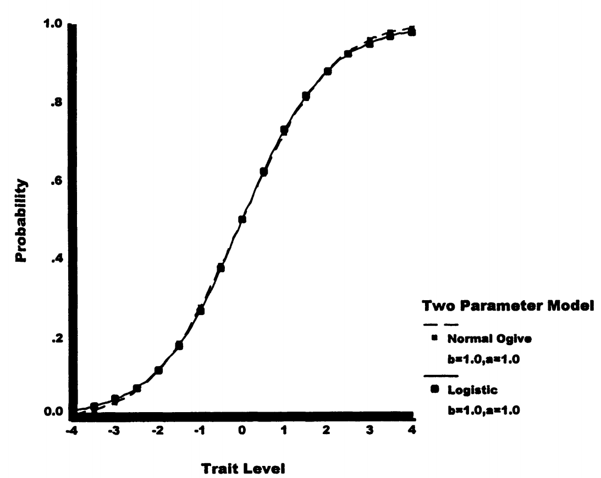

# 3. 传统正态Ogive模型

## 3.1为什么需要正态Ogive模型？

正态ogive模型包含与相应逻辑模型相同的参数，但项目特征曲线由不同函数产生。

**历史背景：**

- 基于累积正态分布
- 在计算机时代之前更容易理解
- 与经典测验理论有重要联系

**为什么叫"Ogive"？**

Ogive是累积曲线的另一个名称，形状像拉长的S，在统计学中常用来描述累积分布函数。

## 3.2 形式

正态ogive模型将ICC表示为低于某个标准分数 \(z_{is}\) 的案例比例：

\[
P(X_{is} = 1) = \int_{-\infty}^{z_{is}} \frac{1}{\sqrt{2\pi}} \exp\left(-\frac{t^2}{2}\right)dt \tag{4.7}
\]

其中：

- 积分符号表示从 \(-\infty\) 到 \(z_{is}\) 的分布区域
- \(\pi\) = 常数3.14159...
- 公式包含正态密度函数

**通俗理解：**

这就是在问："标准正态分布中，有多少比例的值小于 \(z_{is}\)？"

如果 \(z_{is} = 0\)，答案是50%
如果 \(z_{is} = 1\)，答案约是84%
如果 \(z_{is} = -1\)，答案约是16%

## 3.3 两参数正态Ogive模型

### 3.3.1 参数结构

两参数正态ogive模型具有与2PL模型相同的参数结构：

\[
z_{is} = \alpha_i(\theta_s - \beta_i) \tag{4.8}
\]

完整模型：

\[
P(X_{is} = 1|\theta_s,\beta_i,\alpha_i) = \int_{-\infty}^{\alpha_i(\theta_s - \beta_i)} \frac{1}{\sqrt{2\pi}} \exp\left(-\frac{t^2}{2}\right)dt \tag{4.9}
\]

### 3.3.2 计算示例

**例1：** 如果 \(\alpha_i = 1.0\)，\(\theta_s = 2.00\)，\(\beta_i = 1.00\)

计算步骤：

1. \(z_{is} = 1.0 \times (2.00 - 1.00) = 1.00\)
2. 查正态分布表：\(\Phi(1.00) = 0.8413\)
3. 因此，项目成功概率为0.8413

**实际意义：**
能力比难度高1个标准差的学生，有84%的概率答对！

**例2：** 如果参数组合产生 \(z_{is} = -1.50\)

从累积正态分布得到的概率为0.0668

**实际意义：**
能力比难度低1.5个标准差的学生，只有6.7%的概率答对。

### 3.3.3 与经典测验理论的联系

重要关系

如果特质水平呈正态分布，且数据符合两参数正态ogive模型，Lord和Novick（1968）表明存在以下关系：

**1. 区分度与双列相关的关系：**

\[
\alpha_i \cong \frac{r_{bis}}{\sqrt{1 - r^2_{bis}}} \tag{4.10}
\]

含义：

- 项目区分度与双列相关单调递增
- 通过IRT项目区分度选择项目与通过双列相关选择项目类似

**具体例子：**

- 如果 \(r_{bis} = 0.5\)，则 \(\alpha \approx 0.58\)
- 如果 \(r_{bis} = 0.7\)，则 \(\alpha \approx 0.98\)

**2. 难度与p值的关系：**

首先将 \(p_i\) 转换为正态偏差 \(z_i\)：

- 如果 \(p_i = 0.84\)，则 \(z_i = -1.00\)（注意：是上侧面积）

然后：

\[
\beta_i \cong \frac{z_i}{r_{bis}} \tag{4.11}
\]

含义：

- p值对项目的排序与IRT项目难度的排序有些不同
- 使用IRT项目难度可能导致选择与经典测验理论p值不同的项目

**为什么会不同？**

CTT只考虑通过率，IRT还考虑了项目的区分能力！

## 3.4 三参数正态Ogive模型

类似于3PL模型，可以添加下渐近线参数：

\[
P(X_{is} = 1|\theta_s,\beta_i,\alpha_i,\gamma_i) = \gamma_i + (1-\gamma_i)\int_{-\infty}^{\alpha_i(\theta_s - \beta_i)} \frac{1}{\sqrt{2\pi}} \exp\left(-\frac{t^2}{2}\right)dt \tag{4.12}
\]

与3PL模型一样，项目难度参数表示ICC的拐点，但不是特质水平的.50阈值。

## 3.5 逻辑与正态Ogive模型的比较

### 3.5.1 概率预测的相似性

让我们比较前面的两个例子：

**例1（\(z_{is} = 1.0\)）：**

- 正态ogive：P = 0.8413
- 逻辑模型（带1.7乘数）：P = 0.8455
- 差异：0.0042

**例2（\(z_{is} = -1.5\)）：**

- 正态ogive：P = 0.0668
- 逻辑模型（带1.7乘数）：P = 0.0724
- 差异：0.0056

**结论：** 两种模型的预测几乎相同！

1.7缩放因子

为使逻辑模型与正态ogive模型相似，需要在指数中包含乘数1.7。

这个因子来自两个分布方差的比值：\(\pi^2/3 \approx 3.29\)，\(\sqrt{3.29/1.13} \approx 1.7\)

**记忆技巧：** 逻辑分布比正态分布"胖"，需要1.7倍缩放才能匹配！

### 3.5.2 视觉比较

图4.6显示了两参数逻辑和正态ogive模型为单个项目产生的ICC。

**关键观察：**

- ICC几乎完全重叠
- 模型之间的最大差异出现在极端特质水平上
- 实际应用中，两种模型几乎无法区分

### 3.5.3 选择建议

**应该选择逻辑还是正态ogive模型？**

由于两种模型预测几乎相同，选择主要基于：

- **计算方便** → 逻辑模型（不需要积分）
- **理论需要** → 正态ogive模型（与CTT的联系）
- **软件支持** → 现代软件多支持逻辑模型

**实际建议：**

除非有特殊理由（如需要与CTT参数对接），一般选择逻辑模型，因为：
1. 计算更简单
2. 参数解释更直观
3. 软件支持更广泛
