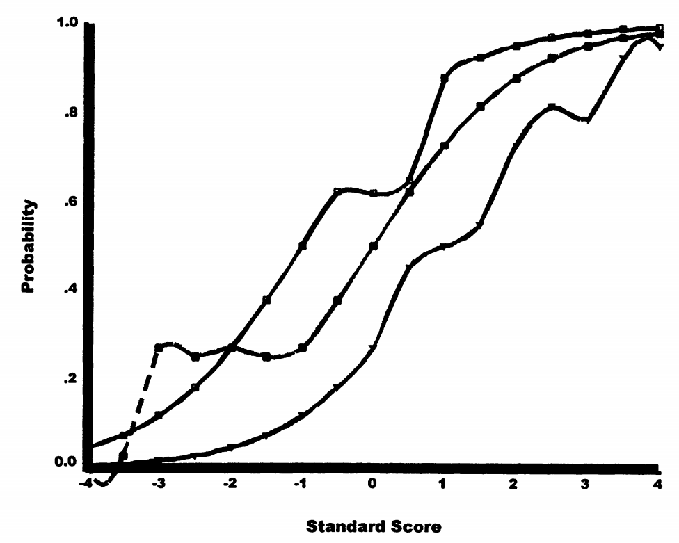

# 4. 其他单维模型

虽然完整描述所有模型超出本章范围，但应提及几个重要的扩展模型。

## 4.1 线性逻辑潜在特质模型（LLTM）

### 4.1.1 模型动机

LLTM（Fischer，1973）旨在将项目内容纳入项目成功的预测中。

**核心思想：** 如果我们知道是什么因素导致题目困难，能否直接建模这些因素？

**实际例子：**

题目的难度可能由以下因素决定：
- 计算步骤数
- 是否需要进位
- 是否涉及分数
- 是否有文字描述

LLTM试图量化每个因素的贡献！

### 4.1.2 表达

LLTM将项目难度分解为可解释的成分：

\[
\beta_i = \sum_k \tau_k q_{ik} + q_0
\]

完整模型：

\[
P(X_{is} = 1|\theta_s,\tau) = \frac{\exp(\theta_s - (\sum_k \tau_k q_{ik} + q_0))}{1 + \exp(\theta_s - (\sum_k \tau_k q_{ik} + q_0))} \tag{4.13}
\]

其中：

- \(q_{ik}\) = 项目 i 中刺激因素 k 的值
- \(\tau_k\) = 项目难度中刺激因素 k 的权重
- \(q_0\) = 标准化常数

### 4.1.3 应用示例

**段落理解项目的难度分解：**

假设项目受五个因素影响：

1. 词汇水平
2. 句法复杂性
3. 命题类型1的密度
4. 命题类型2的密度
5. 命题类型3的密度

如果能够数值化每个因素的参与度，LLTM可估计每个因素的权重。

**示例设计矩阵：**

| 项目 | 词汇 | 句法 | 命题1 | 命题2 | 命题3 |
| --- | --- | --- | --- | --- | --- |
| 1 | 2 | 1 | 3 | 0 | 1 |
| 2 | 3 | 2 | 1 | 2 | 0 |
| 3 | 1 | 3 | 2 | 1 | 2 |

估计结果可能显示：

- \(\tau_1 = 0.3\)（词汇权重）
- \(\tau_2 = 0.4\)（句法权重）
- 等等...

**实际意义：**

如果句法复杂性的权重是0.4，意味着：

- 句法复杂度每增加1个单位
- 题目难度增加0.4个logit单位
- 可以预测新题目的难度！

### 4.1.4 特殊应用：变化测量

LLTM的一个特例是条件间的变化测量。如果项目在改变平均特质水平的条件后呈现，则添加常数反映条件影响。

**例子：**

测试药物对认知的影响：

- 服药前的题目难度 = β
- 服药后的题目难度 = β + τ
- τ表示药物效应

## 4.2 结合速度和准确性的模型

### 4.2.1 现实需求

许多测验中，表现水平取决于准确性和速度两方面：

- 限时认知测验
- 反应时任务
- 效率评估

**实际场景：**

标准化考试中：

- 有些学生准确但慢
- 有些学生快但粗心
- 理想状态是又快又准

### 4.2.2 建模方法

将反应时间纳入成功预测的几种方式：

1. **直接纳入模型**：正确反应概率部分取决于反应时间
2. **联合建模**：同时建模准确性和速度
3. **条件模型**：在给定速度条件下建模准确性

Roskam（1997）和Verhelst等（1997）提出了各种模型。对于某些变体，只需要平均或总反应时间。

**应用例子：**

在线测验系统可以：

- 记录每题用时
- 发现rushed responses（太快可能是乱猜）
- 调整能力估计

## 4.3 单个项目多次尝试

### 4.3.1 适用情境

同一任务被重复多次的情况：

- 精神运动任务（如投篮）
- 行为观察（如社会反应）
- 技能练习

**具体例子：**

- 篮球罚球：10次机会，进了几个？
- 打字测试：5分钟内，错了几次？
- 儿童行为：一天中，发脾气几次？

### 4.3.2 模型类型

Masters（1992）和Spray（1997）提出了适当的模型：

1. **二项分布模型**：假设每次尝试独立且概率恒定
2. **泊松模型**：适用于罕见事件
3. **逆二项分布模型**：允许过度离散

**应用示例：** Safrit等（1989）描述了对运动行为的应用。

**选择原则：**

- 固定次数 → 二项分布
- 固定时间内的次数 → 泊松分布
- 存在个体内变异 → 逆二项分布

## 4.4 ICC特殊形式的模型

### 4.4.1 非单调ICC

某些情况下，项目反应概率不是单调递增的。

**态度数据示例：**

陈述："我认为死刑是必要的，但我希望不是这样"

- 极端反对者：不同意（认为不必要）
- 中等态度者：同意（矛盾心理）
- 极端支持者：不同意（认为必要且应该）

**图形特征：**

不是S形曲线，而是倒U形曲线！中间态度的人最可能同意。

### 4.4.2 适用模型

1. **双曲余弦IRT模型**（Andrich，1997）
2. **平行四边形IRT模型**（Hoijtink，1991）

这些模型允许ICC在某个点达到最大值，然后下降。

**形式示例：**

双曲余弦模型使用：

\[
P(\theta) = \frac{\cosh(\alpha(\theta - \beta))}{\gamma + \cosh(\alpha(\theta - \beta))}
\]

## 4.5 非参数IRT模型

### 4.5.1 为什么需要非参数方法？

假设ICC具有单一函数形式可能过于限制性。某些数据可能需要更复杂的函数。

**类比：**

参数模型像是用直尺画线，非参数模型像是用曲线板，可以画出任意形状。

### 4.5.2 Ramsey的方法

Ramsey（1991）的非参数IRT方法：

- 对每个项目应用核平滑技术
- 不假设特定的函数形式
- 灵活拟合各种ICC形状

**优点：**

- 能发现意外的模式
- 不受函数形式限制
- 适合探索性分析

**缺点：**

- 需要大样本
- 难以解释
- 不易推广

### 4.5.3 可能的ICC形式

图4.7显示了三条用非参数方法拟合的ICC：

1. **非零下渐近线**：类似3PL
2. **局部平坦**：某些能力范围内概率变化很小
3. **非单调**：某些区域概率下降

**权衡：** 更大的灵活性以模型复杂性为代价。每个项目可能需要不同的函数。

**使用建议：**

- 先用参数模型
- 如果拟合不好，尝试非参数
- 用非参数结果指导参数模型的改进
