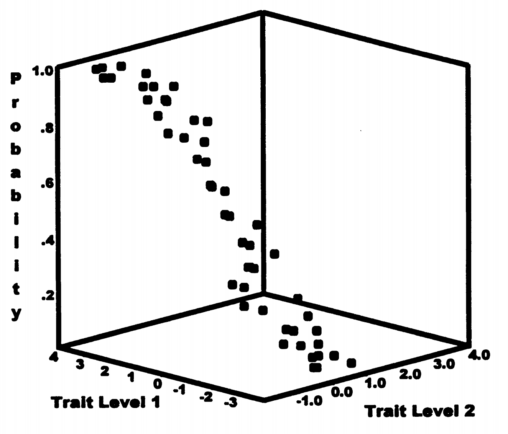

# 6. 探索性多维模型

## 6.1 与因子分析的关系

二元项目的因子分析与多维IRT模型越来越相似：

- Takane & de Leeuw（1988）证明在某些假设下它们相同
- McDonald（1967）的非线性因素分析是统一基础
- 都涉及潜在特质的加权组合

**关键区别：**

- 因子分析：建模相关性
- 多维IRT：直接建模项目反应（全信息方法）

**优势对比：**

因子分析：

- 概念简单
- 软件普及
- 结果易解释

多维IRT：

- 使用全部信息
- 处理二元数据更合理
- 可以预测个体反应

## 6.2 多维逻辑模型

### 6.2.1 多维Rasch模型

McKinley和Reckase（1982）的模型：

\[
P(X_{is} = 1|\theta_s,\delta_i) = \frac{\exp(\sum_m \theta_{sm} + \delta_i)}{1 + \exp(\sum_m \theta_{sm} + \delta_i)} \tag{4.14}
\]

**关键特征：**

- 单维特质水平被替换为等权重特质的复合体
- 所有维度权重相等

**问题：** 模型不可识别

- 无法区分个体在各维度上的差异状态
- 不同特质水平无法分别估计

**类比：**

就像说"这个学生的总能力是5"，但不知道是"数学3+语文2"还是"数学1+语文4"。

### 6.2.2 二参数逻辑模型的多维扩展

为每个项目在每个维度上给出区分度参数：

\[
P(X_{is} = 1|\theta_s,\delta_i,\alpha_i) = \frac{\exp(\sum_m \alpha_{im} \theta_{sm} + \delta_i)}{1 + \exp(\sum_m \alpha_{im} \theta_{sm} + \delta_i)} \tag{4.15}
\]

**关键理解：**

- 个体潜力通过加权特质之和反映
- 权重越高（\(\alpha_{im}\)），该特质越重要
- 不同项目可以依赖不同的维度组合

**实例解释：**

应用题可能是：

- 70%依赖计算能力（\(\alpha_{i1} = 0.7\)）
- 30%依赖阅读能力（\(\alpha_{i2} = 0.3\)）

### 6.2.3 模型识别

为使模型可识别，需要约束：

- 固定特质均值和标准差
- 或施加其他参数约束

**常见方法：**

1. 固定每个维度均值为0，方差为1
2. 固定某些"标记"项目只在一个维度上有载荷

### 6.2.4 三维可视化

图4.8显示了两个潜在特质影响下的项目反应概率。

**观察要点：**

- 特质水平1的影响更大（曲面沿该轴上升更快）
- 这反映了该项目在特质1上有更高区分度
- 两个维度共同决定成功概率

**如何理解三维图？**

想象一个山坡：

- X轴：东西方向（能力1）
- Y轴：南北方向（能力2）
- Z轴：高度（答对概率）
- 坡度反映了各方向的重要性

### 6.2.5 三参数逻辑模型的多维扩展

添加猜测参数：

\[
P(X_{is} = 1|\theta_s,\delta_i,\alpha_i,\gamma_i) = \gamma_i + (1-\gamma_i)\frac{\exp(\sum_m \alpha_{im} \theta_{sm} + \delta_i)}{1 + \exp(\sum_m \alpha_{im} \theta_{sm} + \delta_i)} \tag{4.16}
\]

概率曲面类似图4.8，但不会降到零。

**理解要点：**

即使两个维度的能力都很低，仍有\(\gamma_i\)的概率猜对。

## 6.3 正态Ogive多维模型

### 6.3.1 Bock等人的模型

Bock, Gibbons和Muraki（1988）的全信息因子分析模型。

个体潜力：

\[
z_{si} = \sum_m \alpha_{im} \theta_{sm} + \delta_i \tag{4.17}
\]

概率：

\[
P(X_{is} = 1|\theta_s,\delta_i,\alpha_i) = \int_{-\infty}^{z_{si}} \frac{1}{\sqrt{2\pi}} \exp\left(-\frac{t^2}{2}\right)dt \tag{4.18}
\]

### 6.3.2 参数转换

因素负荷和标准难度可以计算为：

\[
\lambda_{im} = \frac{\alpha_{im}}{g_i} \quad \text{和} \quad \beta_i = \frac{\delta_i}{g_i} \tag{4.19}
\]

其中：

\[
g_i = \sqrt{1 + \sum_m \alpha_{im}^2}
\]

**这些转换的意义：**

将IRT参数转换为因子分析中熟悉的形式，便于解释和比较。

### 6.3.3 带猜测的版本

\[
P(X_{is} = 1|\theta_s,\beta_i,\alpha_i,\gamma_i) = \gamma_i + (1-\gamma_i) \int_{-\infty}^{z_{si}} \frac{1}{\sqrt{2\pi}} \exp\left(-\frac{t^2}{2}\right)dt \tag{4.20}
\]
