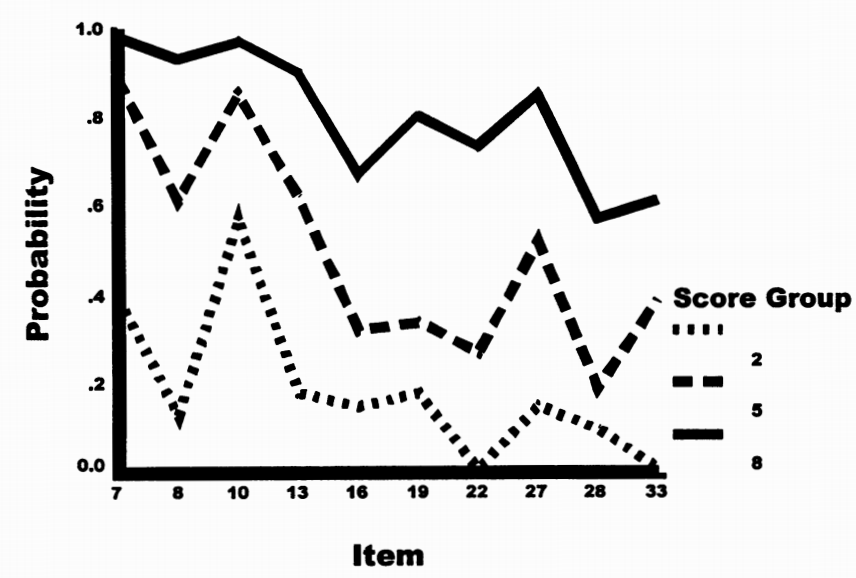
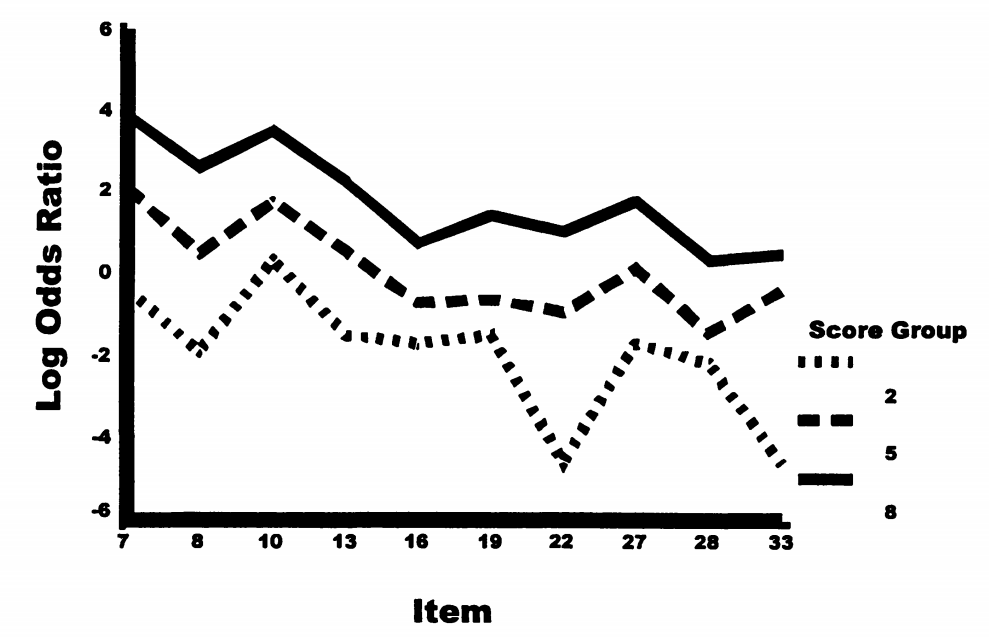
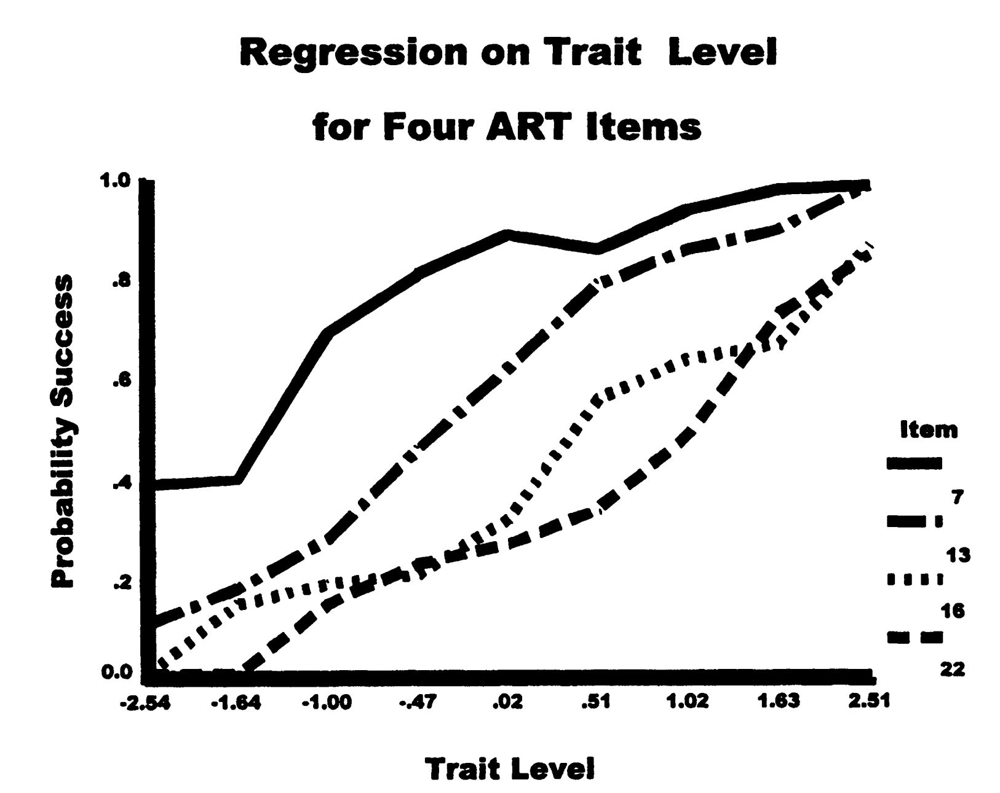
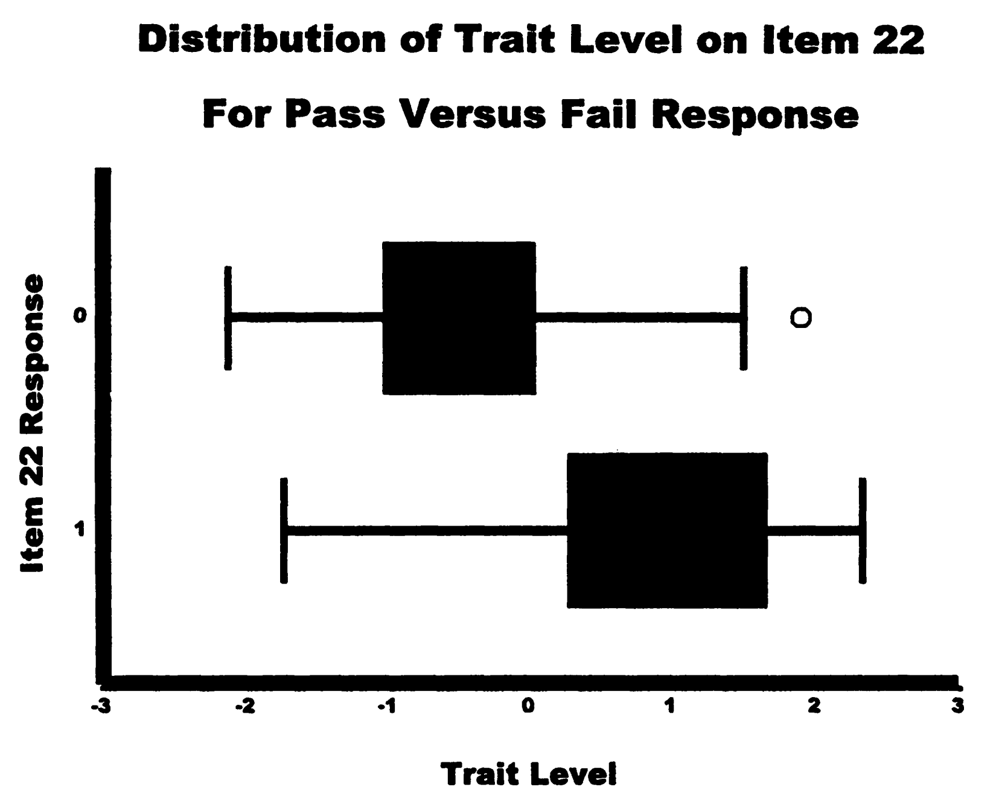
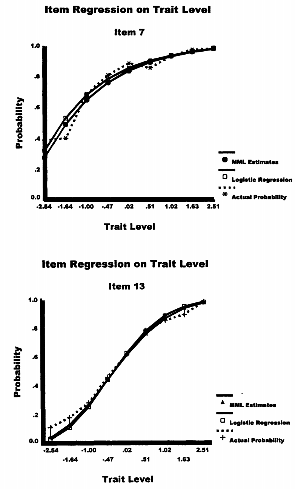
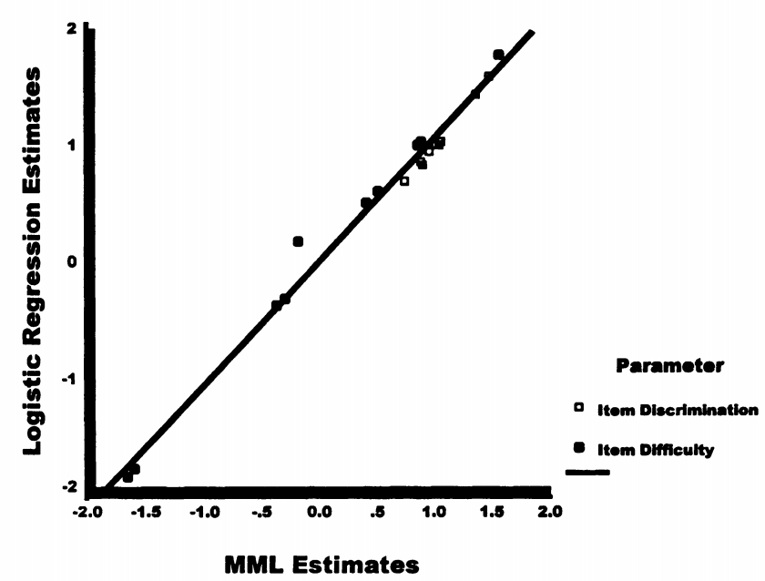
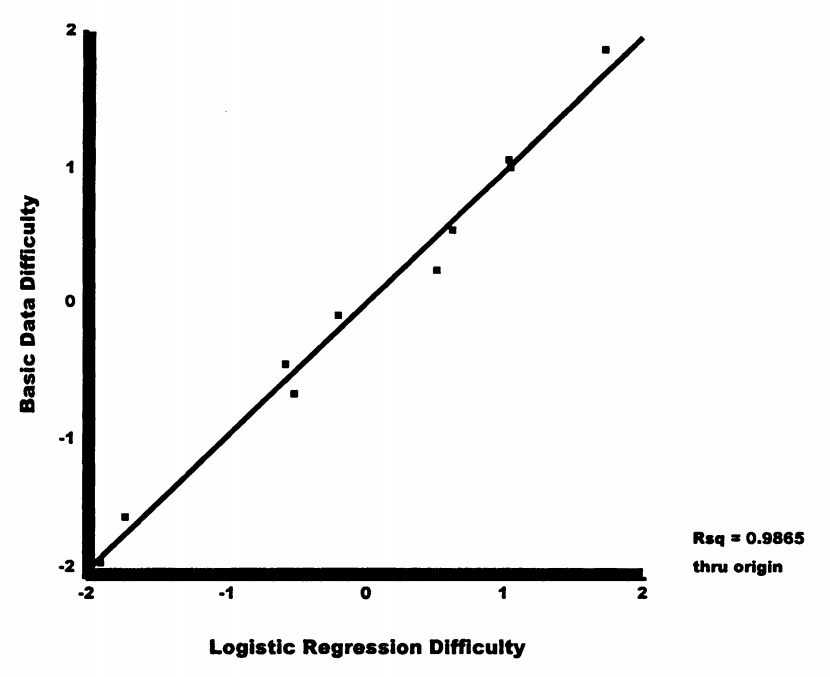
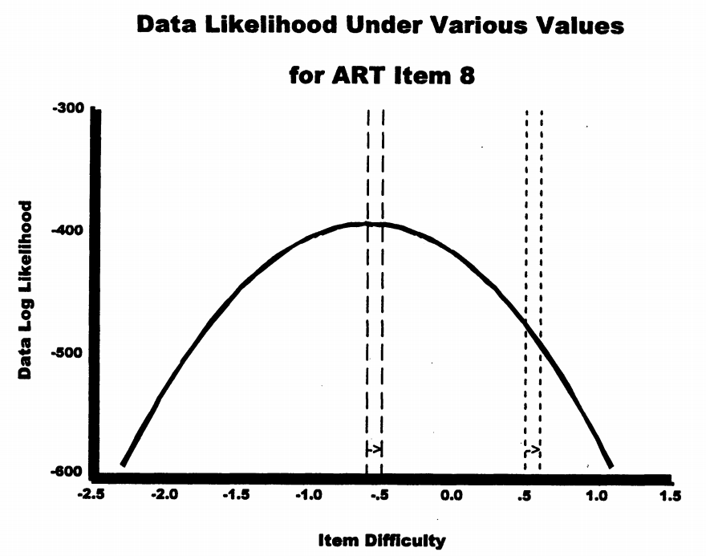
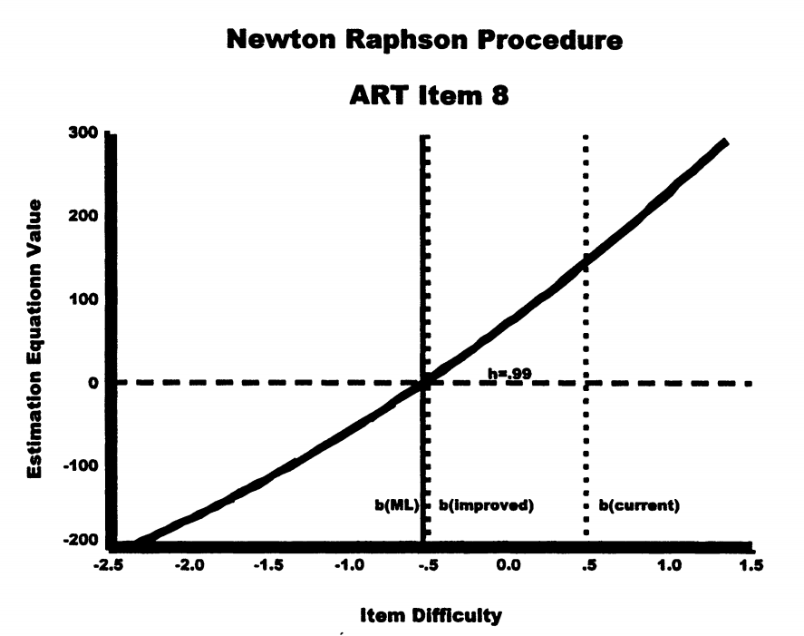
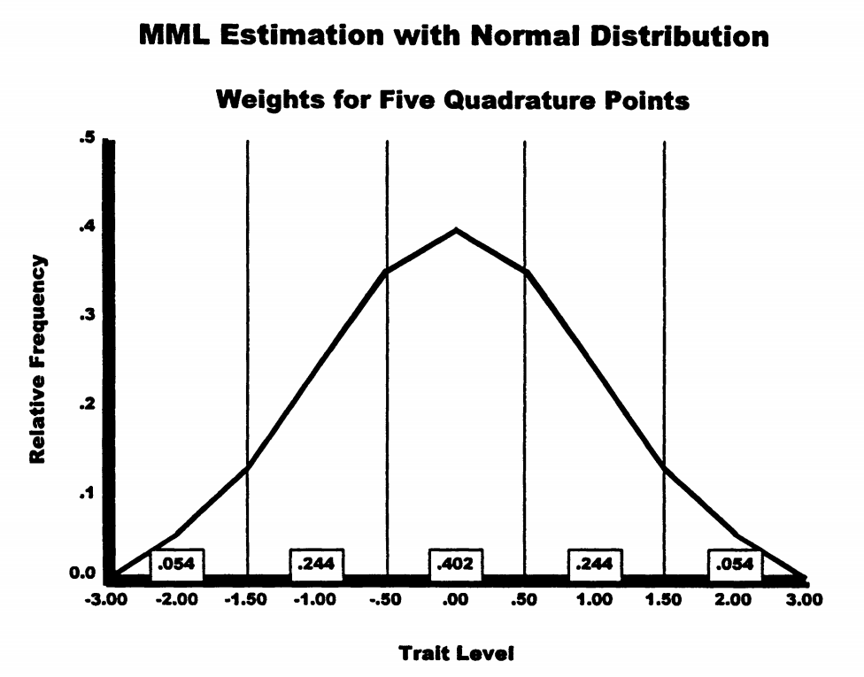

# 项目参数估计：IRT模型的校准

## 0. 引言：项目参数估计的核心问题

### 0.1 章节定位与前提

在第7章中，我们学习了如何估计考生的能力水平，但那时假设题目参数是已知的。现实中，当开发新测验时，必须先估计题目参数。这就是本章要解决的核心问题。

根本挑战

要估计题目难度，需要知道学生能力；要估计学生能力，需要知道题目难度。

两者都未知时，如何开始？

### 0.2 本章使用的数据

本章所有方法都将在抽象推理测验（ART）的10个项目数据上演示：

- 样本量：818名年轻成人（有效样本787人，排除了31个极端分数）
- 题目数：10道，8选1（猜测概率极小）
- 模型拟合：合理拟合Rasch模型

### 0.3 估计的前提假设

两个关键假设

1. **局部独立性**：控制能力后，各题目反应相互独立
2. **单维性**：测验测量单一潜在特质

对于ART数据，项目间相关性整体显著（χ²₄₅ = 550.154, p < .000），但控制单因子后残差相关性不显著（χ²₃₅ = 41.980, p = .194），支持局部独立性假设。

## 1. 启发式估计方法

### 1.1 Rasch的基本数据矩阵方法

#### 1.1.1 方法原理

Rasch（1960）展示了如何通过基本数据矩阵手工计算估计项目参数。关键思想是：

- 行代表项目，列代表具有相等能力的人群（按总分分组）
- 总分是估计能力的充分统计量
- 通过项目的人数是估计难度的充分统计量

#### 1.1.2 构建基本数据矩阵

**表8.1 ART的基本数据矩阵（n = 787）**

| 项目 | 分数1 | 分数2 | 分数3 | 分数4 | 分数5 | 分数6 | 分数7 | 分数8 | 分数9 |
| --- | --- | --- | --- | --- | --- | --- | --- | --- | --- |
| (N) | (18) | (40) | (96) | (101) | (132) | (133) | (111) | (88) | (68) |
| 7 | .39 | .40 | .69 | .81 | .89 | .86 | .94 | .98 | 1.00 |
| 10 | .22 | .57 | .63 | .75 | .85 | .91 | .91 | .97 | .96 |
| 13 | .11 | .18 | .28 | .46 | .62 | .79 | .86 | .90 | .99 |
| 8 | .00 | .13 | .38 | .52 | .61 | .74 | .87 | .93 | .97 |
| 27 | .00 | .15 | .34 | .39 | .52 | .69 | .82 | .85 | .93 |
| 19 | .11 | .18 | .14 | .30 | .34 | .54 | .60 | .80 | .91 |
| 16 | .01 | .15 | .19 | .21 | .32 | .56 | .64 | .67 | .87 |
| 33 | .01 | .01 | .16 | .25 | .39 | .32 | .54 | .61 | .87 |
| 22 | .00 | .01 | .15 | .23 | .27 | .34 | .49 | .73 | .85 |
| 28 | .00 | .10 | .01 | .01 | .19 | .24 | .32 | .57 | .68 |

矩阵中每个单元格表示该能力组在该题目上的通过率。注意：

- 同一行内，通过率随能力增加而增加
- 同一列内，通过率随题目难度递减

#### 1.1.3 对数比值转换

为获得与Rasch模型一致的估计，需要将通过率转换为对数比值：

\[
\log \text{odds}_{ig} = \log_e\left(\frac{P_{ig}}{1-P_{ig}}\right)
\]

例如，项目7在分数组5的对数比值：

\[
\log \text{odds}_{75} = \log_e\left(\frac{0.89}{0.11}\right) = 2.09
\]

**表8.2 ART的对数比值数据矩阵，边际均值和简单Rasch项目难度估计**

| 项目 | 1 | 2 | 3 | 4 | 5 | 6 | 7 | 8 | 9 | 均值 | Rasch难度 |
| --- | --- | --- | --- | --- | --- | --- | --- | --- | --- | --- | --- |
| 7 | -.45 | -.27 | .78 | 1.48 | 2.09 | 1.83 | 2.77 | 3.89 | 大 | 1.86 | -1.91 |
| 10 | -1.27 | .28 | .50 | 1.10 | 1.79 | 2.31 | 2.31 | 3.56 | 3.18 | 1.52 | -1.57 |
| ... | ... | ... | ... | ... | ... | ... | ... | ... | ... | ... | ... |
| 能力θ | -2.68 | -1.61 | -.98 | -.73 | -.45 | -.19 | .08 | .53 | 1.18 |  |  |

（注：表中"大"表示极大值，实际计算时使用连续性校正）

#### 1.1.4 参数估计

1. 计算每行（项目）的平均对数比值
2. 计算总体项目均值：-0.05
3. 项目难度 = -(行均值 - 总体均值)

例如，项目7：

- 行均值 = 1.86
- 偏差 = 1.86 - (-0.05) = 1.91
- 难度 = -1.91（容易项目有负的难度值）

#### 1.1.5 群体不变性的实现

为什么不受样本分布影响？

关键在于**无权重平均**：每个能力组的权重相等，不管组内有多少人。

这确保了无论测试的是好学生多还是差学生多，项目参数估计保持不变。

### 1.2 已知能力的Logistic回归方法

假设787名参与者的能力已知（实际使用MML估计得到），可以用logistic回归估计项目参数。

#### 1.2.1 模型设定

Logistic回归模型：

\[
P(x_i = 1) = \frac{\exp(y)}{1 + \exp(y)}
\]

其中 \(y = b_0 + b_1\theta\)

对于2PL模型，重新参数化：\(y = \alpha_i(\theta - \beta_i)\)

因此：

- 区分度：\(\alpha_i = b_1\)
- 难度：\(\beta_i = -b_0/b_1\)

#### 1.2.2 估计结果比较

**表8.4 启发式项目估计**

| 项目库 | P值 | 基本数据矩阵 | Logistic回归 |
| --- | --- | --- | --- |
| 7 | .84 | -1.91 | -1.65 |
| 10 | .82 | -1.57 | -1.50 |
| 13 | .65 | -.68 | -.50 |
| 8 | .66 | -.46 | -.45 |
| 27 | .60 | -.09 | -.17 |
| 19 | .47 | .25 | .46 |
| 16 | .45 | .54 | .55 |
| 33 | .40 | 1.01 | .90 |
| 22 | .38 | 1.06 | .91 |
| 28 | .26 | 1.87 | 1.57 |

两种方法的估计高度一致（r² = .99）。

## 2. 最大似然估计原理

### 2.1 似然函数的构建

#### 2.1.1 单个反应的似然

对于二分反应（x ∈ {0,1}），似然为：

\[
P(X_{is}) = P_i^{X_{is}} Q_i^{1-X_{is}}
\]

其中 \(Q_i = 1 - P_i\)

#### 2.1.2 完整数据的似然

假设局部独立性，数据似然为：

\[
L(\mathbf{X}) = \prod_s \prod_i P_{is}^{X_{is}} Q_{is}^{1-X_{is}}
\]

对数似然：

\[
\ln L(\mathbf{X}) = \sum_s \sum_i [X_{is} \ln P_{is} + (1-X_{is}) \ln Q_{is}]
\]

### 2.2 搜索过程

似然函数呈倒U形，有唯一最大值。

估计方程（一阶导数）在最大值处为零。

### 2.3 Newton-Raphson方法

迭代公式：

\[
\beta_{\text{improved}} = \beta_{\text{current}} - \frac{L'(\beta_{\text{current}})}{L''(\beta_{\text{current}})}
\]

其中：

- \(L'\)：一阶导数（估计方程）
- \(L''\)：二阶导数（曲率信息）

### 2.4 标准误计算

对于Rasch模型：

\[
SE(\beta) = \frac{1}{\sqrt{\sum_s P_{is}(1-P_{is})}}
\]

当 \(P_{is} = 0.5\) 时，标准误最小。

## 3. 处理未知能力的三种方法

### 3.1 联合最大似然（JML）

#### 3.1.1 基本思想

交替估计：

1. 固定项目参数，估计能力
2. 固定能力，估计项目参数
3. 重复直到收敛

#### 3.1.2 估计方程

对于Rasch模型：

\[
\sum_s X_{is} = \sum_s P(X_{is} = 1|\theta_s, \beta_i)
\]

左边是观察到的正确数，右边是模型预测的期望正确数。

#### 3.1.3 JML的问题

- 参数估计有偏
- 不一致（增加样本不改善精度）
- 无法处理极端分数

### 3.2 边际最大似然（MML）

#### 3.2.1 核心思想

将能力视为随机变量，通过积分消除：

\[
P(\mathbf{X}_r|\mathbf{\beta}) = \int P(\mathbf{X}_r|\theta, \mathbf{\beta}) g(\theta) d\theta
\]

其中 \(g(\theta)\) 是能力分布（通常假设为标准正态）。

#### 3.2.2 数值积分

使用高斯求积近似：

\[
P(\mathbf{X}_r|\mathbf{\beta}) \approx \sum_{q=1}^Q P(\mathbf{X}_r|\theta_q, \mathbf{\beta}) w_q
\]

#### 3.2.3 EM算法

E步：计算期望频数

- 在能力点 \(\theta_q\) 的期望人数：\(N'_q\)
- 在 \(\theta_q\) 答对题目 \(i\) 的期望人数：\(R_{iq}\)

M步：最大化期望对数似然

\[
\sum_q R_{iq} = \sum_q N'_q P_i(\theta_q, \beta_i)
\]

### 3.3 条件最大似然（CML）

#### 3.3.1 充分统计量

在Rasch模型中，总分 \(r\) 是能力的充分统计量。

#### 3.3.2 条件概率

给定总分，反应模式的概率：

\[
P(\mathbf{X}|r, \mathbf{\beta}) = \frac{\prod_i e^{-\beta_i X_i}}{\gamma_r}
\]

注意：能力参数 \(\theta\) 完全消失了！

#### 3.3.3 基本对称函数

\(\gamma_r\) 是 \(r\) 阶基本对称函数，表示得到 \(r\) 分的所有可能方式。

例如，4题测验：

- \(\gamma_0 = 1\)
- \(\gamma_1 = e^{-\beta_1} + e^{-\beta_2} + e^{-\beta_3} + e^{-\beta_4}\)
- \(\gamma_2 = e^{-\beta_1-\beta_2} + e^{-\beta_1-\beta_3} + ...\)（6项）
- \(\gamma_3 = e^{-\beta_1-\beta_2-\beta_3} + ...\)（4项）
- \(\gamma_4 = e^{-\beta_1-\beta_2-\beta_3-\beta_4}\)

### 3.4 三种方法的比较

**表8.5 10项ART数据的最大似然估计**

| 项目库 | JML估计 |  | MML估计 |  | CML估计 |  |
| --- | --- | --- | --- | --- | --- | --- |
|  | 难度 | SE | 难度 | SE | 难度 | SE |
| 7 | -1.596 | .102 | -1.591 | .108 | -1.586 | .105 |
| 10 | -1.414 | .097 | -1.442 | .103 | -1.440 | .102 |
| 8 | -.460 | .084 | -.470 | .087 | -.473 | .085 |
| 13 | -.422 | .083 | -.419 | .087 | -.421 | .085 |
| 27 | -.151 | .082 | -.153 | .084 | -.155 | .082 |
| 19 | .452 | .081 | .437 | .083 | .438 | .081 |
| 16 | .531 | .081 | .531 | .083 | .532 | .081 |
| 33 | .752 | .082 | .776 | .084 | .778 | .083 |
| 22 | .863 | .082 | .868 | .085 | .870 | .083 |
| 28 | 1.445 | .088 | 1.462 | .091 | 1.457 | .090 |

三种方法的估计非常接近。

## 4. 方法选择与实践建议

### 4.1 方法选择决策

**实践决策指南**

| 情况 | 推荐方法 | 理由 |
| --- | --- | --- |
| Rasch模型 + 大样本(N≥500) | CML | 最优性质 |
| Rasch模型 + 小样本(N<500) | MML | 更稳定 |
| 2PL/3PL模型 | MML | 唯一选择 |
| 需要处理极端分数 | MML | JML/CML无法处理 |

### 4.2 样本量要求

- Rasch模型：最少200人
- 2PL模型：最少500人
- 3PL模型：最少1000人

### 4.3 软件实现

- **Rasch模型**：Winsteps（JML/CML）、ConQuest（MML）
- **2PL/3PL模型**：BILOG-MG（MML）、mirt包（MML）

## 5. 技术附录要点

### 5.1 JML的导数

**表8.6 1PL、2PL和3PL IRT模型的一阶和二阶导数**

| 模型 | 参数 | 一阶导数 | 二阶导数 |
| --- | --- | --- | --- |
| 1PL(Rasch) | 困难度 | \(-\sum_s (X_{is} - P_{is})\) | \(-\sum_s P_{is}(1-P_{is})\) |
| 2PL | 区分度 | \(\sum_s (X_{is} - P_{is})(\theta_s - \beta_i)\) | \(-\sum_s P_{is}(1-P_{is})(\theta_s - \beta_i)^2\) |
| 2PL | 困难度 | \(-\alpha_i \sum_s (X_{is} - P_{is})\) | \(-\alpha_i^2 \sum_s P_{is}(1-P_{is})\) |

### 5.2 MML的期望频数

在能力点 \(\theta_q\) 答对题目 \(i\) 的期望人数：

\[
R_{iq} = \sum_p n_p x_{ip} P(\theta_q|\mathbf{X}_p, \mathbf{\beta})
\]

其中后验概率：

\[
P(\theta_q|\mathbf{X}_p, \mathbf{\beta}) = \frac{w_q L(\mathbf{X}_p|\theta_q, \mathbf{\beta})}{\sum_{q'} w_{q'} L(\mathbf{X}_p|\theta_{q'}, \mathbf{\beta})}
\]

### 5.3 CML的条件概率

给定总分 \(r\) 时，答对项目 \(i\) 的概率：

\[
P(X_i = 1|r, \mathbf{\beta}) = e^{-\beta_i} \frac{\gamma_{r-1}^{(i)}}{\gamma_r}
\]

其中 \(\gamma_{r-1}^{(i)}\) 是除去项目 \(i\) 后的基本对称函数。

## 总结

本章介绍了估计IRT项目参数的方法：

1. **启发式方法**提供直观理解，展示了群体不变性
2. **最大似然原理**是现代估计方法的基础
3. **三种ML方法**各有优缺点：
   - JML：简单但有偏
   - MML：复杂但性质最好
   - CML：优雅但仅限Rasch模型

选择方法时需考虑模型类型、样本量和实际需求。MML是现代IRT软件的主流选择。

本章内容基于 Embretson & Reise (2000) 第八章整理
