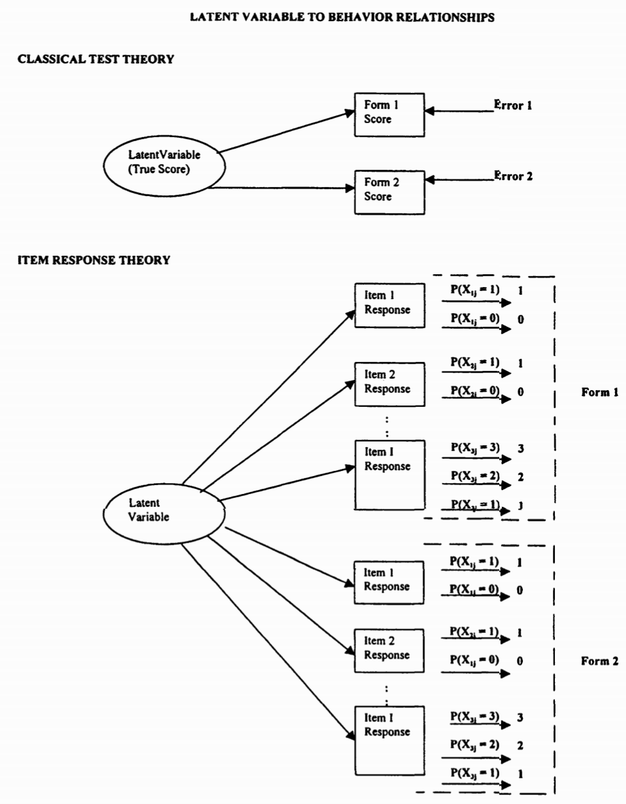
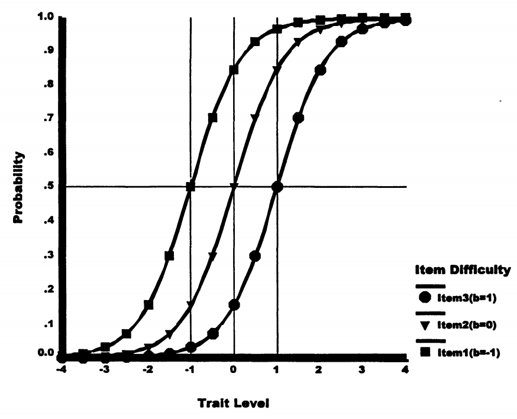
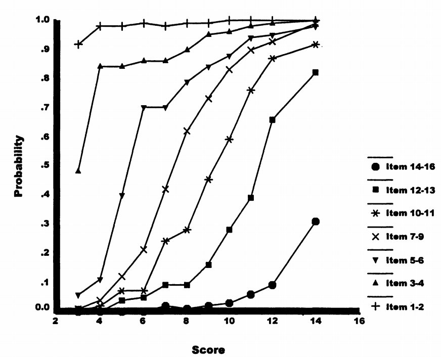
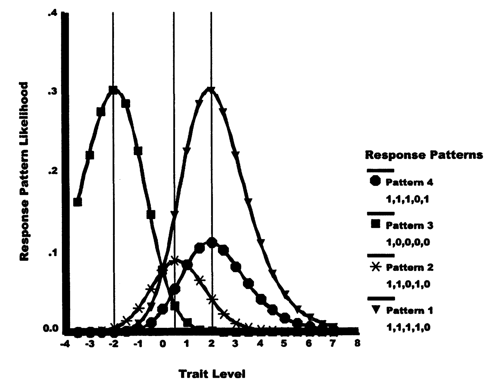
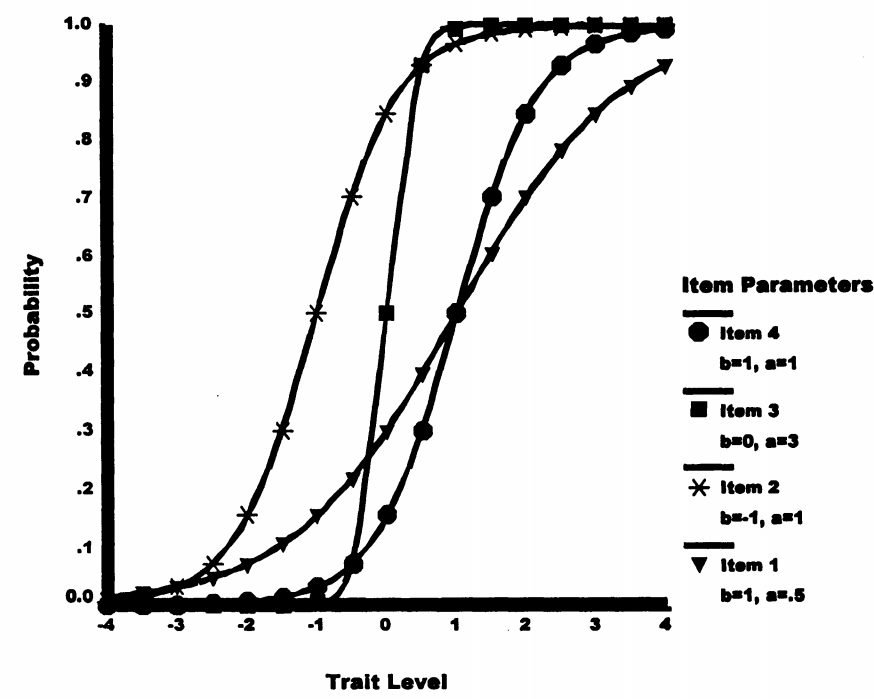
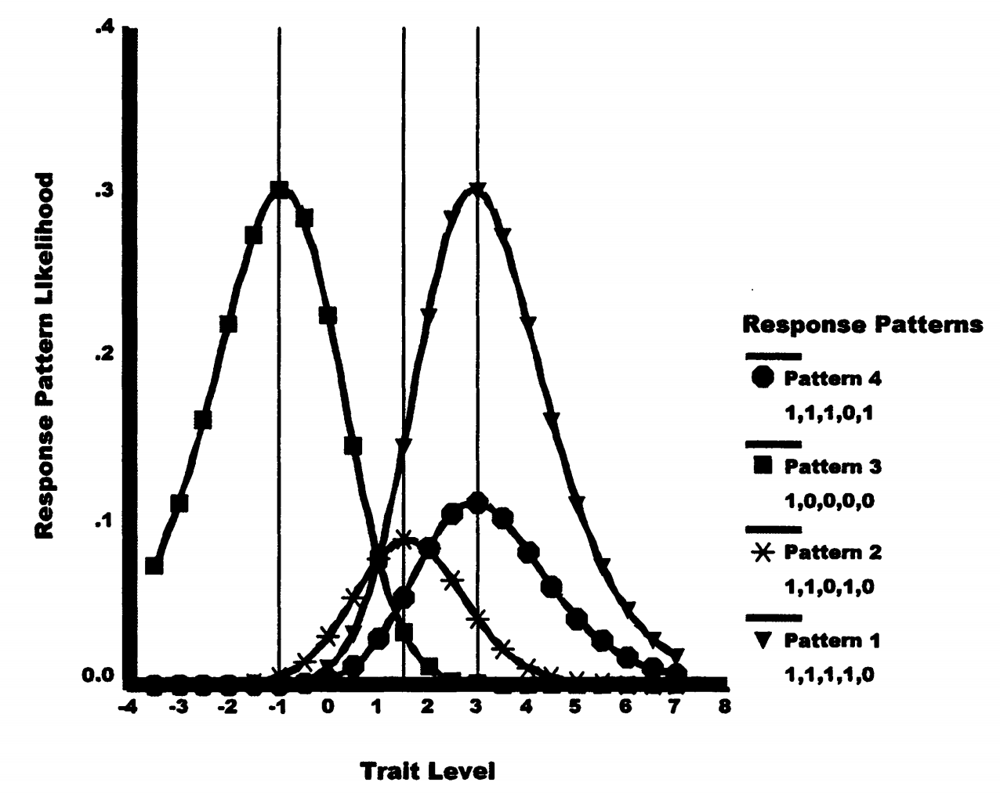

# 项目反应理论：基于模型的测量

## 0. 为什么需要更好的测量方法？

思考题

假设你是一位老师，有两个学生：

- 小明在一份简单试卷上得了80分
- 小红在一份困难试卷上得了70分

**问题：谁的能力更强？**

这个看似简单的问题，恰恰揭示了传统测试理论（CTT）的根本缺陷。今天，我们将学习项目反应理论（IRT）如何解决这个问题。

## 1. 理解测量的本质

### 1.1 潜变量问题

核心概念

**潜变量（Latent Variables）**：不可直接观察但影响可观察行为的心理特质

**显变量（Manifest Variables）**：可以直接观察和记录的行为表现

让我们用医学诊断来类比：

| 类比对象 | 可见信息 | 推断目标 |
| --- | --- | --- |
| 医学诊断 | 发烧 38.5°C、咳嗽、乏力 | 可能是流感 |
| 心理测量 | 答对第 1 题、答错第 5 题、总分 75 分 | 能力水平是多少？ |

关键差异

医生有体温计可以精确测量发烧程度，但心理学家如何"测量"看不见的能力？
这就是为什么我们需要**测量模型**！

### 1.2 两种测量模型的对比

**经典测试理论（CTT）**：

- 关注总分
- 模型：观察分数 = 真分数 + 误差
- 简单但有局限

**项目反应理论（IRT）**：

- 关注每个项目的反应
- 模型：P(答对) = f(能力, 项目参数)
- 复杂但更精确

## 2. CTT的三大致命缺陷

CTT的根本问题

1. **测试依赖性**：换一套题，分数含义就变了
2. **信息浪费**：只用总分，忽略答题模式
3. **无法分离参数**：不知道高分是因为能力强还是题目简单

### 2.1 案例分析：为什么CTT不够用？

考虑以下情况：

| 学生 | 答题模式 | 总分 | CTT结论 |
| --- | --- | --- | --- |
| A | 答对题1-4（简单题） | 4分 | 能力相同 |
| B | 答对题2-5（包含难题） | 4分 | 能力相同 |

真的相同吗？

如果题5比题1难很多，学生B答对题5是否说明他能力更强？
CTT无法回答这个问题！

## 3. IRT的革命性突破

### 3.1 Rasch模型：最简单的IRT模型

Rasch模型的核心思想

答对概率取决于：

- **能力（θ）**：个人的潜在特质水平
- **难度（β）**：项目的难度参数

当能力 = 难度时，答对概率 = 50%

#### 3.1.1 形式化表达

**对数几率形式**（直观理解）：

\[
\ln\left[\frac{P_{答对}}{P_{答错}}\right] = \theta - \beta
\]

**概率形式**（实际计算）：

\[
P(答对) = \frac{e^{(\theta - \beta)}}{1 + e^{(\theta - \beta)}}
\]

记忆技巧

- θ > β：能力超过难度 → 答对概率 > 50%
- θ = β：能力匹配难度 → 答对概率 = 50%
- θ < β：难度超过能力 → 答对概率 < 50%

### 3.2 项目特征曲线（ICC）

ICC的关键特征

1. **S形曲线**：中间陡峭，两端平缓
2. **位置参数**：曲线左右移动表示难度不同
3. **平行曲线**：Rasch模型中所有ICC平行（相同斜率）

### 3.3 真实数据示例

让我们看看Rasch最初研究的数据：

数据特征

1. 概率随总分单调递增
2. 呈现S形增长模式
3. 项目曲线不相交（保持难度顺序）

## 4. 能力估计的革命性方法

### 4.1 从求和到搜索

根本性转变

**CTT 方法：** 依赖总分
总分 = \(\sum\) 项目得分
能力估计 = 标准化后的总分

**IRT 方法：** 基于概率的最大似然估计

对每个可能的 \(\theta\)：

- 计算 \(L(\text{观察到的答题模式} \mid \theta)\)
- 选择使 \(L\) 最大的 \(\theta\) 作为能力估计

### 4.2 具体计算示例

假设5道题，难度为 (-2, -1, 0, 1, 2)，某学生答题模式为 (1,1,1,1,0)：

似然计算过程

**步骤1**：选择一个候选 θ 值（比如 θ = 0）

**步骤2**：计算每题的答对概率：

| 题目 | 难度 β | 实际答题 | \(P(\text{答对}\mid \theta=0)\) |
| --- | --- | --- | --- |
| 1 | -2 | 答对 | 0.88 |
| 2 | -1 | 答对 | 0.73 |
| 3 | 0 | 答对 | 0.50 |
| 4 | 1 | 答对 | 0.27 |
| 5 | 2 | 答错 | 0.12 |

**步骤3**：计算似然
L = 0.88 × 0.73 × 0.50 × 0.27 × (1 - 0.12) = 0.076

**步骤4**：尝试其他 θ 值，找到使 L 最大的 θ

### 4.3 搜索过程可视化

关键发现

- 不同答题模式的似然曲线形状不同
- 峰值位置就是最佳能力估计
- 不一致的答题模式（如先答对难题再答错易题）似然较低

## 5. 2PL模型 - 加入区分度

### 5.1 为什么需要区分度参数？

思考

所有题目都同样有效吗？

- 有些题目能很好地区分不同能力的学生
- 有些题目区分效果较差

### 5.2 2PL模型公式

\[
P(答对) = \frac{e^{α(\theta - β)}}{1 + e^{α(\theta - β)}}
\]

其中：

- α = 区分度参数（斜率）
- α越大，曲线越陡峭，区分效果越好

重要区别

在 **2PL 模型** 中，总分不再是充分统计量！

相同总分的两个学生，如果：

- **学生 A**：主要答对了低区分度的题目
- **学生 B**：主要答对了高区分度的题目

那么：→ **学生 B 将获得更高的能力估计**

**原因解释**：

在 2PL 中，每道题的**区分度参数（α）**影响答题的“信息量”。
高区分度题对能力估计贡献更大，因此
→ 相同总分但解题模式不同的学生，其**能力估计不相同**。

换句话说：
总分无法捕捉“答对的是哪些题”，因此 **不是充分统计量**。

## 6. IRT的实际应用

### 6.1 测试等值问题

IRT的解决方案

通过包含项目参数，IRT自动调整不同测试难度的影响

在困难测试上答对4题 → 更高的能力估计

在容易测试上答对4题 → 较低的能力估计

能力估计的可信度

- **横轴 θ**：哪个 θ 让模型预测的反应模式概率最大 → 就是该学生的能力估计
- **纵轴 L(θ)**：最大似然值的高度表示该反应模式的“合理性”或“内部一致性”

**示例比较**：

- **Pattern 1 (1,1,1,1,0)**：在容易题上答对 4 题，θ ≈ 1，似然值较高 → 稳定估计
- **Pattern 4 (1,1,1,0,1)**：在更难题上答对 4 题，θ ≈ 2.5，似然值也较高 → 能力更强
- **Pattern 2 (1,1,0,1,0)**：对错交替、答题不一致，似然值整体偏低 → 能力估计不稳定、不可信

### 6.2 适应性测试（CAT）

IRT使CAT成为可能

1. 根据当前能力估计选择最合适难度的题目
2. 实时更新能力估计
3. 达到精度要求即可停止测试

结果：更短的测试，更准确的测量！

## 7. 总结：IRT vs CTT

IRT的革命性贡献

| 特征 | CTT | IRT |
| --- | --- | --- |
| **测量不变性** | ❌ 依赖特定测试 | ✅ 跨测试稳定 |
| **信息利用** | ❌ 只用总分 | ✅ 利用答题模式 |
| **参数分离** | ❌ 混在一起 | ✅ 能力与项目独立 |
| **测量精度** | ❌ 假设恒定 | ✅ 随能力变化 |
| **适应性测试** | ❌ 不支持 | ✅ 天然支持 |

核心理念

CTT问："你得了多少分？"

IRT问："基于你的答题模式和题目特性，什么能力水平最可能产生这个结果？"

**这就是从"计分"到"测量"的本质飞跃！**

## 8. 思考与练习

课后思考

1. 为什么说IRT是"基于模型"的测量？
2. 在什么情况下，两个总分相同的学生会得到不同的能力估计？
3. 如果你要设计一个适应性测试系统，IRT如何帮助你？

深入学习建议

- 尝试手动计算一个简单的似然函数
- 思考不同学科测试的项目特征曲线可能是什么样的
- 了解现代大型考试（如GRE、托福）如何应用IRT

本章内容基于 Embretson & Reise (2000) 第三章整理
