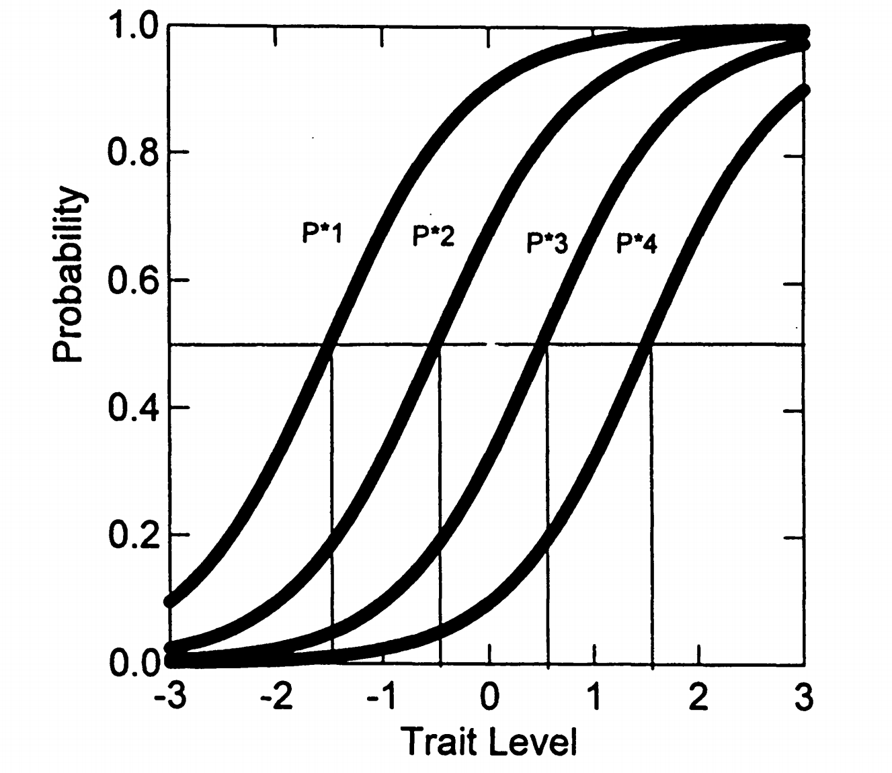
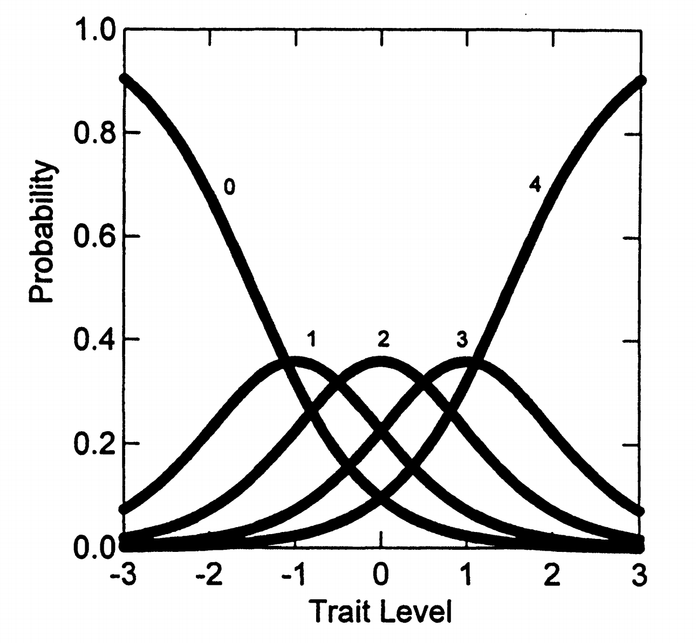

# 3. 等级反应模型（GRM）

## 3.1 基本信息

- 开发者：Samejima, 1969; 1996
- 适用：项目反应可表征为有序类别反应（如李克特评定量表）
- 性质：是第4章2PL模型的泛化，属于"差异模型"类别
- 类型："间接"IRT模型（需要两步过程计算反应概率）

## 3.2 模型优势

- 测验中项目不必有相同数量的反应类别
- 项目参数估计不会因不同反应格式而复杂化
- （这点与后面的评定量表模型不同）

## 3.3 参数说明

对每个量表项目(i)，需要估计：

- **一个项目斜率参数**（\(\alpha_i\)）
- \(j\) = 1... \(m_i\) 个类别"阈值"参数（\(\beta_{ij}\)）
- 其中：\(m_i + 1 = K_i\) = 项目内的反应类别数

## 3.4 举例说明

考虑一个有K = 5个反应选项的项目，受试者得分x = 0...4：

- 有5个反应选项
- 因此有\(m_i = 4\)个阈值（j = 1...4）位于反应选项之间

**具体例子：**

问题：我喜欢参加喧闹的兄弟会派对吗？

```text
讨厌它们  不是真的  有点喜欢  是绝对  爱它们
    0        1        2       3      4
    |        |        |       |      |
  阈值1    阈值2    阈值3   阈值4
```

## 3.5 GRM的两个计算阶段

### 3.5.1 第一阶段：计算操作特征曲线 (ICC)

GRM采用两步法计算类别反应概率。首先计算**操作特征曲线**。

\[
P^*_x(\theta) = \frac{\exp[\alpha_i(\theta - \beta_{ij})]}{1 + \exp[\alpha_i(\theta - \beta_{ij})]} \tag{5.1}
\]

其中 \(x = j = 1, ..., m_i\)

操作特征曲线的含义

\(P^*_x(\theta)\) 表示考生的原始项目反应(x)落在**或高于**给定类别阈值(j)的概率，条件是特质水平(\(\theta\))。

本质上这就是第4章的2PL函数，对每个阈值都计算一条曲线。

**参数解释：**

对于5个类别的项目：

- 需要估计4个 \(\beta_{ij}\) 参数（阈值）
- 需要估计1个公共斜率 \(\alpha_i\) 参数

\(\beta_{ij}\) 参数的含义

\(\beta_{ij}\) 表示必要的特质水平，使得在该阈值j上的概率为0.50。

GRM将项目视为一系列 \(m_i = K-1\) 个二分选择：

- 0 vs. 1,2,3,4
- 0,1 vs. 2,3,4
- 0,1,2 vs. 3,4
- 0,1,2,3 vs. 4

### 3.5.2 第二阶段：计算实际类别反应概率

通过相邻操作特征曲线的差值计算实际类别概率：

\[
P_x(\theta) = P^*_x(\theta) - P^*_{x+1}(\theta) \tag{5.2}
\]

**边界条件：**

- \(P^*_0(\theta) = 1.0\)（反应在最低类别或以上的概率）
- \(P^*_5(\theta) = 0.0\)（反应高于最高类别的概率）

5类别项目的具体计算

对于5个类别（0-4）的项目：

\[P_0(\theta) = 1.0 - P^*_1(\theta)\]

\[P_1(\theta) = P^*_1(\theta) - P^*_2(\theta)\]

\[P_2(\theta) = P^*_2(\theta) - P^*_3(\theta)\]

\[P_3(\theta) = P^*_3(\theta) - P^*_4(\theta)\]

\[P_4(\theta) = P^*_4(\theta) - 0\]

注意：对任何固定 \(\theta\) 值，所有反应概率之和等于1.0

## 3.6 GRM的图形例子

### 3.6.1 操作特征曲线示例

考虑一个五类别项目，参数设置如下：

- \(\alpha_i = 1.5\)
- \(\beta_{i1} = -1.5\), \(\beta_{i2} = -0.5\), \(\beta_{i3} = 0.5\), \(\beta_{i4} = 1.5\)



图5.1显示了四条操作特征曲线 \(P^*_x(\theta)\)，每条曲线表示在该阈值或以上反应的概率。

### 3.6.2 类别反应曲线



图5.2显示了相应的类别反应曲线，表示在每个类别(x = 0...4)中反应的概率。

## 3.7 GRM中项目参数的作用

斜率参数 \(\alpha_i\) 的影响

- **值越高**：操作特征曲线越陡峭，类别反应曲线的峰值越高
- **含义**：反应类别在特质水平间区分良好
- **类比**：像调节照相机镜头的聚焦程度

阈值参数 \(\beta_{ij}\) 的影响

- 决定操作特征曲线的位置
- 决定各中间反应选项的类别反应曲线的峰值位置
- **重要规律**：类别反应曲线的峰值出现在两个相邻阈值参数的中点

## 3.8 NEO-FFI神经质项目的GRM参数估计

### 3.8.1 表 5.3：估计的项目参数

使用 MULTILOG (Thissen, 1991) 程序估计的参数结果如下所示：

| 项目 | \(a_i\) (SE) | \(\beta_{i1}\) (SE) | \(\beta_{i2}\) (SE) | \(\beta_{i3}\) (SE) | \(\beta_{i4}\) (SE) |
| --- | --- | --- | --- | --- | --- |
| 1 | 0.70 (0.13) | -3.80 (0.84) | -1.93 (0.43) | -0.87 (0.28) | 1.88 (0.39) |
| 2 | 1.42 (0.15) | -2.07 (0.25) | -0.22 (0.12) | 0.93 (0.15) | 2.42 (0.26) |
| 3 | 1.93 (0.18) | -2.37 (0.28) | -0.92 (0.14) | -0.39 (0.13) | 1.34 (0.17) |
| 4 | 1.31 (0.15) | -2.72 (0.36) | -0.81 (0.15) | 0.04 (0.13) | 1.85 (0.24) |
| 5 | 1.14 (0.14) | -3.14 (0.42) | -0.60 (0.16) | 0.64 (0.15) | 2.72 (0.39) |
| 6 | 1.84 (0.19) | -1.15 (0.14) | -0.15 (0.10) | 0.37 (0.10) | 1.60 (0.18) |
| 7 | 1.06 (0.13) | -3.75 (0.57) | -0.99 (0.20) | 0.11 (0.16) | 2.47 (0.37) |
| 8 | 0.65 (0.12) | -4.43 (0.90) | -1.08 (0.31) | 0.75 (0.28) | 3.96 (0.79) |
| 9 | 2.09 (0.20) | -1.93 (0.18) | -0.20 (0.09) | 0.42 (0.09) | 1.70 (0.17) |
| 10 | 1.18 (0.14) | -2.81 (0.39) | -0.64 (0.16) | 0.37 (0.15) | 2.24 (0.32) |
| 11 | 1.69 (0.18) | -1.46 (0.17) | 0.08 (0.10) | 0.81 (0.12) | 2.13 (0.23) |
| 12 | 1.15 (0.14) | -2.52 (0.35) | -0.76 (0.16) | -0.04 (0.14) | 1.71 (0.24) |

注：

- 响应类别：0 = 强烈不同意；1 = 不同意；2 = 中立；3 = 同意；4 = 强烈同意。
- \(a_i\)：项目 \(i\) 的**区分度参数**（discrimination），反映项目对潜在能力的敏感程度。
- \(\beta_{ij}\)：项目 \(i\) 的**第 \(j\) 个阈值参数**（threshold），表示作答者从类别 \(j-1\) 向类别 \(j\) 过渡时所需的能力水平。
- 本表参数基于 GRM（等级反应模型）估计，适用于有序多类别项目。

### 3.8.2 重要观察

**1. 阈值参数分布：**

类别间阈值参数在特质范围内分布相当均匀。

有序性约束

在每个项目内，类别间阈值参数必然是有序的：

\[\beta_{i1} < \beta_{i2} < \beta_{i3} < \beta_{i4}\]

这是GRM模型的内在要求。

**2. 估计问题：**

某些项目的第一个和最后一个类别阈值参数估计不佳（如项目1和8）。

极端类别的估计问题

**原因**：很少受试者选择这些项目的极端选项，且这些项目与潜在特质关系不强。

**解决方案**：可能需要合并极端类别或收集更多数据。

**3. 斜率参数差异：**

- **最大斜率**：项目9（"感到沮丧，想放弃"）和项目6（"有时感到无价值"）
- **最小斜率**：项目8（"对待遇方式感到愤怒"）和项目1（"不是忧虑者"）

### 3.8.3 斜率参数与区分度的关系

重要提醒

在多项IRT模型中，斜率参数值**不应直接解释为项目区分度**。

**为什么斜率参数≠区分度？**

在多项模型中，区分度取决于两个因素的组合：

1. **斜率参数 \(\alpha_i\)**：影响所有类别反应曲线的"陡峭程度"
2. **阈值参数的分布范围**：\(\beta_1, \beta_2, \beta_3, \beta_4\) 的分布范围

具体例子

考虑两个项目：

**项目A**：\(\alpha = 2.0\)，阈值：-0.1, 0.0, 0.1, 0.2（阈值密集）

**项目B**：\(\alpha = 1.0\)，阈值：-2.0, -1.0, 1.0, 2.0（阈值分散）

结果：

- 项目A虽然斜率大，但只在 \(\theta \approx 0\) 附近提供好的区分度
- 项目B虽然斜率小，但在更广的 \(\theta\) 范围内都有不错的区分度

要直接评估项目提供的区分度，需要计算**项目信息曲线(IICs)**（详见第7章）。

## 3.9 GRM的模型拟合评估

### 3.9.1 MULTILOG的拟合检验功能

程序为每个项目提供：

- 各类别中**观察到的反应比例**
- **模型预测值**（通过项目参数和估计的潜在特质分布计算）

### 3.9.2 本例的拟合结果

估计的模型参数在预测观察到的反应比例方面表现出色：

- **没有残差大于0.01**
- 大多数残差为零

重要提醒

1. **样本外预测**：当模型应用于未包含在校准中的新受试者样本时，残差值预计会增加。
2. **拟合评估的复杂性**：在IRT中，单一拟合指标在判断模型拟合的复杂问题上很少令人满意。实践中应使用多种方法（详见第9章）。
