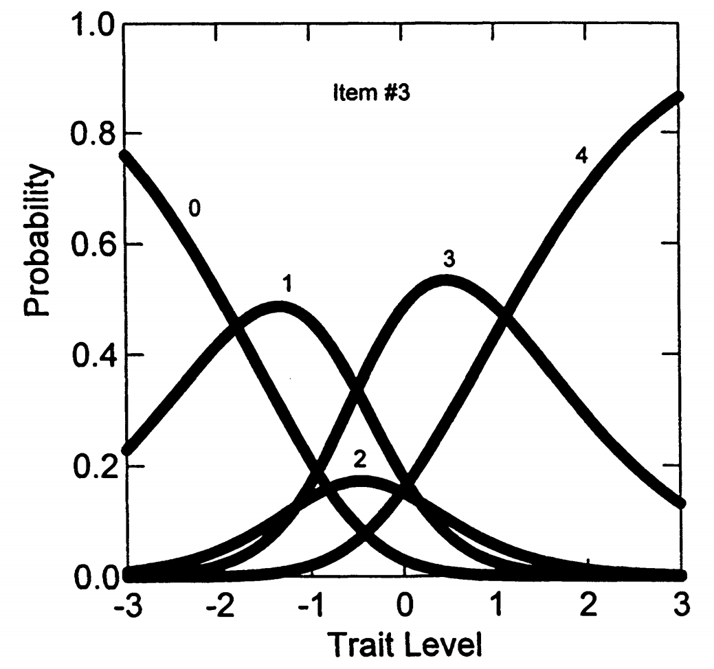
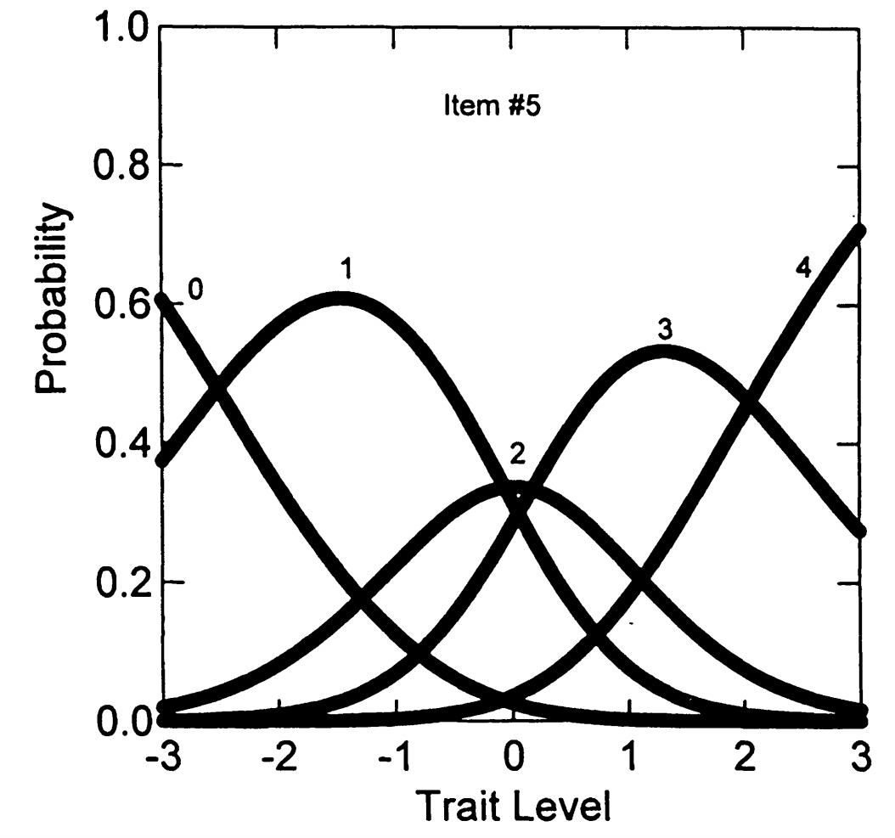

# 6. 部分计分模型（PCM）

## 6.1 开发背景

**开发者：** Masters (1982)

**最初目的：**

- 分析需要多个步骤的测试项目
- 对解题过程中完成的各个步骤给予部分计分很重要

**适用范围：**

- 自然适用于成就测验项目（如中学数学问题），部分正确答案是可能的
- 也非常适合分析态度或人格量表反应（多点量表评分）

## 6.2 PCM与前面模型的关键区别

模型类型

- 与GRM和M-GRM不同，PCM是分类-总计（divide-by-total）模型
- 也称为"直接"IRT模型
- 特定类别中反应的概率直接写为指数的比值除以指数之和
- 不需要像GRM那样的两步过程

**模型性质：**

- PCM可视为第4章1PL模型的扩展
- 具有标准Rasch模型的所有特性，如人和项目参数的可分离性

## 6.3 PCM的形式化表达

**假设：** 项目 \(i\) 的得分为 \(x\) = 0, ..., \(m_i\)，项目有\(K_i = m_i + 1\)个反应类别

**公式 5.6：** 在部分计分模型（Partial Credit Model, PCM）中，被试在项目 \(i\) 上取得得分 \(x \in \{0, 1, \dots, m_i\}\) 的概率由下式给出：

\[
P_{ix}(\theta) = \frac{\exp\left(\sum_{j=1}^{x} (\theta - \delta_{ij}) \right)}{\sum_{r=0}^{m_i} \exp\left( \sum_{j=1}^{r} (\theta - \delta_{ij}) \right)} \tag{5.6}
\]

其中：

- \(\theta\)：被试的潜在能力水平；
- \(\delta_{ij}\)：项目 \(i\) 的第 \(j\) 个**步骤参数**，表示从得分 \(j - 1\) 跃升至 \(j\) 所需的能力；
- \(m_i\)：项目 \(i\) 的最大得分等级。

由于 PCM 中对每个项目仅能估计 \(m_i\) 个自由参数，为确保模型可识别，通常采用如下约定：

\[
\delta_{i0} := 0
\]

这样，最小得分 \(x = 0\) 时有：

\[
\sum_{j=1}^{0} (\theta - \delta_{ij}) := 0
\]

即概率分子为：

\[
\exp(0) = 1
\]

这是一个常规的规范化设定，并非模型推导的结果，而是为了将得分 0 的响应作为基准类别，以简化整个分布的归一化处理。所有其他等级的响应概率都相对于这个基准定义。

## 6.4 公式逐步解释

### 6.4.1 分子部分

\[\exp\left[\sum_{j=0}^{x}(\theta - \delta_{ij})\right]\]

这表示要到达类别 x，需要累积完成从步骤 0 到步骤 x 的所有步骤。

具体展开

- 类别 0：\(\exp[0] = 1\)（什么都不做）
- 类别 1：\(\exp[(\theta - \delta_{i1})]\)（完成步骤1）
- 类别 2：\(\exp[(\theta - \delta_{i1}) + (\theta - \delta_{i2})]\)（完成步骤1和2）
- 类别 3：\(\exp[(\theta - \delta_{i1}) + (\theta - \delta_{i2}) + (\theta - \delta_{i3})]\)（完成步骤1、2、3）

### 6.4.2 分母部分

\[\sum_{r=0}^{m_i}\exp\left[\sum_{j=0}^{r}(\theta - \delta_{ij})\right]\]

这是所有可能类别的分子之和，确保概率总和为1。

## 6.5 参数解释

参数含义

- **\(\theta\) (theta)：** 受试者的特质水平（如神经质程度）
- **\(\delta_{ij}\)：** 类别交叉点参数
  - \(\delta_{i1}\)：从类别0到类别1的步骤难度
  - \(\delta_{i2}\)：从类别1到类别2的步骤难度
  - \(\delta_{i3}\)：从类别2到类别3的步骤难度

关键理解

1. **累积性质：** 要到达类别 x，必须"通过"所有前面的步骤
2. **步骤难度：** \(\delta_{ij}\) 越大，该步骤越难完成，需要更高的特质水平
3. **交叉点含义：** \(\delta_{ij}\) 是两个相邻类别反应曲线在特质量表上相交的点
4. **与GRM的区别：**
   - GRM的 \(\beta_{ij}\) 是阈值概率为0.5的点
   - PCM的 \(\delta_{ij}\) 是类别反应曲线的交叉点

## 6.6 步骤概念的理解

四类态度项目的例子

一个四类评分的态度项目，选项与步骤结构如下：

```text
分数：    0           1           2           3
        ─────────┬──────────┬──────────┬─────────
选项：  完全不同意   有点同意     适度同意     同意
                  │          │          │
               步骤1      步骤2      步骤3
```

受试者必须按顺序完成三个步骤：

1. 在完全不同意和有点之间做决定（步骤1）
2. 在有点和适度之间做决定（步骤2）
3. 在适度和同意之间做决定（步骤3）

## 6.7 PCM在NEO-FFI数据上的参数估计

### 6.7.1 表5.5：PCM估计的估计项目参数和项目拟合统计量

\[
H_0: \text{模型拟合得很好，即没有显著偏离}
\]

| 项目 | δ₁ (SE) | δ₂ (SE) | δ₃ (SE) | δ₄ (SE) | χ² | df | p |
| --- | --- | --- | --- | --- | --- | --- | --- |
| 1 | -1.400 (.23) | -0.279 (.19) | -1.017 (.16) | 0.923 (.14) | 38.78 | 10 | 0.000 |
| 2 | -1.763 (.19) | 0.080 (.14) | 0.622 (.15) | 1.830 (.24) | 11.36 | 11 | 0.413 |
| 3 | -1.800 (.23) | 0.167 (.19) | -1.168 (.17) | 1.117 (.15) | 9.36 | 10 | 0.498 |
| 4 | -2.205 (.25) | -0.003 (.16) | -0.507 (.15) | 1.471 (.17) | 8.82 | 11 | 0.639 |
| 5 | -2.519 (.26) | -0.063 (.14) | 0.170 (.14) | 2.055 (.23) | 9.90 | 10 | 0.450 |
| 6 | -0.686 (.16) | 0.431 (.17) | -0.354 (.17) | 1.376 (.19) | 5.74 | 10 | 0.837 |
| 7 | -2.890 (.32) | -0.105 (.15) | -0.383 (.14) | 1.835 (.19) | 13.86 | 10 | 0.179 |
| 8 | -2.143 (.24) | -0.154 (.15) | 0.011 (.14) | 1.907 (.21) | 29.31 | 10 | 0.001 |
| 9 | -2.132 (.21) | 0.505 (.15) | -0.139 (.16) | 1.636 (.20) | 7.53 | 11 | 0.755 |
| 10 | -2.206 (.24) | 0.065 (.15) | -0.134 (.15) | 1.623 (.19) | 13.35 | 10 | 0.204 |
| 11 | -1.281 (.16) | 0.600 (.15) | 0.264 (.17) | 1.823 (.24) | 22.29 | 11 | 0.022 |
| 12 | -1.738 (.21) | 0.203 (.17) | -0.666 (.16) | 1.166 (.16) | 20.02 | 10 | 0.029 |

**总模型拟合：**
χ² = 190.38, df = 124, p < 0.001
-2 log likelihood = 11,553.011

> 注：δₖ 表示从类别 *k-1* 到 *k* 的步骤参数；标准误（SE）括在括号中。

**使用程序：** PARSCALE (Muraki, 1993)

**参数结构：**

每个项目有4个类别交叉点参数：\(\delta_1\), \(\delta_2\), \(\delta_3\), \(\delta_4\)

### 6.7.2 重要发现1：参数"反转"现象

**与GRM的对比**

**GRM中：** 类别间阈值参数必然有序

**PCM中：** \(\delta_{ij}\)参数不像GRM那样必然有序

**"反转"定义**

当交叉点参数不是有序的，这种现象被称为"反转"(Dodd & Koch, 1987)

**具体例子**

看项目3（"压力下感觉要崩溃"）：

- \(\delta_1 = -1.800\)
- \(\delta_2 = 0.167\)
- \(\delta_3 = -1.168\)
- \(\delta_4 = 1.117\)

正常顺序应该是：\(\delta_1 < \delta_2 < \delta_3 < \delta_4\)

但实际是：\(\delta_1 < \delta_3 < \delta_2 < \delta_4\) （发生了反转）

### 6.7.3 图5.4：项目3的类别反应曲线（有反转）



图5.4显示了项目3的类别反应曲线，展现了反转现象。

**交叉点的相对顺序：**
步骤1、步骤3、步骤2、步骤4

**实际含义：**

- 从得分0→1（步骤1）：相对容易的转变
- 从得分2→3（步骤3）：相对容易的转变
- 从得分1→2（步骤2）：相对困难的转变

**结果：**

PCM很好地解释了项目3类别2很少被选择而类别3相对频繁被选择的现象（参见表5.1的频数分布）

### 6.7.4 图5.5：项目5的类别反应曲线（无反转）



图5.5显示了项目5的类别反应曲线，展现了正常的有序情况。

**对比例子：** 项目5（"感觉紧张焦虑"）

**特点：**

- 具有有序的交叉点参数
- 大多数受试者在类别1、2或3中反应（见表5.1）
- 每个反应选项都有其"最可能的特质水平区域"

### 6.7.5 反转的一般规律

**Andrich (1988)的重要结论**

**有序交叉点：**

- 如果项目内类别交叉点参数是有序的
- 则在潜在特质水平上存在每个反应选项最可能的区域

**反转交叉点：**

- 如果交叉点参数存在"反转"
- 这保证至少有一个类别永远不会是最可能的选择（条件是特质水平）

### 6.7.6 图形解释：反转现象的深入理解


让我们再看一次图5.4, 观察图5.4的关键特征

**1. 类别2的"消失"：**

- 看图中标号为"2"的曲线，它的峰值非常低（大约0.2）
- 在整个特质水平范围内，类别2几乎从来不是最可能的选择
- 这解释了为什么表5.1中项目3的类别2只有43人选择（相对较少）

**2. 奇怪的选择模式：**

- 特质水平-3到-2之间：主要选择类别0
- 特质水平-2到-1之间：主要选择类别1
- 特质水平-1到1之间：直接跳到类别3（跳过了类别2！）
- 特质水平1以上：主要选择类别4

**3. 反转的具体体现：**

由于\(\delta_3 = -1.168 < \delta_2 = 0.167\)，导致：

- 从类别2到类别3比从类别1到类别2更容易
- 人们倾向于"跳过"类别2

**观察图5.5的正常特征**


**1. 每个类别都有"地盘"：**

- 类别0：在\(\theta < -2.5\)时概率最高
- 类别1：在\(\theta \approx -1.5\)时概率最高
- 类别2：在\(\theta \approx 0\)时概率最高
- 类别3：在\(\theta \approx 1.5\)时概率最高
- 类别4：在\(\theta > 2.5\)时概率最高

**2. 平滑过渡：**

- 随着特质水平增加，人们从低类别平滑过渡到高类别
- 没有任何类别被"跳过"

**3. 符合直觉：**

- 神经质程度低的人选择"不同意"
- 神经质程度逐渐增加，选择也逐渐增加
- 这符合我们的心理学直觉

### 6.7.7 实际意义

**对测验编制的启示**

**反转现象说明：**

- 类别2的表述可能有问题
- 受试者可能觉得类别2和类别3之间没有清晰的区分
- 或者类别2的描述不够吸引人

**改进建议：**

- 重新设计类别标签
- 或者合并相似的类别
- 确保每个类别都有其独特的心理意义

**PCM模型的优势：**

PCM能够发现这种问题，而传统的统计方法可能忽略这种细微但重要的测验质量问题。

## 6.8 PCM的项目拟合统计量

我们再来看一次表5.5，重点关注PCM的项目拟合统计量。

\[
H_0: \text{模型拟合得很好，即没有显著偏离}
\]

| 项目 | δ₁ (SE) | δ₂ (SE) | δ₃ (SE) | δ₄ (SE) | χ² | df | p |
| --- | --- | --- | --- | --- | --- | --- | --- |
| 1 | -1.400 (.23) | -0.279 (.19) | -1.017 (.16) | 0.923 (.14) | 38.78 | 10 | 0.000 |
| 2 | -1.763 (.19) | 0.080 (.14) | 0.622 (.15) | 1.830 (.24) | 11.36 | 11 | 0.413 |
| 3 | -1.800 (.23) | 0.167 (.19) | -1.168 (.17) | 1.117 (.15) | 9.36 | 10 | 0.498 |
| 4 | -2.205 (.25) | -0.003 (.16) | -0.507 (.15) | 1.471 (.17) | 8.82 | 11 | 0.639 |
| 5 | -2.519 (.26) | -0.063 (.14) | 0.170 (.14) | 2.055 (.23) | 9.90 | 10 | 0.450 |
| 6 | -0.686 (.16) | 0.431 (.17) | -0.354 (.17) | 1.376 (.19) | 5.74 | 10 | 0.837 |
| 7 | -2.890 (.32) | -0.105 (.15) | -0.383 (.14) | 1.835 (.19) | 13.86 | 10 | 0.179 |
| 8 | -2.143 (.24) | -0.154 (.15) | 0.011 (.14) | 1.907 (.21) | 29.31 | 10 | 0.001 |
| 9 | -2.132 (.21) | 0.505 (.15) | -0.139 (.16) | 1.636 (.20) | 7.53 | 11 | 0.755 |
| 10 | -2.206 (.24) | 0.065 (.15) | -0.134 (.15) | 1.623 (.19) | 13.35 | 10 | 0.204 |
| 11 | -1.281 (.16) | 0.600 (.15) | 0.264 (.17) | 1.823 (.24) | 22.29 | 11 | 0.022 |
| 12 | -1.738 (.21) | 0.203 (.17) | -0.666 (.16) | 1.166 (.16) | 20.02 | 10 | 0.029 |

**总模型拟合统计：**

- χ² = 190.38，df = 124，p < 0.001
- -2 log likelihood = 11,553.011

> 注：δₖ 表示从类别 *k–1* 到 *k* 的步骤阈值参数。括号内为标准误（Standard Error）。

### 6.8.1 表5.5：拟合统计量结果

**右侧列显示：** PARSCALE输出的似然比卡方拟合统计量（详见第9章）

**结果汇总：**

- 12个项目中有4个未能被估计的PCM项目参数很好地表示
- 这些项目的p < 0.05，表明拟合不佳

### 6.8.2 整体拟合评估

**项目间可加性：**

- 卡方统计量在项目间是可加的
- 总卡方值：190.39（124自由度）
- p值 < 0.001，表明整体模型拟合不佳

**对数似然值：**

- -2倍对数似然值 = 11,553.011
- 虽然该统计量不能单独用于评估模型拟合
- 但在比较PCM与下一节的广义部分计分模型时有用

### 6.8.3 预期中的结果

**为什么拟合不佳？**

还记得我们之前在GRM分析中发现的吗？

- 不同项目的斜率参数变异很大（表5.3）
- 项目9：\(\alpha = 2.09\)
- 项目8：\(\alpha = 0.65\)

**PCM的限制：**

- PCM假设所有项目具有相同的斜率（都等于1.0）
- 但实际数据显示项目斜率差异很大
- 因此PCM无法很好拟合这个数据
