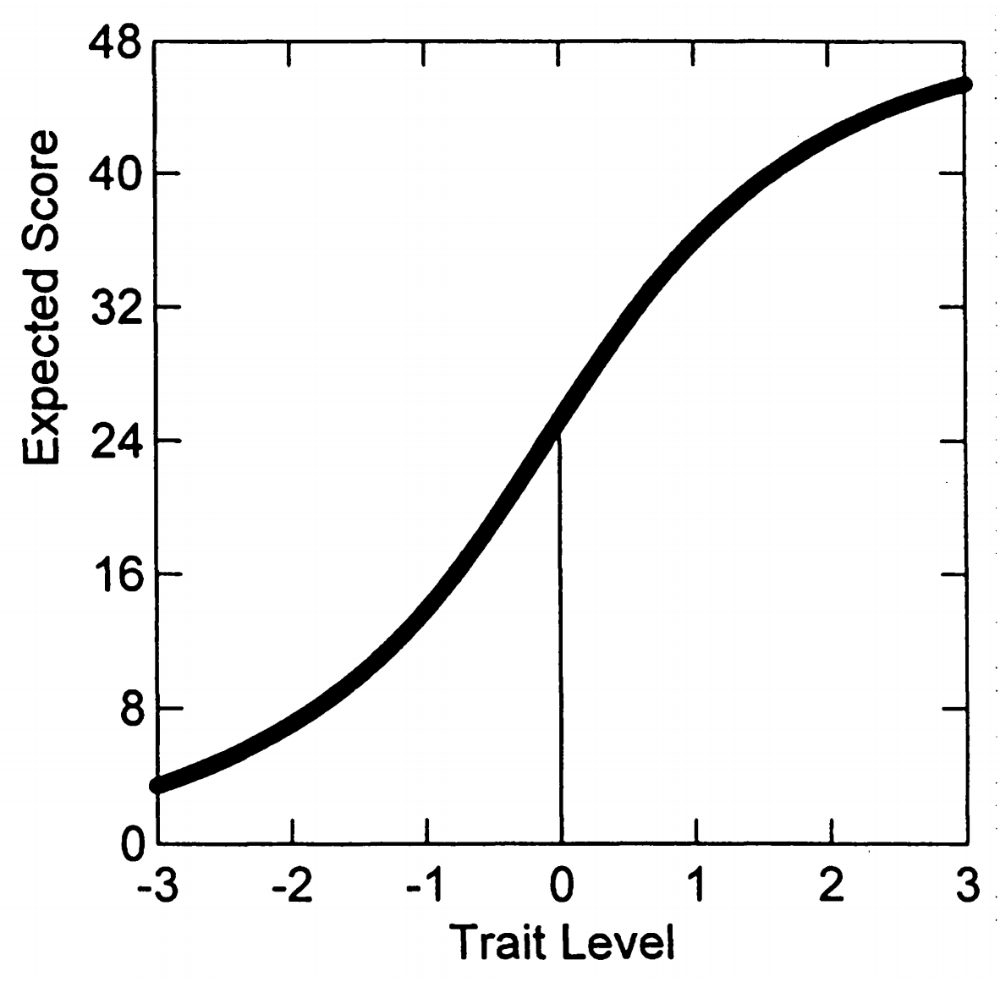

# 8. 概念补充4：期望项目反应（真分数曲线）

## 8.1 公式5.7：期望得分计算

\[
E(X) = \sum_{x=0}^{m_i} xP_x(\theta) \tag{5.7}
\]

**含义：**

- 显示受试者的预期项目反应如何随特质水平变化
- 有时称为项目"真分数"

## 8.2 PCM的特殊性质

**相同斜率的结果：**

- 由于PCM是Rasch模型，所有项目具有相同斜率（1.0）
- 这些真分数曲线在项目间非常相似
- 项目真分数曲线在项目间是可加的

## 8.3 图5.6：神经质量表的真分数曲线

图5.6显示了12个神经质真分数曲线的汇总。

**显示内容：**

- 12个神经质真分数曲线的汇总
- 预期原始总分如何随特质水平变化

**重要观察：**

- 特质变量接近零的受试者预计得分约为24个原始分数点
- 曲线显示观察分数与特质水平之间的非线性关系
- 应与假设线性关系的CTT视角形成对比

## 8.4 测量工具质量评估

检查这样的真分数曲线是研究测量工具质量的一种方式，用于评估潜在特质变量的测量效果。

## 8.5 为什么PCM中真分数曲线可以直接叠加？

### 8.5.1 核心原因：相同斜率

**PCM的基本假设：**

- 所有项目的斜率参数都等于1.0
- 这是Rasch模型家族的特征

**结果：**

当所有项目斜率相同时，各项目的真分数曲线具有相似的形状，只是在特质量表上的位置不同。

### 8.5.2 用简单例子说明

假设有3个项目，都是斜率=1.0：

- 项目A的真分数曲线：在\(\theta=-1\)处得分期望为2
- 项目B的真分数曲线：在\(\theta=-1\)处得分期望为1.5
- 项目C的真分数曲线：在\(\theta=-1\)处得分期望为1.8

总的期望得分 = 2 + 1.5 + 1.8 = 5.3

### 8.5.3 如果斜率不同会怎样？

假设项目有不同斜率：

- 项目A：斜率=2.0（很陡峭）
- 项目B：斜率=0.5（很平缓）

**问题：**

- 不同斜率的曲线形状差异很大
- 在不同θ水平上的贡献模式不一样
- 简单相加不能准确反映总的测量精度

### 8.5.4 实际意义

**PCM/Rasch模型的优势：**

- 由于斜率相同，可以简单地将各项目的信息"叠加"
- 总分是各项目贡献的直接累加
- 这就是为什么"原始总分是充分统计量"

**有不同斜率的模型（如GRM）：**

- 各项目在不同θ水平上的贡献权重不同
- 不能简单叠加
- 需要更复杂的权重组合
