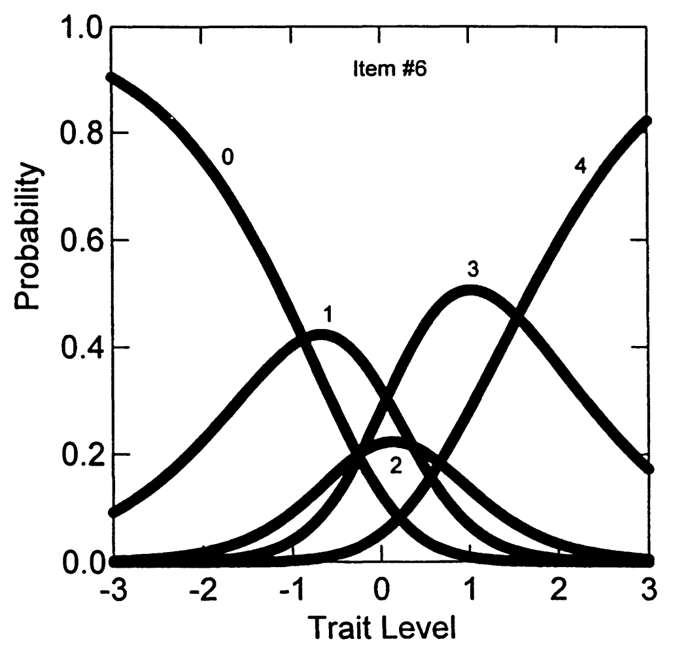
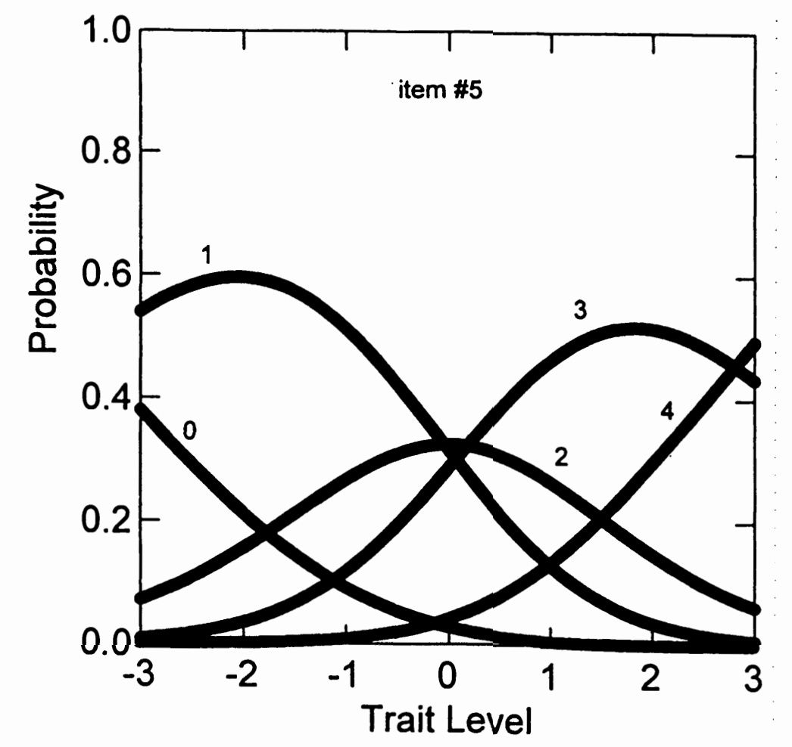
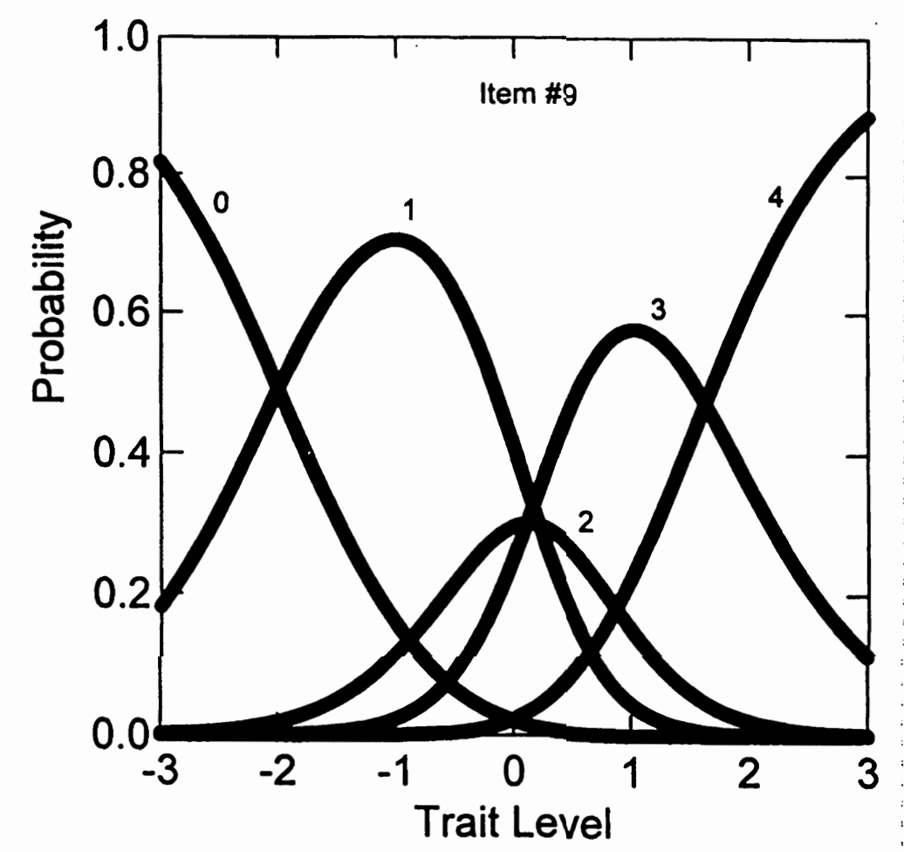

# 9. 广义部分计分模型（G-PCM）

## 9.1 开发背景

**开发者：** Muraki (1992; 1993)

**核心改进：**

- 是PCM的泛化
- 允许量表内的项目在斜率参数上有所不同
- 解决了PCM所有项目斜率必须相等的限制

**估计程序：** PARSCALE (Muraki, 1993)

## 9.2 G-PCM的表达

**公式5.8：** 在PCM基础上加入斜率参数

\[
P_x(\theta) = \frac{\exp\left[\sum_{j=0}^{x}\alpha_i(\theta - \delta_{ij})\right]}{\sum_{r=0}^{m_i}\exp\left[\sum_{j=0}^{r}\alpha_i(\theta - \delta_{ij})\right]} \tag{5.8}
\]

其中：\(\sum_{j=0}^{0}\alpha_i(\theta - \delta_{ij}) = 0\)

## 9.3 参数解释

类别交叉点参数 \(\delta_{ij}\)

- 解释与PCM相同
- 作为两个相邻类别反应曲线的交叉点
- 是一个类别反应变得比前一个反应相对更可能的点

斜率参数 \(\alpha_i\) 的特殊解释

- **注意：** 与二分IRT模型中的解释方式不同！
- 在多项模型中，项目区分度取决于斜率参数与类别交叉点分布范围的组合

## 9.4 斜率参数在G-PCM中的作用

**Muraki (1992, p. 162)的描述：**
斜率参数"表示当θ水平变化时，类别反应在项目间变化的程度"

**具体影响：**

- \(\alpha_i < 1.0\) 时：相对于PCM，CRCs变得平坦
- \(\alpha_i > 1.0\) 时：CRCs相对于PCM变得更加尖峰

## 9.5 分析设置说明

重要注意

在PARSCALE分析中，12个NEO-FFI神经质项目各自形成自己的"块"（详见第13章）

**结果：**

- 为每个项目估计了一组单独的类别交叉点参数
- 这与之前PCM的设置不同

## 9.6 G-PCM在NEO-FFI数据上的参数估计

### 9.6.1 表5.6：G-PCM估计的项目参数

| 项目 | α (斜率) | δ1 | δ2 | δ3 | δ4 | χ² | DF | p 值 |
| --- | --- | --- | --- | --- | --- | --- | --- | --- |
| 1 | 0.261 (.03) | -2.937 (.87) | 0.121 (.74) | -3.857 (.63) | 2.328 (.54) | 36.29 | 13 | 0.001 |
| 2 | 0.877 (.07) | -2.130 (.22) | 0.070 (.16) | 0.755 (.18) | 2.197 (.28) | 8.71 | 13 | 0.795 |
| 3 | 0.797 (.06) | -2.295 (.30) | 0.197 (.24) | -1.462 (.22) | 1.399 (.19) | 9.29 | 14 | 0.813 |
| 4 | 0.735 (.06) | -2.923 (.34) | 0.028 (.22) | -0.703 (.20) | 1.919 (.23) | 3.02 | 13 | 0.998 |
| 5 | 0.683 (.05) | -3.513 (.38) | -0.041 (.20) | 0.182 (.21) | 2.808 (.33) | 9.29 | 12 | 0.678 |
| 6 | 1.073 (.09) | -0.873 (.15) | 0.358 (.16) | -0.226 (.16) | 1.547 (.18) | 8.71 | 11 | 0.650 |
| 7 | 0.583 (.05) | -4.493 (.55) | -0.004 (.26) | -0.732 (.24) | 2.792 (.33) | 16.93 | 11 | 0.109 |
| 8 | 0.345 (.03) | -4.815 (.68) | 0.012 (.42) | -0.362 (.41) | 4.256 (.60) | 11.58 | 14 | 0.640 |
| 9 | 1.499 (.11) | -1.997 (.15) | 0.210 (.10) | 0.103 (.11) | 1.627 (.14) | 4.93 | 11 | 0.934 |
| 10 | 0.631 (.05) | -3.215 (.37) | 0.195 (.24) | -0.292 (.23) | 2.299 (.30) | 15.07 | 13 | 0.302 |
| 11 | 1.059 (.09) | -1.440 (.16) | 0.551 (.15) | 0.397 (.16) | 2.039 (.23) | 22.12 | 11 | 0.023 |
| 12 | 0.565 (.05) | -2.628 (.37) | 0.534 (.30) | -1.241 (.29) | 1.720 (.28) | 9.65 | 13 | 0.723 |

**总模型拟合：**

- 总卡方统计量：155.64
- 总自由度：149
- 总拟合 p 值：0.338
- -2 log likelihood = 11,384.921

> 注：表中括号内为标准误（Standard Error）。

**参数结构：**

每个项目显示：

- α：斜率参数
- δ₁, δ₂, δ₃, δ₄：四个类别交叉点参数
- 卡方拟合统计量、自由度和p值

### 9.6.2 重要发现1：斜率参数的巨大变异

**具体数值：**

- 项目1：α = 0.261（最小）
- 项目8：α = 0.345
- 项目9：α = 1.499（最大）
- 项目6：α = 1.073

**变异范围：**

从0.261到1.499，差异接近6倍！这验证了我们之前的预期。

### 9.6.3 重要发现2：与GRM结果的一致性

**斜率排序的一致性解释**

**回顾之前的GRM结果（表5.3）：**

GRM中的斜率参数：

- 项目9：α = 2.09（最高）
- 项目6：α = 1.84
- 项目2：α = 1.42
- 项目1：α = 0.70
- 项目8：α = 0.65（最低）

GRM中的斜率排序（从高到低）：

项目9 > 项目6 > 项目2 > ... > 项目1 > 项目8

**现在看G-PCM的结果（表5.6）：**

G-PCM中的斜率参数：

- 项目9：α = 1.499（最高）
- 项目6：α = 1.073
- 项目2：α = 0.877
- 项目1：α = 0.261
- 项目8：α = 0.345（最低）

G-PCM中的斜率排序（从高到低）：

项目9 > 项目6 > 项目2 > ... > 项目8 > 项目1

关键发现：排序几乎相同！

**一致性体现：**

- 在GRM中斜率最高的项目（项目9），在G-PCM中也是最高
- 在GRM中斜率最低的项目（项目8），在G-PCM中也是最低
- 中间项目的相对排序也基本一致

**为什么数值不同但排序相同？**

**1. 不同的建模框架：**

- GRM是"间接"模型（两步过程）
- G-PCM是"直接"模型（一步过程）
- 表达方式不同，所以参数数值不同

**2. 但测量的是同一个概念：**

- 两个模型都在测量"项目区分度"
- 区分度高的项目在两个模型中都表现为高斜率
- 区分度低的项目在两个模型中都表现为低斜率

**实际意义：**

- 模型验证：一致的排序证明两个模型都在合理地识别项目特性
- 实用价值：无论用哪个模型，我们都会得出相同结论

### 9.6.4 图形例子：不同斜率的影响

选择三个典型项目进行说明：

图5.7显示了项目6的类别反应曲线，斜率估计≈1.0，可作为与其他曲线比较的基线。

图5.8显示了项目5的类别反应曲线，具有相对较低的斜率值。曲线很好地捕捉该项目大多数反应集中在类别1和3的事实，展示了低斜率如何产生更平坦的曲线。

图5.9显示了项目9的类别反应曲线，具有大斜率值。相对于项目5，这些曲线更加尖峰，展示了高斜率如何产生更陡峭、更有区分度的曲线。

### 9.6.5 斜率参数的视觉效果总结

**低斜率(如项目5)：**

- 曲线平坦
- 在较宽的θ范围内提供信息
- 区分度相对较低

**高斜率(如项目9)：**

- 曲线尖峰
- 在较窄的θ范围内提供强烈信息
- 区分度相对较高

**中等斜率(如项目6)：**

- 介于两者之间的平衡

## 9.7 G-PCM的拟合统计量评估

### 9.7.1 表5.6：拟合统计量结果

| 项目 | α (斜率) | δ1 | δ2 | δ3 | δ4 | χ² | DF | p 值 |
| --- | --- | --- | --- | --- | --- | --- | --- | --- |
| 1 | 0.261 (.03) | -2.937 (.87) | 0.121 (.74) | -3.857 (.63) | 2.328 (.54) | 36.29 | 13 | 0.001 |
| 2 | 0.877 (.07) | -2.130 (.22) | 0.070 (.16) | 0.755 (.18) | 2.197 (.28) | 8.71 | 13 | 0.795 |
| 3 | 0.797 (.06) | -2.295 (.30) | 0.197 (.24) | -1.462 (.22) | 1.399 (.19) | 9.29 | 14 | 0.813 |
| 4 | 0.735 (.06) | -2.923 (.34) | 0.028 (.22) | -0.703 (.20) | 1.919 (.23) | 3.02 | 13 | 0.998 |
| 5 | 0.683 (.05) | -3.513 (.38) | -0.041 (.20) | 0.182 (.21) | 2.808 (.33) | 9.29 | 12 | 0.678 |
| 6 | 1.073 (.09) | -0.873 (.15) | 0.358 (.16) | -0.226 (.16) | 1.547 (.18) | 8.71 | 11 | 0.650 |
| 7 | 0.583 (.05) | -4.493 (.55) | -0.004 (.26) | -0.732 (.24) | 2.792 (.33) | 16.93 | 11 | 0.109 |
| 8 | 0.345 (.03) | -4.815 (.68) | 0.012 (.42) | -0.362 (.41) | 4.256 (.60) | 11.58 | 14 | 0.640 |
| 9 | 1.499 (.11) | -1.997 (.15) | 0.210 (.10) | 0.103 (.11) | 1.627 (.14) | 4.93 | 11 | 0.934 |
| 10 | 0.631 (.05) | -3.215 (.37) | 0.195 (.24) | -0.292 (.23) | 2.299 (.30) | 15.07 | 13 | 0.302 |
| 11 | 1.059 (.09) | -1.440 (.16) | 0.551 (.15) | 0.397 (.16) | 2.039 (.23) | 22.12 | 11 | 0.023 |
| 12 | 0.565 (.05) | -2.628 (.37) | 0.534 (.30) | -1.241 (.29) | 1.720 (.28) | 9.65 | 13 | 0.723 |

**总模型拟合：**

- 总卡方统计量：155.64
- 总自由度：149
- 总拟合 p 值：0.338
- -2 log likelihood = 11,384.921

> 注：表中括号内为标准误（Standard Error）。

**右侧列显示：** PARSCALE输出的卡方拟合统计量

**结果汇总：**

- 12个项目中只有2个未能被估计的G-PCM项目参数很好地表示
- 这与PCM的4个不拟合项目相比，有明显改善

### 9.7.2 整体拟合评估

**总体拟合统计量：**

- 总卡方值：155.64（149自由度）
- p = 0.33，表明整体拟合是充分的
- 这是一个非显著的结果，说明模型拟合良好

**对数似然值：**

- -2倍对数似然值 = 11,384.921

### 9.7.3 模型比较：PCM vs G-PCM

**统计比较：**

- PCM的-2 log likelihood = 11,553.011
- G-PCM的-2 log likelihood = 11,384.921
- 卡方变化 = 11,553.011 - 11,384.921 = 168.09
- 自由度变化 = 12（每个项目增加1个斜率参数）

**显著性检验：**

- 卡方变化 = 168.08（12自由度）
- p < 0.001
- 这意味着G-PCM相对于PCM是显著改进

### 9.7.4 结果解释

**G-PCM的优势得到验证：**

1. **更好的项目水平拟合**：从4个不拟合项目降到2个
2. **更好的整体拟合**：总体p值从<0.001提升到0.33
3. **统计显著的改进**：似然比检验高度显著

**为什么G-PCM表现更好？**

- 允许项目有不同的斜率参数
- 更好地反映了实际数据中项目区分度的差异
- 没有PCM"所有项目斜率相等"的不现实约束

### 9.7.5 实际启示

模型选择建议

- 当数据显示项目区分度差异较大时，应选择G-PCM而非PCM
- 额外的参数（斜率）是值得的，因为显著改善了拟合

测验开发启示

- NEO-FFI的不同项目确实具有不同的区分度
- 这种差异是真实存在的，不应被忽略
