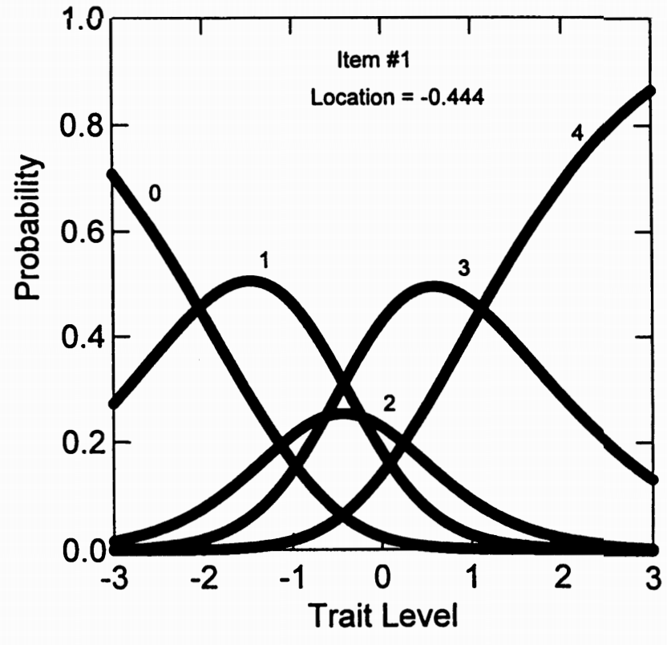
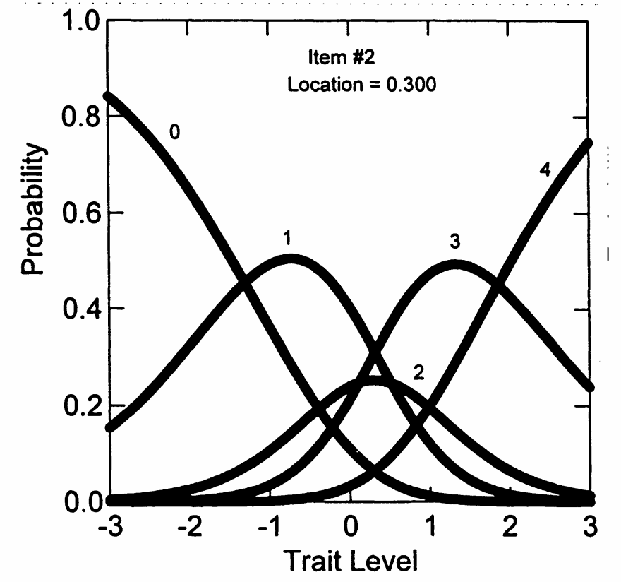

# 11. 评定量表模型（RSM）

## 11.1 定义

评定量表模型（Rating Scale Model, RSM）是由 Andrich（1978a, 1978b）提出的一种多分类项目反应模型，是部分计分模型（Partial Credit Model, PCM）的一种特化形式。RSM 的主要特点是：**所有项目共用相同的反应类别结构（即阈值间距相等），但允许每个项目具有不同的位置参数（difficulty shift）**。该模型适用于评分标准固定、使用统一量表的测验情境，如态度测验、心理量表等。

### 11.1.1 参数分解

在RSM中，PCM的步骤难度被分解为两个成分：

\[\delta_{ij} = \lambda_i + \delta_j\]

其中：

- \(\lambda_i\)：项目在潜在量表上的位置
- \(\delta_j\)：类别交叉点参数

### 11.1.2 RSM 的形式(Dodd (1990)的表示)为：

\[
P_{ix}(\theta) = \frac{\exp\left[\sum_{j=0}^{x}(\theta - \lambda_i - \delta_j)\right]}{\sum_{k=0}^{m} \exp\left[\sum_{j=0}^{k}(\theta - \lambda_i - \delta_j)\right]}
\]

其中：

- \(P_{ix}(\theta)\)：受试者在第 \(i\) 个项目上获得第 \(x\) 类别得分的概率
- \(\theta\)：受试者的潜在能力
- \(\lambda_i\)：第 \(i\) 个项目的位置参数（整体难度）
- \(\delta_j\)：第 \(j\) 个类别交叉点（所有项目共享）

### 11.1.3 替代等效形式

\[P_x(\theta) = \frac{\exp[\psi_x + x(\theta - \lambda_i)]}{\sum_{r=0}^{m_i}\exp[\psi_r + r(\theta - \lambda_i)]} \tag{5.10}\]

其中：

- \(\psi_x = -\sum_{j=0}^{x}\delta_j\)
- \(\psi_0 = \psi_m = 0\)

## 11.2 重要的命名说明

术语混淆警告

“评定量表模型”这一术语可能会引起混淆，原因包括：

- 存在多个版本的 RSM，模型结构和假设各不相同
- 不同文献中的命名与表述方式不一致
- 本节介绍的是 **Andrich（1978）版本** 的 RSM，这是在实际软件实现中最常用的形式

## 11.3 什么是评定量表？

**定义：**
评定量表（Rating Scale）是所有项目都使用完全相同的反应选项和相同的类别标签的量表。

典型的评定量表

请对以下陈述表示您的同意程度：

- 1 = 完全不同意
- 2 = 不同意
- 3 = 中立
- 4 = 同意
- 5 = 完全同意

项目1：我喜欢参加聚会 1 2 3 4 5

项目2：我经常感到焦虑 1 2 3 4 5

项目3：我做事有条理 1 2 3 4 5

## 11.4 RSM 与 PCM 的关系

- RSM 可以视为 PCM 的一个简化形式（Masters & Wright, 1984）
- 二者都采用分数为基础的模型结构
- 关键区别在于：PCM 每个项目有独立的类别阈值，而 RSM 所有项目共享统一阈值结构，只调整整体位置

## 11.5 RSM 的关键特征

对于具有统一反应格式（例如都是 0–4 分）的项目，RSM 假定：

- 每个项目用一个位置参数 \(\lambda_i\) 表示整体难度
- 所有项目共享一组类别交叉点参数 \(\delta_1, \delta_2, \dots, \delta_m\)
- 类别阈值间距在所有项目间相同，模型结构更加紧凑

这种结构尤其适用于使用标准化评分表的量表，如：

- 心理健康测量量表
- 学习动机或态度量表
- 五级评分（Likert 量表）项目组

## 11.6 RSM 与 PCM 的核心区别（示例说明）

假设我们有三个评分为 0–4 的项目，测量同一潜在特质（如“神经质”）。

### 11.6.1 PCM 模型中：

每个项目都有自己的阈值：

- 项目1："我经常焦虑"
  \(\delta_{11} = -1.0,\ \delta_{12} = 0.2,\ \delta_{13} = 1.1,\ \delta_{14} = 2.0\)
- 项目2："我容易紧张"
  \(\delta_{21} = -0.5,\ \delta_{22} = 0.8,\ \delta_{23} = 1.5,\ \delta_{24} = 2.3\)
- 项目3："我很担心"
  \(\delta_{31} = -1.2,\ \delta_{32} = -0.1,\ \delta_{33} = 0.9,\ \delta_{34} = 1.8\)

此时，每个项目的类别间隔不同，模型更灵活但参数更多。

### 11.6.2 RSM 模型中：

所有项目共用相同类别结构，但允许整体位置差异：

- 公共类别阈值：
  \(\delta_1 = -1.0,\ \delta_2 = 0.1,\ \delta_3 = 1.0,\ \delta_4 = 2.0\)
- 项目位置参数：
  \(\lambda_1 = 0.2,\ \lambda_2 = 0.5,\ \lambda_3 = -0.1\)

则每个项目的实际阈值为：
\(\lambda_i + \delta_j\)，即通过整体平移获得项目特性。

核心对比总结

PCM：每个项目的类别间距（step difficulties）**可变**
RSM：所有项目的类别间距**相同**，只允许整体位置偏移（项目难度）

## 11.7 RSM的适用条件和限制

**基本要求：**

- RSM假设整个项目集使用固定的评定点集
- 如果量表内项目具有不同格式，RSM不是适当选择

不适合用RSM的情况

混合格式的例子：

- 项目1："你多久感到焦虑？"（1=从不 到 5=总是）
- 项目2："你的年龄组？"（1=18-25岁 到 4=46岁以上）
- 项目3："你同意这个说法吗？"（1=完全不同意 到 4=完全同意）

这不是评定量表，因为每个项目的类别含义不同！

## 11.8 总和为0的识别约束

为什么需要这个约束？

如果没有约束，参数估计会有无穷多个解。

举例：如果真实的类别交叉点是：

\(\delta_1 = -1\), \(\delta_2 = 0\), \(\delta_3 = 1\), \(\delta_4 = 2\)

我们可以给所有参数都加上常数C，同时给所有\(\lambda_i\)都减去C，结果完全一样！

"总和为0"约束固定了参数的"零点"，确保参数估计的唯一性。

## 11.9 RSM在NEO-FFI数据上的应用

### 11.9.1 分析程序

**使用程序：** RUMM (Sheridan, Andrich, & Luo, 1996)

### 11.9.2 表5.7：RSM估计结果

| 项目 | 位置 (SE) | 项目拟合 | CHI | DF | p |
| --- | --- | --- | --- | --- | --- |
| 1 | -0.44 (0.05) | 7.492 | 9.199 | 1 | 0.031 |
| 2 | 0.30 (0.05) | -1.943 | 2.492 | 1 | 0.648 |
| 3 | -0.39 (0.05) | 1.008 | 4.470 | 1 | 0.329 |
| 4 | -0.16 (0.05) | -0.934 | 0.960 | 1 | 0.913 |
| 5 | 0.08 (0.05) | -2.356 | 5.728 | 1 | 0.200 |
| 6 | 0.27 (0.05) | 1.631 | 28.309 | 1 | 0.000 |
| 7 | -0.14 (0.05) | -0.695 | 6.234 | 1 | 0.160 |
| 8 | 0.21 (0.05) | 3.838 | 20.313 | 1 | 0.000 |
| 9 | 0.15 (0.05) | -3.502 | 7.524 | 1 | 0.087 |
| 10 | 0.00 (0.05) | 0.010 | 1.318 | 1 | 0.855 |
| 11 | 0.47 (0.05) | -1.107 | 11.022 | 1 | 0.000 |
| 12 | -0.17 (0.05) | 3.800 | 1.392 | 1 | 0.841 |

**注：** RSM 公共类别交叉点为：-1.600，0.224，-0.184，1.560。

**位置参数(\(\lambda_i\))的解释**

**第一列显示：** 各项目的RSM位置参数

**重要发现：**
位置参数表示项目的"难度"，且排序与表5.1所示的项目平均值完全对应

**具体对应关系：**

- 项目2：小平均值(1.70) → 高位置(\(\lambda_2 = 0.30\))
- 含义：很少受试者在该项目上得分高
- 项目1：大平均值(2.52) → 低位置(\(\lambda_1 = -0.44\))
- 含义：很少受试者在该项目上得分低

**共同类别交叉点参数**

**表5.7底部显示：** 四个估计的类别交叉点(\(\delta_j\))参数

- \(\delta_1 = -1.600\)
- \(\delta_2 = 0.224\)
- \(\delta_3 = -0.184\)
- \(\delta_4 = 1.560\)

**特性：**

- 这些值在所有12个项目间保持不变
- 总和为0（程序强加的量表识别约束）

### 11.9.3 位置参数的效果

图5.10显示了项目1的类别反应曲线。

图5.11显示了项目2的类别反应曲线。

**关键观察：**

- 这些CRCs具有相同的一般形状
- 但项目2的曲线相对于项目1向右移动

**\(\lambda_i\)参数的作用：**

- 表示相对于类别交叉点的特定项目的平均难度
- 项目2的\(\lambda_2 = 0.30\) > 项目1的\(\lambda_1 = -0.44\)
- 所以项目2更"难"（需要更高神经质水平才能得高分）

### 11.9.4 RSM的拟合评估

**RUMM程序的拟合统计：**

- 项目拟合值
- 1自由度卡方值
- 相关概率

**结果：**

- 12个项目中约有一半（5个）不符合该模型（p < 0.05）
- 这表明RSM在项目水平上产生相当差的拟合

预期中的差拟合

**为什么拟合不好？**

- G-PCM和GRM分析表明项目在斜率上存在差异
- NEO-FFI项目可能不构成RSM所假设的评定量表
- RSM假设所有项目具有相同的区分度（斜率），但实际数据显示项目区分度差异很大
