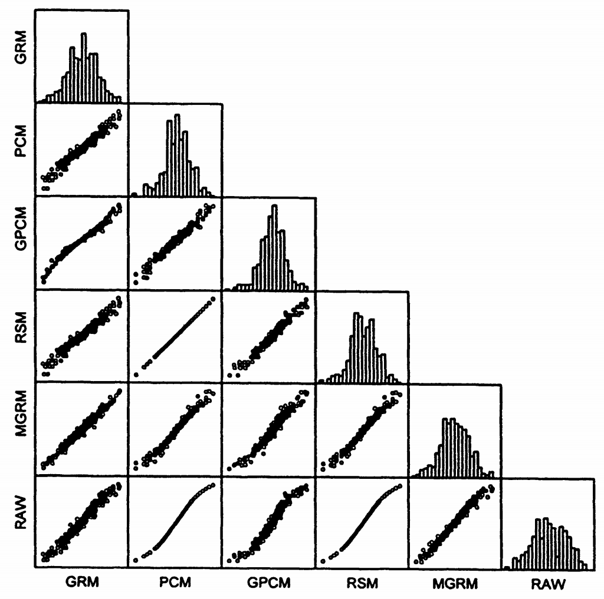

# 12. 比较六种得分方法

**包含的得分：**

- RAW：原始量表得分
- GRM：等级反应模型得分
- M-GRM：修正等级反应模型得分
- PCM：部分计分模型得分
- G-PCM：广义部分计分模型得分
- RSM：评定量表模型得分

**评分方法说明：**

- 大多数使用最大似然估计（ML）
- M-GRM使用EAP得分
- GRM使用MAP得分
- 后两种方法主要在使用先验方面与ML不同（详见第7章）

## 12.1 表5.8：描述性统计量

**重要发现：**

- 这些值在IRT模型间存在差异，表明使用了不同的度量
- 但所有潜在特质得分高度相关（r > 0.97）
- 每个又与原始分数高度相关
- 最低相关为r = 0.97（原始分数和G-PCM之间）

## 12.2 可视化结果

图5.12显示了各种多项模型下特质水平估计的散点图矩阵，每个散点图显示两种得分方法之间的关系。

**视觉观察：**

- 所有散点图都显示强线性关系
- 验证了前面提到的高相关性（r > 0.97）

## 12.3 重要注意事项

PCM和RSM的特殊性质

在PCM和RSM中，特质水平估计是原始分数的非线性变换。

即：原始分数是特质水平的充分统计量。
这一性质在包含斜率参数的其他模型（GRM、G-PCM、M-GRM）中不成立。

## 12.4 重要警告：不要误解结果

常见误解

**错误结论：** "既然所有方法的结果高度相关，那么IRT建模不比简单计算原始量表分数更好"

**为什么这个结论是错误的？**

- 对于受试者相对排序：这个结论可能是正确的
- 但IRT提供的远不止排序

## 12.5 IRT模型的众多心理测量优势

**a) 连接（等同化）测验量表：** 可以将不同测验放在同一量尺上比较

**b) 探索差异项目功能（DIF）：** 发现对不同群体有偏向的项目

**c) 计算Person Fit统计量：** 识别反应模式异常的受试者

**d) 电脑化自适应测验：** 根据受试者能力调整题目难度

**e) 标准误随特质水平变化：** 在不同能力水平上提供不同精度的测量

**f) 项目参数的实质意义：** 项目难度、区分度等有明确心理测量解释

## 12.6 结论

虽然在这个特定数据集上，不同方法的受试者排序很相似，但IRT建模的价值远超过简单的排序。IRT提供了丰富的心理测量信息和灵活的应用可能性，这些是原始分数无法提供的。
