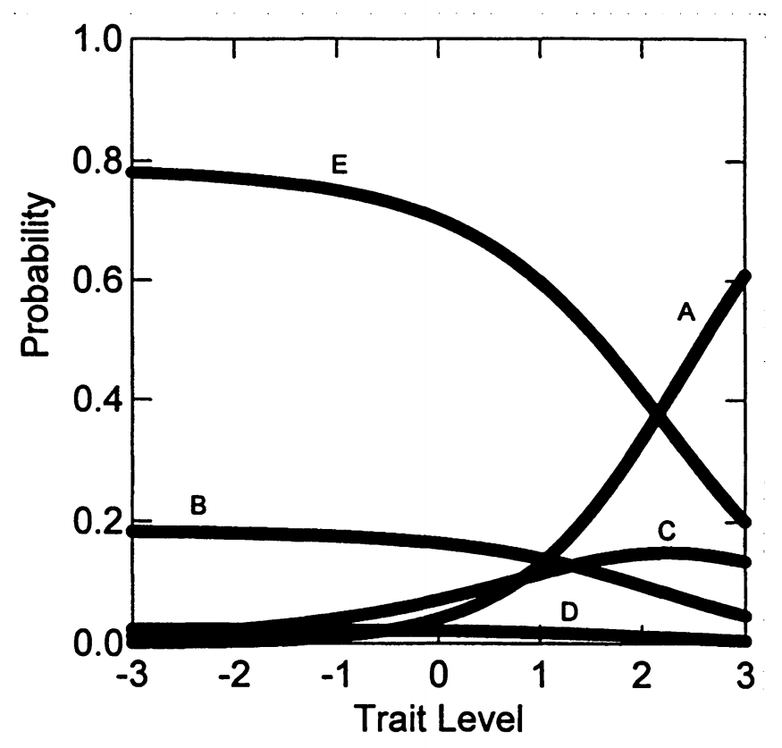

# 13. 名义反应模型（NRM）

## 13.1 开发背景

**开发者：** Bock (1972)

**模型特性：**

- 通用的分类-总计（divide-by-total）或直接IRT模型
- 可用于表征项目反应，当反应不必沿特质连续体有序时

**重要地位：**

所有上述分类-总计或直接模型都是名义反应模型的特例（Thissen & Steinberg, 1986）

## 13.2 开发动机和应用

**最初动机：**

- 允许多项选择测验中的干扰项通过特征线进行表征
- 处理错误选项也能提供有用信息的情况

**广泛应用：**

- 可用于任何具有多个反应选项的项目
- 包括人格和态度评估中的应用（见Thissen, 1993）

## 13.3 NRM的表达

**公式5.11：** 受试者在类别x中反应的概率

\[
P_{ix}(\theta) = \frac{\exp(\alpha_{ix} \theta + c_{ix})}{\sum_{x=0}^{m_i}\exp(\alpha_{ix} \theta + c_{ix})} \tag{5.11}
\]

## 13.4 参数解释

每个反应类别需要两个参数：

参数含义

**\(\alpha_{ix}\)参数：** 与类别x的特征线的斜率（即区分度）相关

**\(c_{ix}\)参数：** 类别x的截距参数

## 13.5 模型识别约束

为了识别模型（即估计参数），必须设置约束：

**方法1：** \(\sum \alpha_{ix} = \sum c_{ix} = 0\)

**方法2：** 将最低反应类别的参数设为 \(\alpha_{i1} = c_{i1} = 0\)

## 13.6 NRM的实际应用例子

### 13.6.1 Thissen (1993)的贪食症研究

**问题项目：** "我喜欢吃："

**选项：**

- (a) 独自在家时
- (b) 与他人在家时
- (c) 在公共餐厅
- (d) 在朋友家
- (e) 无所谓

**为什么用NRM？** 这些选项没有明显的"从低到高"的顺序，不是有序类别。

**参数估计结果：**

斜率参数(α)：

- \(\alpha_a = -0.39\)（独自在家）
- \(\alpha_b = -0.39\)（与他人在家）
- \(\alpha_c = 0.24\)（公共餐厅）
- \(\alpha_d = -0.39\)（朋友家）
- \(\alpha_e = 0.93\)（无所谓）

图5.13显示了贪食症项目的NRM反应概率曲线。

重要发现

只有反应选项(a)"独自在家"与贪食症风险增加相关。
高贪食症风险的人更可能选择"独自在家时"吃东西。
这符合贪食症的临床特征（避免在他人面前进食）。
