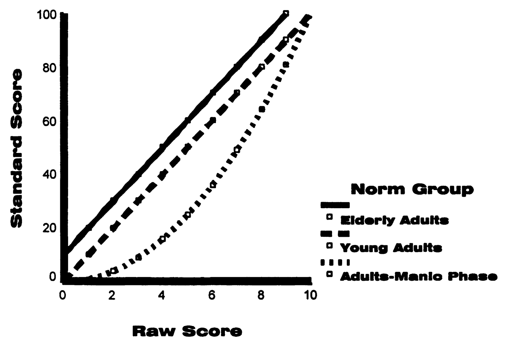
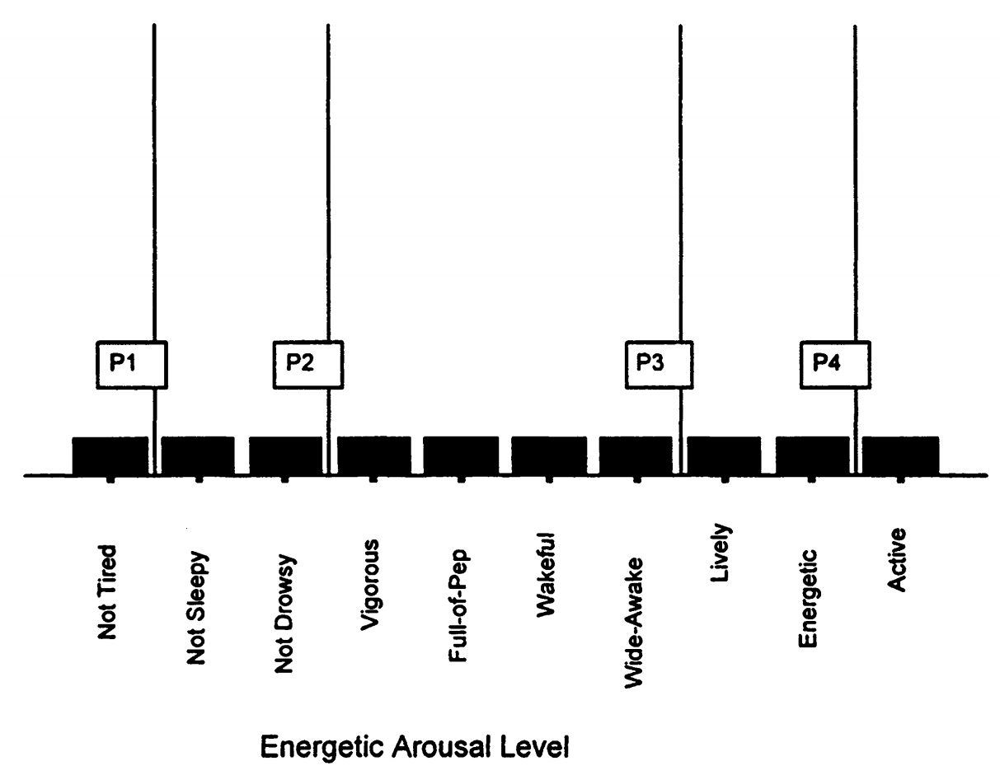

# 1. 特质水平的含义：CTT vs IRT的根本差异

## 1.1 测量的本质：比较的艺术

要理解任何测量，我们首先需要明白一个基本道理：**测量就是比较**。

日常生活中的测量类比

当我们说"小明身高1.75米"时，我们实际上是在说：

- **比较对象：** 小明的身高 vs 标准米尺
- **比较结果：** 小明的身高是标准米尺长度的1.75倍
- **比较性质：** 这是一个比率关系（1.75:1）

## 1.2 心理测量中的比较挑战

但是心理测量面临一个困难：我们测量的是看不见、摸不着的心理特质。

心理测量的困惑

- 智力、焦虑、外向性这些特质没有"标准米尺"
- 我们无法直接测量一个人的"智力长度"
- 那么，我们拿什么来做比较标准呢？

## 1.3 CTT的解决方案：以人为标准

经典测验理论（CTT）选择了一个看似自然的解决方案：**用其他人作为比较标准**。

### 1.3.1 CTT的比较逻辑

CTT的核心思想

**比较标准：** 其他人的分数分布（常模组）

**比较性质：** 序数关系（排名）

**解释方式：** "你比多少人高，比多少人低"

### 1.3.2 CTT解释的具体例子

让我们通过一个能量唤醒量表的例子来理解CTT的解释方式：

**表2.1：能量唤醒量表的项目难度**

| 变量 | \(p\)-值 | Logit \(\beta_i\) | 赔率 \(e_i\) |
| --- | --- | --- | --- |
| **能量唤醒** |  |  |  |
| 活跃 | 0.36 | 1.84 | 6.30 |
| 精力充沛 | 0.48 | 0.90 | 2.45 |
| 精力旺盛 | 0.69 | -0.74 | 0.48 |
| 活泼 | 0.52 | 0.61 | 1.84 |
| 充满活力 | 0.63 | -0.22 | 0.80 |
| 昏昏欲睡 (-) | 0.73 | -1.02 | 0.36 |
| 疲倦 (-) | 0.76 | -1.34 | 0.26 |
| 困倦 (-) | 0.71 | -0.94 | 0.39 |
| 清醒 | 0.53 | 0.50 | 1.65 |
| 警觉 | 0.55 | 0.40 | 1.49 |

> 注：\((-)\) 表示反向计分项目；\(p\)-值表示认同该项目的受试者比例

图2.1展示了同样的原始分数在三个不同群体中的含义完全不同。

### 1.3.3 概念补充1：常模组的威力与陷阱

常模组是CTT的核心概念，但也是其最大的弱点。让我们深入理解这个概念：

常模组的深度解析

**什么是常模组？**

常模组就是一群用来做比较标准的人。就像比赛中的对手一样，你的成绩好坏完全取决于你和谁比。

**常模组的选择如何影响结果？**

同样的原始分数在不同常模组中有完全不同的含义，这不是技术问题，而是CTT的根本特征。

### 1.3.4 不同常模组的惊人差异

让我们通过具体数字来理解这种差异：

同样的分数，不同的含义

假设小李在能量唤醒量表上得了6分：

**在年轻人群体中：** T分数 = 45（低于平均）

**在老年人群体中：** T分数 = 55（高于平均）

**在躁狂症患者群体中：** T分数 = 35（非常低）

同样是6分，在不同群体中的含义截然不同！

这个例子揭示了CTT的一个根本问题：分数的含义完全依赖于我们选择的比较群体。这就像说一个人的身高是"高"还是"矮"，完全取决于他站在篮球队还是体操队中一样。

### 1.3.5 线性变换 vs 非线性变换的深刻影响

转换类型的关键差异

**线性转换（正态分布常模组）：**

当常模组的分数呈正态分布时，原始分数到标准分数的转换是线性的。这意味着相等的原始分数差异对应相等的标准分数差异。

**非线性转换（偏态分布常模组）：**

当常模组的分数呈偏态分布时，需要进行标准化处理。这会改变分数之间的相对距离，原本相等的差异变成不相等的差异。

### 1.3.6 CTT解释的根本特征

通过这个例子，我们可以总结CTT解释的核心特征：

CTT的根本限制

**相对性：** 分数含义完全依赖参照群体

**不稳定性：** 换个群体，分数含义就变了

**序数性：** 只能知道高低，不能知道"高多少"

## 1.4 IRT的革命性解决方案：以题目为标准

项目反应理论提出了一个革命性的想法：**用题目作为比较标准**。

### 1.4.1 IRT的比较逻辑

IRT的核心创新

**比较标准：** 题目的难度

**比较性质：** 差异关系（能力-难度）

**解释方式：** "你能做对什么样的题目"

### 1.4.2 人-题目共同量表的革命性概念

这是IRT最重要的创新：将人和题目放在同一个连续量表上。

图2.2显示了革命性的人-题目共同量表概念。在这个图中，我们看到10个项目和4个人都被定位在同一个连续体上。

### 1.4.3 概念补充2：人-题目共同量表的深度理解

共同量表的突破性意义

**传统思维的局限：**

在传统思维中，人是人，题目是题目，两者属于不同的世界。人有能力高低，题目有难易之分，但二者无法直接比较。

**IRT的突破：**

IRT将人的能力和题目的难度放在同一个量表上，使得直接比较成为可能。就像将温度计和待测物体都用摄氏度来表示一样。

### 1.4.4 特质水平的直接含义

在这个共同量表上，特质水平有了直接的含义：

IRT特质水平的核心含义

**当 \(\theta = \beta\) 时：** 成功概率 = 0.5

**当 \(\theta > \beta\) 时：** 成功概率 > 0.5

**当 \(\theta < \beta\) 时：** 成功概率 < 0.5

用公式表达（Rasch模型）：

\[P(X_{ij} = 1|\theta_j, \beta_i) = \frac{\exp(\theta_j - \beta_i)}{1 + \exp(\theta_j - \beta_i)}\]

### 1.4.5 具体的解释实例

让我们通过图2.2中的例子来理解：

人4的特质水平解释

**人4的特质水平：** \(\theta = 0.90\)

**对应的题目：** "精力充沛"（\(\beta = 0.90\)）

**具体含义：** 人4认同"精力充沛"的概率是50%

**更容易的题目：** 人4认同"不困倦"（\(\beta = -0.94\)）的概率是87%

这种解释方式提供了丰富的实质性含义。我们不仅知道人4比人2在能量唤醒方面得分更高，我们还知道人4的特质水平对应于"精力充沛"这个具体的项目内容。

### 1.4.6 心理物理学的类比

为了更好地理解这种解释，我们可以借用心理物理学的概念：

听力测试的类比

**传统听力测试：**

- 播放不同音量的声音
- 找到被试有50%概率能听到的音量
- 这就是听力阈值

**IRT特质测量：**

- 呈现不同难度的题目
- 找到被试有50%概率答对的题目
- 这就是能力阈值

就像我们可以通过一个人能够检测到的最小声音强度来描述其听力敏感度一样，我们也可以通过一个人有50%概率认同的项目来描述其在某个心理特质上的水平。

### 1.4.7 概念补充3：阈值概念的深入理解

阈值概念是理解IRT的关键，让我们深入探讨：

阈值概念的多重含义

**物理学中的阈值：**

在物理学中，阈值是一个临界点。比如水的沸点是100摄氏度，这是一个明确的阈值。

**心理学中的阈值：**

在心理学中，阈值通常指50%的概率点。这反映了心理现象的概率性质，而非绝对性质。

**IRT中的阈值：**

在IRT中，当一个人的能力等于题目难度时，成功概率为50%。这个点就是该人在该题目上的阈值。

## 1.5 两种方法的本质差异总结

CTT vs IRT的根本差异

**CTT（经典测验理论）：**

- 比较标准：其他人
- 数值基础：序数（排名）
- 解释逻辑：相对位置
- 稳定性：依赖群体

**IRT（项目反应理论）：**

- 比较标准：题目
- 数值基础：差异/比率
- 解释逻辑：绝对能力
- 稳定性：独立于群体
