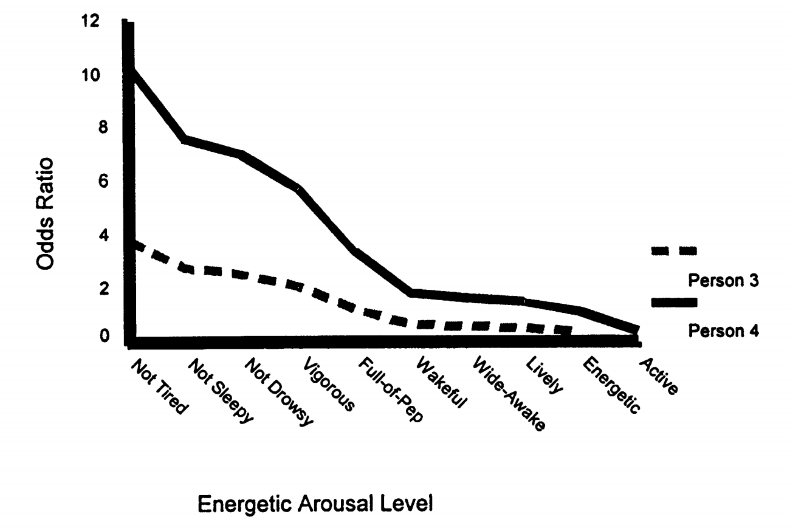
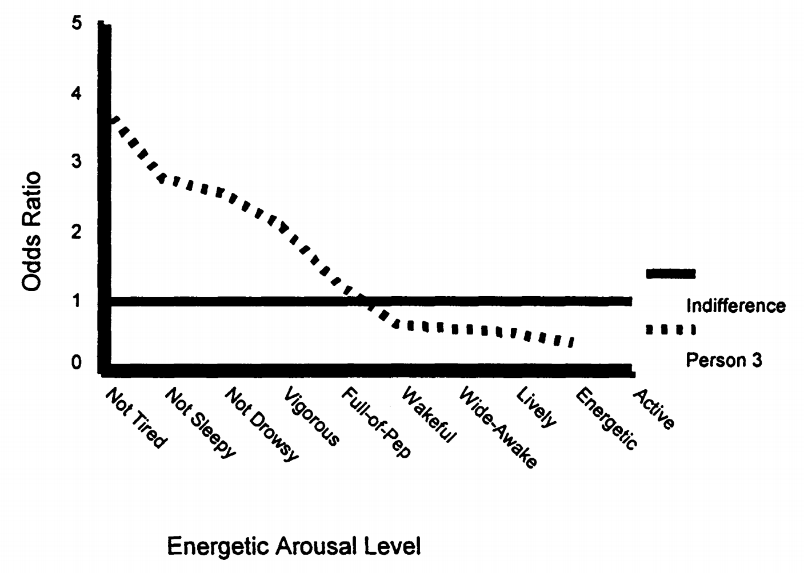
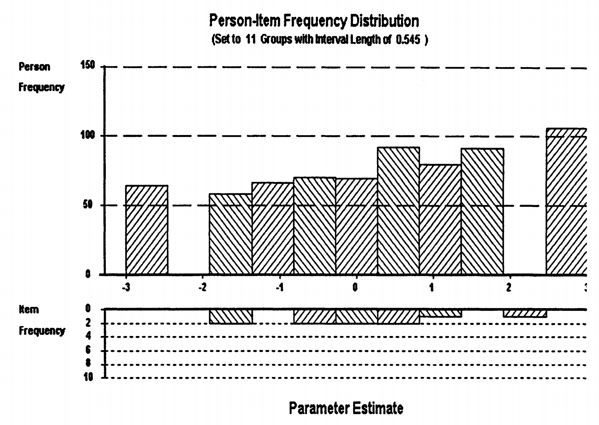

# 2. 特质水平的数值解释：量表单位的奥秘

## 2.1 为什么同样的能力会有不同的数值？

当我们使用不同的IRT软件或不同的参数设置时，经常会发现同一个人的特质水平有不同的数值。比如：

令人困惑的现象

- 软件A显示：\(\theta = 1.2\)
- 软件B显示：\(\theta = 0.8\)
- 软件C显示：\(\theta = 2.4\)

这三个结果哪个是"正确"的？

## 2.2 锚定系统：给量表找个"零点"

答案是：它们都可能是正确的！差异来源于**锚定系统**的不同。

### 2.2.1 为什么需要锚定？

让我们通过一个推导例子来理解锚定的必要性。

模型识别问题的详细推导

在 Rasch 模型中，我们要预测对数几率：

\[
\ln\left(\frac{P_{is}}{1 - P_{is}}\right) = \theta_i - \beta_i
\]

假设我们想预测对数几率为 1.5，让我们看看有多少种解法：

**解法 1：** \(\theta = 3,\ \beta = 1.5\)

\[
3 - 1.5 = 1.5 \quad \checkmark
\]

**解法 2：** \(\theta = 2,\ \beta = 0.5\)

\[
2 - 0.5 = 1.5 \quad \checkmark
\]

**解法 3：** \(\theta = 1,\ \beta = -0.5\)

\[
1 - (-0.5) = 1.5 \quad \checkmark
\]

**解法 4：** \(\theta = 0,\ \beta = -1.5\)

\[
0 - (-1.5) = 1.5 \quad \checkmark
\]

所有这些组合都能产生相同的预测结果，因此模型存在 **识别问题**。

这就是**模型识别问题**：仅仅从数据无法确定参数的绝对值，只能确定相对关系。

### 2.2.2 概念补充4：模型识别问题的深层理解

为什么会出现识别问题？

**根本原因：**

在IRT模型中，我们真正关心的是能力和难度的相对关系（\(\theta - \beta\)），而不是它们的绝对值。

**类比理解：**

这就像说两个城市的海拔差是100米，但这并不能告诉我们每个城市的绝对海拔。我们需要选择一个参照点（比如海平面）来确定绝对高度。

**解决方案：**

锚定就是选择这样一个参照点，让所有参数都有确定的数值。

### 2.2.3 锚定到题目：以题目为中心

**基本思想：** 将题目难度的平均值设为0

题目锚定的设置

- 题目难度平均值：\(\mu_\beta = 0\)
- 题目区分度：\(\alpha = 1.0\)（Rasch模型）
- 结果：特质水平相对于题目平均难度来解释

**解释逻辑：**

题目锚定的解释

- \(\theta > 0\)：能力高于题目平均难度，容易答对
- \(\theta = 0\)：能力等于题目平均难度，答对概率50%
- \(\theta < 0\)：能力低于题目平均难度，不容易答对

这种锚定方式特别适合教育测量，因为它强调的是学生能够掌握什么样的题目，而不是他们在群体中的排名。

### 2.2.4 锚定到人：以人群为中心

**基本思想：** 将人群的能力平均值设为0，标准差设为1

人群锚定的设置

- 能力平均值：\(\mu_\theta = 0\)
- 能力标准差：\(\sigma_\theta = 1\)
- 结果：特质水平类似于z分数

**解释逻辑：**

人群锚定的解释

- \(\theta = 1.0\)：比平均水平高1个标准差，超过84%的人
- \(\theta = 0\)：平均水平，超过50%的人
- \(\theta = -1.0\)：比平均水平低1个标准差，只超过16%的人

### 2.2.5 锚定方法的等价性

这里有一个重要的认识：

锚定选择的本质

不同的锚定方法只是选择了不同的"坐标系"，就像温度可以用摄氏度或华氏度表示一样。

重要的关系（比如两个人的能力差异）不会因为锚定方式改变。

### 2.2.6 度量单位的选择：Logit vs Normal

除了锚定，还有度量单位的选择：

**Logit度量：**

\[\ln(P(X_{is})/(1 - P(X_{is}))) = \alpha(\theta_i - \beta_i)\]

**Normal度量：**

\[\ln(P(X_{is})/(1 - P(X_{is}))) = 1.7\alpha(\theta_i - \beta_i)\]

1.7乘数的来源

1.7这个常数来自于logistic分布和正态分布的标准差比值。它使得两种度量系统下的参数值具有相似的数值范围。

## 2.3 量表类型：数字的不同“语言”

在项目反应理论（IRT）中，个体的能力水平 \(\theta\) 并不是唯一可以表达的方式。除了固定锚点位置外，IRT 还允许将能力转换为不同的量表表示方式。

### 定义：什么是“量表”？

在IRT中，**量表（scale）**指的是用来表达被试能力（latent trait）数值的表示方法。不同的量表传达了不同的信息重点，例如差异、比率、概率等。

### 2.3.1 Logit量表：差异的语言

**定义：** Logit量表是最基础也是最常用的IRT量表类型，直接源于logistic模型的线性预测部分。

\[
\theta \in \mathbb{R}, \quad P(X=1|\theta, \beta) = \frac{1}{1 + e^{-(\theta - \beta)}}
\]

Logit量表的特征

- **数值范围：** 通常在 \(-3\) 到 \(+3\) 之间
- **核心特性：** 等间距（相等的差异有一致含义）
- **理论基础：** 对数几率（log-odds）
- **适用场景：** 理论建模、模型拟合、参数估计

**等间距的含义推导：**

Logit量表的等间距性推导

设两个人的能力差异为 \(d = \theta_1 - \theta_2\)，则：

\[
\ln\left(\frac{P_1}{1 - P_1}\right) - \ln\left(\frac{P_2}{1 - P_2}\right) = (\theta_1 - \beta) - (\theta_2 - \beta) = d
\]

对数几率差仅取决于能力差，与项目难度无关。因此，在logit量表上，相同的数值差异始终代表相同的行为差异。

### 2.3.2 赔率量表（Odds Scale）：倍数的语言

**定义：** 赔率量表是 logit 的指数变换，用来表达成功与失败之间的倍数关系：

\[
\xi_s = e^{\theta_s}
\]

赔率量表的特征

- **数值范围：** \((0, \infty)\)，永远为正
- **核心特性：** 比率有意义（即“成功是失败的几倍”）
- **理论基础：** 成功概率与失败概率之比，定义为 \( \text{odds} = \frac{p}{1 - p} \)
- **适用场景：** 实际解释、非专业读者理解，例如在教育、医疗、心理测量报告中

**示例表格：**

| 人员 | Logit量表 \(\theta_i\) | 赔率量表 \(\xi_i = e^{\theta_i}\) | 赔率解释 |
| --- | --- | --- | --- |
| 人1 | -2.20 | 0.11 | 1比9（失败比成功） |
| 人2 | -1.10 | 0.33 | 1比3 |
| 人3 | 0.00 | 1.00 | 1比1（五五开） |
| 人4 | 1.10 | 3.00 | 3比1（成功比失败） |
| 人5 | 2.20 | 9.02 | 9比1（成功比失败） |

赔率量表的直观解释

**人4的赔率 = 3.0，意味着：**

- 成功概率是失败概率的 3 倍
- 如果尝试 100 次，大约 75 次成功，25 次失败
- 成功概率 = \( \frac{3}{3 + 1} = 0.75 \)

### 2.3.3 概念补充5：赔率 vs 概率

赔率 vs 概率的区别

- **概率（Probability）：** 成功次数 / 总次数，范围是 \([0, 1]\)
- **赔率（Odds）：** 成功次数 / 失败次数，范围是 \([0, \infty)\)

**转换关系如下：**

- 从概率到赔率：

\[
\text{odds} = \frac{p}{1 - p}
\]

- 从赔率到概率：

\[
p = \frac{\text{odds}}{1 + \text{odds}}
\]

赔率具有更强的区分性，特别是在低概率区域。

### 2.3.4 比例真分数（Proportion True Score）：成功率的语言

**定义：** 比例真分数是指一个人在某一组题目上的**平均正确率**，也即期望得分：

\[
P_{is} = \frac{1}{I} \sum_{i=1}^{I} P(X_{is} = 1 | \theta_s, \beta_i)
\]

比例真分数的特征

- **数值范围：** \([0, 1]\)，代表期望正确率
- **核心特性：** 直观易懂，适合直接展示为“正确率”
- **理论基础：** 每道题答对的概率之和的平均值，即

\[
\text{EPC} = \frac{1}{I} \sum_{i=1}^I P(X_i = 1)
\]

- **适用场景：** 测验报告、能力解释、非专业受众理解

**示例表格：**

| 人 | Logit \(\theta_i\) | 测验1（容易） | 测验2（困难） | 题库总体 |
| --- | --- | --- | --- | --- |
| 人1 | -2.20 | 0.13 | 0.06 | 0.18 |
| 人2 | -1.10 | 0.28 | 0.14 | 0.28 |
| 人3 | 0.00 | 0.50 | 0.30 | 0.50 |
| 人4 | 1.10 | 0.71 | 0.52 | 0.72 |
| 人5 | 2.20 | 0.87 | 0.73 | 0.85 |

比例真分数的重要局限

注意人1与人2的差异：

- 在容易测验上：0.28 - 0.13 = 0.15
- 在困难测验上：0.14 - 0.06 = 0.08

**说明：** 相同的能力差异，在不同难度的题组上会呈现出不同的分数差异。因此，比例真分数并不是等间距量表，不适合作为能力的严格测量指标。

### 小结

| 量表 | 例子 | 特点 | 适用 |
| --- | --- | --- | --- |
| Logit量表 | \(\theta = 1.2\) | 等间距，理论建模 | 模型估计 |
| 赔率量表 | \(e^{1.2} = 3.32\) | 倍数解释 | 实践沟通 |
| 比例真分数 | \(P = 0.75\) | 易读直观 | 成绩汇报 |

## 2.4 特质水平解释的具体实例

现在让我们将所有概念综合起来，看看如何解释一个具体的特质水平。

### 2.4.1 与题目比较：能力的直接映射

人-题目比较的实例

**情况：** 使用能量唤醒量表，题目锚定，Logit量表

**人4的特质水平：** \(\theta = 0.90\)

**解释步骤：**

1. 找到难度为0.90的题目："精力充沛"
2. 预测认同概率：P = 0.50
3. 对更容易的题目：概率更高
4. 对更困难的题目：概率更低

图3.1展示了两个人在不同题目上的成功赔率比较。我们可以看到，人4通常有更高的赔率认同量表上的任何项目，这是由于更高的特质水平。

### 2.4.2 概念补充6：赔率差异的非线性特性

关键观察

注意他们的赔率在容易项目上差异很大，而在困难项目上差异较小。

这说明虽然logit量表具有等距性，但当我们转换到赔率量表时，这种等距性就不再保持。

### 2.4.3 与标准比较：绝对水平的判断

我们可以设定一个标准，比如"无差别状态"（既不认同也不反对）。

图3.2显示了人3的特征曲线接近无差别标准。无差别标准是一个特别有趣的概念，因为它代表了一个中性点。

### 2.4.4 与常模比较：相对位置的确定

IRT也可以提供传统的常模比较，但更加丰富。

图3.3展示了人能力分布与题目难度分布的关系。上层显示了以logit单位表示的人的频率分布，下层显示了项目难度分布。

人-项目分布匹配的重要性

这种双层分布图提供了关于测验质量的重要信息。理想情况下，项目难度分布应该与人能力分布相匹配，以便为所有能力水平的人提供精确的测量。

## 2.5 量表选择的实际考虑

面对这么多选择，我们应该如何决定使用哪种量表？

量表选择的指导原则

**Logit量表 - 当需要：**

- 理论分析和模型比较
- 精确的统计推断
- 跨测验的能力比较

**赔率量表 - 当需要：**

- 向非专业人士解释结果
- 强调成功概率的倍数关系
- 进行风险评估

**比例真分数 - 当需要：**

- 最直观的解释
- 与传统分数类比
- 但要小心它的局限性
