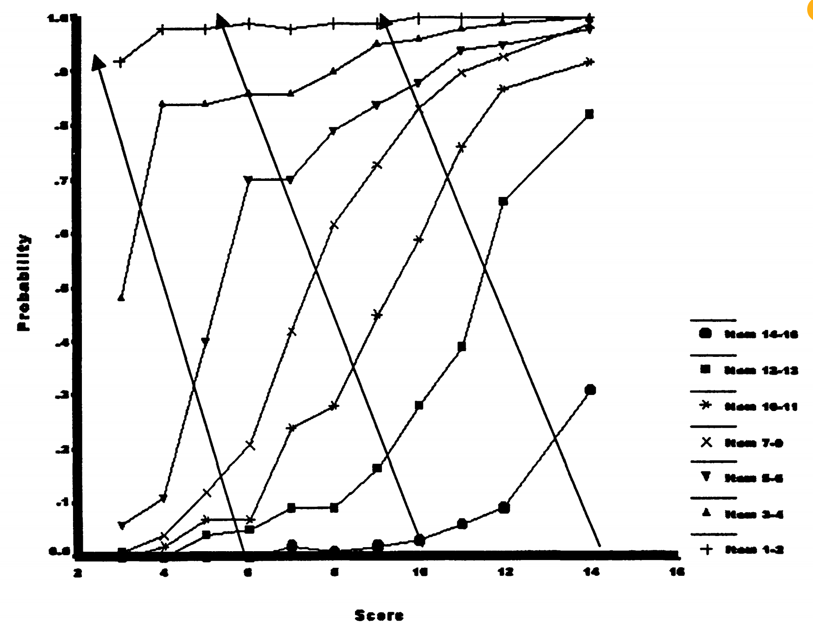
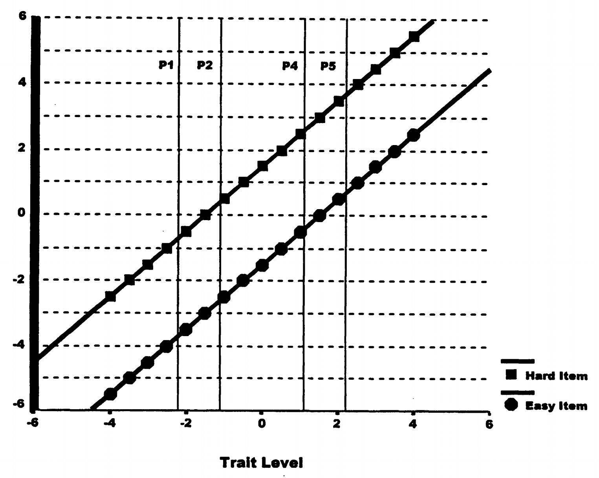

# 3. 测量量表特性：数字背后的规律

## 3.1 为什么要关心数字的"品质"？

当我们拿到测验分数时，经常会进行各种运算：计算平均分、标准差、相关系数等。但是，我们有权利对这些数字进行这些运算吗？

数字运算的合理性问题

**假设有三个学生的分数：**

- 小明：60分
- 小红：80分
- 小李：100分

**我们可以说：**

- 小红比小明高20分？✓
- 小李是小明的1.67倍？❓
- 平均分是80分？❓
- 小红的分数正好在小明和小李中间？❓

答案取决于这些分数具有什么样的**测量量表特性**。

## 3.2 测量的本质：表征理论

在深入讨论之前，我们需要理解测量的根本概念。

表征理论的核心思想

**测量的目的：** 用数字来表征现实世界中对象之间的关系

**基本要求：** 数字之间的关系必须反映对象之间的真实关系

**举例：** 如果物体A比物体B重，那么A的重量数值必须大于B

## 3.3 四种量表水平：从简单到复杂

Stevens (1946) 提出了四种测量水平，每种都有不同的特性。

### 3.3.1 名义量表：标签的世界

**基本特征：** 数字只是标签，没有大小关系

名义量表的例子

**人格障碍类型编码：**

- 偏执型 = 1
- 分裂型 = 2
- 边缘型 = 3

**关键理解：**

- 3 不比 1 "更多"
- 可以随意重新编码：1→99, 2→33, 3→17
- 只要保持类别区分即可

**表4.1：人格障碍的名义测量**

| 类型 | 分数1 | 分数2 | 分数3 |
| --- | --- | --- | --- |
| 偏执型 | 1 | 11 | 1 |
| 分裂型 | 2 | 3 | 1 |
| 分裂样型 | 3 | 4 | 1 |
| 表演型 | 4 | 9 | 2 |
| 自恋型 | 5 | 10 | 2 |
| 反社会型 | 6 | 2 | 3 |
| 边缘型 | 7 | 5 | 3 |
| 回避型 | 8 | 6 | 3 |
| 依赖型 | 9 | 7 | 4 |
| 强迫型 | 10 | 8 | 4 |
| 被动-攻击型 | 11 | 1 | 4 |

> 注：分数1到分数2的变换保持了类别的独特性；分数3的变换导致了信息损失

**允许的统计量：** 频数、众数、卡方检验

**不允许的运算：** 加法、平均数、大小比较

### 3.3.2 序数量表：排名的世界

**基本特征：** 数字表示顺序，但间距没有意义

序数量表的变换实例

**能量唤醒分数的不同变换：**

| 人 | 原始分数 | 线性变换 | 非线性变换 |
| --- | --- | --- | --- |
| 1 | 2 | 51 | 4 |
| 2 | 4 | 52 | 16 |
| 3 | 6 | 53 | 36 |
| 4 | 8 | 54 | 64 |
| 5 | 10 | 55 | 100 |

**关键洞察：**

- 线性变换保持相对距离不变
- 非线性变换改变相对距离
- 两种变换都保持排序关系
- 对序数数据，两种变换都是合法的！

**允许的统计量：** 中位数、百分位数、等级相关

**不允许的运算：** 加法运算的平均数、标准差

### 3.3.3 区间量表：距离的世界

**基本特征：** 相等的数值差异代表相等的实际差异

区间量表的核心特性

**可加性：** 满足额外的特性，使得差异有固定含义

**允许的变换：** 只有线性变换 (\(aX + b\))

**含义：** 间距有意义，但比率没有意义

让我们通过详细推导来验证线性变换的特性：

线性变换的验证推导

**原始数据：**
\(X_1 = 6.22\)（均值），\(\sigma_X = 3.07\)（标准差）

**线性变换：**
\(Y = 0.5X + 50\)

**变换后的均值和标准差：**
\(Y_1 = 53.11\)（均值），\(\sigma_Y = 1.53\)（标准差）

**验证逆变换是否成立：**

\[
\text{原均值} = (Y_1 - 50) \times 2 = (53.11 - 50) \times 2 = 6.22 \quad \checkmark
\]

**非线性变换：**
\(Z = X^2\)

**变换后：**
\(Z_1 = 47.11\)（均值）

**尝试逆变换：**

\[
\sqrt{Z_1} = \sqrt{47.11} \approx 6.86 \neq 6.22 \quad \times
\]

→ 非线性变换下，**均值不具备可逆性**。

这个例子说明线性变换保持统计关系，而非线性变换会破坏这种关系。

**允许的统计量：** 均值、标准差、相关系数、t检验

**不允许的运算：** 比率比较（如"A是B的两倍"）

### 3.3.4 比率量表：比例的世界

**基本特征：** 有真正的零点，比率有意义

比率量表的特征

**真零点：** 零值表示属性的完全缺失

**允许的变换：** 只有乘以常数 (\(aX\))

**含义：** 可以说"A是B的两倍"

**允许的统计量：** 所有统计量，包括变异系数

**心理测量中的现实：** 真正的比率量表很少见，因为心理属性很难有绝对零点

## 3.4 如何证明量表水平？联合测量理论

现在我们面临一个关键问题：如何知道我们的测验分数具有什么量表水平？

### 3.4.1 物理测量的优势

在物理世界中，我们可以直接操作：

长度测量的直接验证

**顺序：** 直接观察哪根棒子更长

**可加性：** 将两根1米的棒子连接，得到2米的棒子

**验证：** 1 + 1 = 2，物理操作与运算一致

### 3.4.2 心理测量的挑战

心理属性无法直接操作，我们需要其他方法。

**联合测量理论**提供了解决方案：当三个变量满足特定关系时，可以证明量表特性。

联合测量的核心条件

**基本要求：**

1. 所有变量都可以排序
2. 结果变量是其他两个变量的加性函数
3. 满足双重消除条件

### 3.4.3 Rasch模型与物理学的平行

Rasch巧妙地将他的模型设计成类似于物理学中的加性关系：

**物理学中的力学关系：**

\[\text{加速度} = \frac{\text{力}}{\text{质量}}\]

取对数得到加性关系：

\[\log(\text{加速度}) = \log(\text{力}) - \log(\text{质量})\]

**Rasch模型的加性关系：**

\[\log(\text{成功赔率}) = \text{能力水平} - \text{题目难度}\]

即：

\[\ln\left(\frac{P_{is}}{1-P_{is}}\right) = \theta_s - \beta_i\]

### 3.4.4 双重消除条件：实际数据的检验

双重消除条件提供了检验加性关系的实用方法。

双重消除条件的含义

在能力×题目的表格中，沿任意对角线移动时，成功概率应该单调变化。

**表4.2：Rasch模型理论预测（双重消除成立）**

| 题目难度 | 能力水平 |  |  |  |  |
| --- | --- | --- | --- | --- | --- |
|  | -1.00 | 0.00 | 1.00 | 1.25 | 1.50 |
| -1.00 | 0.50↗ | 0.73↗ | 0.88↗ | 0.91↗ | 0.92 |
| 0.00 | 0.27↗ | 0.50↗ | 0.73↗ | 0.78↗ | 0.82 |
| 0.25 | 0.22↗ | 0.44↗ | 0.68↗ | 0.73↗ | 0.78 |
| 1.00 | 0.12↗ | 0.27↗ | 0.50↗ | 0.56↗ | 0.62 |

> 注：对角箭头(↗)显示双重消除模式；概率沿对角线方向单调递增

**表4.3：实际数据（基本满足双重消除）**

| 题目组 | 原始分数组 |  |  |  |  |  |  |  |  |  |  |
| --- | --- | --- | --- | --- | --- | --- | --- | --- | --- | --- | --- |
|  | 3 | 4 | 5 | 6 | 7 | 8 | 9 | 10 | 11 | 12 | 13-16 |
| 1-2 | 0.92↗ | 0.98↗ | 0.98↗ | 0.99↗ | 0.98↗ | 0.99↗ | 0.99↗ | 1.00↗ | 1.00↗ | 1.00↗ | 1.00 |
| 3-4 | 0.48↗ | 0.84↗ | 0.84↗ | 0.86↗ | 0.86↗ | 0.90↗ | 0.95↗ | 0.96↗ | 0.98↗ | 0.99↗ | 1.00 |
| 5-6 | 0.06↗ | 0.18↗ | 0.40↗ | 0.70↗ | 0.70↗ | 0.79↗ | 0.84↗ | 0.88↗ | 0.94↗ | 0.95↗ | 0.98 |

> 注：表格显示不同原始分数水平的人在不同项目集上的成功概率；对角箭头显示双重消除模式，除少数例外外基本得到满足

虽然不完美，但总体符合双重消除模式，支持区间量表特性。

图4.1是覆盖有对角箭头的项目特征曲线图。双重消除等同于说ICC不交叉。

**表4.4：2PL模型预测（违反双重消除）**

| 题目难度 | 区分度 | 能力水平 |  |  |  |  |
| --- | --- | --- | --- | --- | --- | --- |
|  |  | -1.00 | 0.00 | 1.00 | 1.25 | 1.50 |
| -1.00 | 1.00 | 0.50↗ | 0.73↗ | 0.88↗ | 0.91↗ | 0.92 |
| 0.00 | 1.50 | 0.38↗ | 0.50↗ | 0.62↗ | 0.65↗ | 0.68 |
| 0.25 | 0.50 | 0.13↗ | 0.41↗ | 0.76↗ | 0.82↗ | 0.87 |

> 注：某些位置的概率沿对角线不是单调递增的，违反了双重消除条件

注意概率有时沿对角线下降，违反了双重消除条件。

### 3.4.5 概念补充7：双重消除条件的深度解析

双重消除条件的直观理解

**什么是双重消除？**

想象一个能力×题目的表格，如果我们沿着对角线移动（同时增加能力和减少题目难度），成功概率应该一直增加。

**为什么重要？**

这个条件确保了能力、题目难度和成功概率之间存在一致的加性关系。

**违反意味着什么？**

如果违反，说明不能简单地将能力和题目难度相减来预测表现。

## 3.5 Rasch模型的特殊地位：不变性的严格证明

Rasch模型具有独特的测量特性，我们可以通过严格证明来理解。

### 3.5.1 不变人比较：能力差异的稳定性

**核心问题：** 两个人的能力差异是否在所有题目上都有相同含义？

让我们考虑两个人：\(\theta_1 = -2.20\), \(\theta_2 = -1.10\)

对任意题目i，他们的表现差异为：

\[\ln\left(\frac{P_{1i}}{1-P_{1i}}\right) - \ln\left(\frac{P_{2i}}{1-P_{2i}}\right)\]

**详细推导：**

根据Rasch模型：

\[\ln\left(\frac{P_{1i}}{1-P_{1i}}\right) = \theta_1 - \beta_i\]

\[\ln\left(\frac{P_{2i}}{1-P_{2i}}\right) = \theta_2 - \beta_i\]

两式相减：

\[\ln\left(\frac{P_{1i}}{1-P_{1i}}\right) - \ln\left(\frac{P_{2i}}{1-P_{2i}}\right) = (\theta_1 - \beta_i) - (\theta_2 - \beta_i)\]

\[= \theta_1 - \theta_2 = -2.20 - (-1.10) = -1.10\]

惊人的结果

题目难度\(\beta_i\)被消除了！这意味着两人的表现差异完全不依赖于题目难度。

图4.2显示了在不同题目上，人与人之间的差异保持恒定。

### 3.5.2 概念补充8：不变性的深层含义

不变性的实际价值

**教育应用中的含义：**

如果学生A比学生B在能力上高1个logit单位，那么无论我们给他们测试容易题目还是困难题目，这个差异的含义都是相同的。

**测验开发中的含义：**

我们可以用不同的题目来测量同样的能力差异，而不用担心题目选择会影响比较结果。

### 3.5.3 不变题目比较：题目差异的稳定性

类似地，我们可以证明题目难度差异不依赖于被试能力：

对任意被试s，两个题目的难度差异为：

\[\ln\left(\frac{P_{s1}}{1-P_{s1}}\right) - \ln\left(\frac{P_{s2}}{1-P_{s2}}\right)\]

**详细推导：**

\[\ln\left(\frac{P_{s1}}{1-P_{s1}}\right) = \theta_s - \beta_1\]

\[\ln\left(\frac{P_{s2}}{1-P_{s2}}\right) = \theta_s - \beta_2\]

两式相减：

\[\ln\left(\frac{P_{s1}}{1-P_{s1}}\right) - \ln\left(\frac{P_{s2}}{1-P_{s2}}\right) = (\theta_s - \beta_1) - (\theta_s - \beta_2)\]

\[= -(\beta_1 - \beta_2)\]

被试能力\(\theta_s\)被消除了！

### 3.5.4 2PL模型的复杂性

相比之下，2PL模型中这种简单性被破坏：

\[\ln\left(\frac{P_{1i}}{1-P_{1i}}\right) - \ln\left(\frac{P_{2i}}{1-P_{2i}}\right)\]

\[= \alpha_i(\theta_1 - \beta_i) - \alpha_i(\theta_2 - \beta_i)\]

\[= \alpha_i(\theta_1 - \theta_2)\]

现在差异依赖于题目的区分度\(\alpha_i\)！

### 3.5.5 不同量表单位的不变性

在 IRT 模型中，能力（\(\theta\)）可以表达在不同的数值单位上。两种常见量表——logit 量表和赔率量表——具有不同的不变性含义：

**Logit 量表：实现差异的不变性**（区间量表）

- **量表特点：** 对于任意两个受试者，其能力差值 \(\theta_1 - \theta_2\) 是有意义的。
- **意义：** 不管题目难度如何，\(\theta\) 的差值恒定地影响正确率的对数几率差。
- **结论：** logit 量表是**区间量表**，即“加法单位”有意义，但零点是任意设定的。

**赔率量表：实现比率的不变性**（比率量表）

- **变换关系：** \(\xi_s = e^{\theta_s}\)，将 logit 转换为赔率量表
- **量表特点：** 任意两个受试者的能力比 \(\xi_1 / \xi_2\) 有固定含义
- **意义：** 成功的相对可能性以**倍数**形式保持一致
- **结论：** 赔率量表是**比率量表**，即“乘法单位”有意义，零点是自然定义的（无成功可能时 \(\xi = 0\)）

**能力比率与题目无关**

考虑在任意题目 \(i\) 上，两位被试 \(1\) 和 \(2\) 的成功概率分别为 \(P_{i1}, P_{i2}\)，他们的赔率比为：

\[
\frac{P_{i1}/(1-P_{i1})}{P_{i2}/(1-P_{i2})}
= \frac{\xi_1 / e^{\beta_i}}{\xi_2 / e^{\beta_i}}
= \frac{\xi_1}{\xi_2}
\]

- \(\xi_s = e^{\theta_s}\)：第 \(s\) 个被试的赔率
- \(e^{\beta_i}\)：题目 \(i\) 的难度在赔率空间的表示

**推论：**

- 虽然每道题的难度不同（\(\beta_i\)），
- 但它们在分子分母中相互抵消，
- 因此赔率比只取决于能力比 \(\xi_1 / \xi_2\)

这就是**单位不变性**的体现：不同题目不会改变被试之间的能力差异或比率的含义。

### 3.5.6 概念补充9：充分统计量的深入理解

Rasch模型还有一个重要特性：原始总分是能力的充分统计量。

充分统计量的含义

**什么是充分统计量？**

一个统计量如果包含了样本中关于参数的所有信息，就称为充分统计量。

**Rasch模型中的充分统计量：**

在Rasch模型中，如果两个人的原始总分相同，那么他们的能力估计也相同，无论他们答对了哪些具体题目。

**充分统计量的推导：**

Rasch模型的似然函数可以写成：

\[L(\theta | \mathbf{x}) = \frac{\exp(\theta \sum x_i)}{\prod_i (1 + \exp(\theta - \beta_i))}\]

其中\(\sum x_i\)是原始总分。注意似然函数只依赖于总分，而不依赖于具体的反应模式。

这意味着：

\[P(\mathbf{x} | \sum x_i, \theta) = P(\mathbf{x} | \sum x_i)\]

即给定总分后，具体的反应模式与能力无关。

## 3.6 CTT的量表水平困境

与IRT形成鲜明对比，CTT在建立量表特性方面面临根本困难。

### 3.6.1 测验难度的影响

CTT的根本问题

在CTT中，分数差异的含义直接受测验难度影响：

**容易测验：** 高能力学生差异很小（都得高分）

**困难测验：** 低能力学生差异很小（都得低分）

**适中测验：** 中等能力学生差异最大

### 3.6.2 区间量表的严格条件

CTT中证明区间量表需要两个条件：

1. **真实能力呈正态分布**（假设问题）
2. **观察分数呈正态分布**（可操作问题）

但是多个常模组会产生矛盾：

多常模组的悖论

假设四个人原始分数：2, 3, 6, 7

**年轻人常模（正态）：** 线性转换，保持相对距离

**躁狂症常模（偏态）：** 标准化转换，改变相对距离

- 第1、2人距离：5个标准分单位
- 第3、4人距离：13个标准分单位

**矛盾：** 同样的原始分差异，在不同常模中有不同含义
