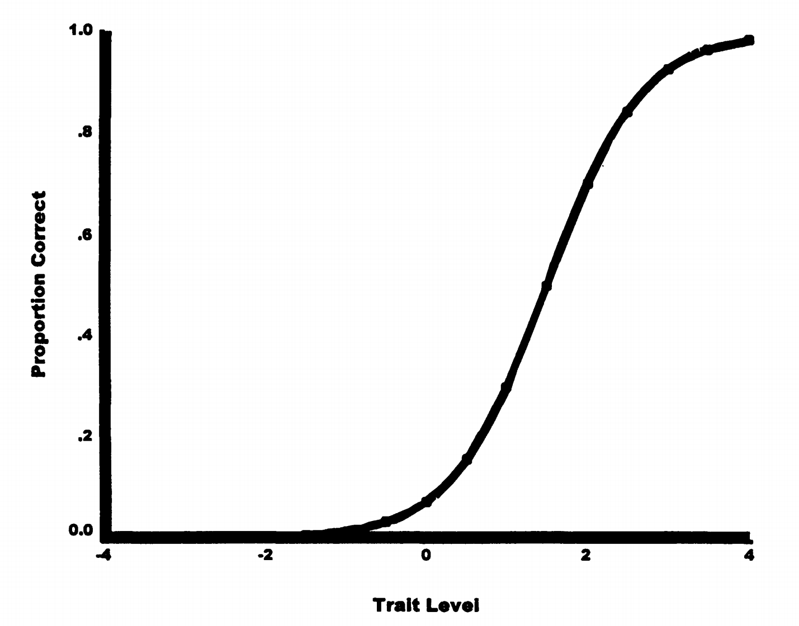
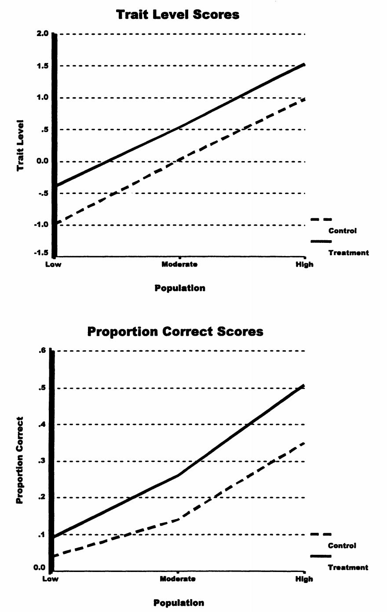

# 4. 量表水平的实际影响：不仅仅是理论问题

## 4.1 错误的统计推断：真实案例

量表水平问题不仅是理论探讨，它会导致实际的错误结论。

### 4.1.1 什么是因子设计（Factorial Design）？

**因子设计**是一种多变量实验设计方法，其中研究者操纵两个或更多“自变量”（因子），观察它们对“因变量”的主效应与交互效应。常见结构如：

- \(2 \times 2\)：两个因子，每个两个水平
- \(3 \times 2\)：一个因子三个水平，另一个两个水平

**交互效应**：指一个因子对结果的影响依赖于另一个因子的水平。例如，治疗对成绩的效果是否因学生能力不同而变化。

### 4.1.2 虚假的 t 检验结果

Maxwell 和 Delaney (1985) 的研究展示了一个令人震惊的现象：

令人震惊的发现

**实验设计：** 两组被试，真实能力均值相等
**CTT分析结果：** 两组观察分数均值显著不同！
**原因：** 测验难度过高 + 能力分布不同导致分数非线性压缩

### 4.1.3 虚假的交互效应

更严重的后果出现在因子分析中：

虚假交互的产生

**真实情况：** 没有交互效应（只有主效应）
**CTT分析结果：** 检测出显著交互
**后果：** 研究者可能错误地推导出某种理论交互结构

## 4.2 模拟研究：量表差异的具体展示

通过一个模拟实验可以清晰看到量表带来的误判。

### 4.2.1 实验设计说明

3×2因子设计模拟

- **能力因子 A：** 三组（低、中、高）
  控制组均值：-1.0, 0.0, 1.0
  处理组均值：-0.5, 0.5, 1.5
- **处理因子 B：** 控制 vs 处理
  效应均为 +0.5（无交互）

### 4.2.2 从 IRT 能力转换为 CTT 分数

设测验项目难度 \(\beta = 1.5\)（偏难），则 IRT 能力 \(\theta\) 被转换为比例正确率（通过 logistic 函数）：

\[
P = \frac{1}{1 + e^{-(\theta - \beta)}}
\]

此变换具有非线性，尤其在能力极高或极低时会“压缩”得分。

### 4.2.3 图示比较：结果如何被扭曲

- 
- 

**图5.2解释：**

- **上图（IRT量表）：** 平行线，表示无交互，处理效应恒定
- **下图（CTT量表）：** 明显交互，误导研究者认为不同能力组反应不同

虚假交互的机制

**根本原因：** 测验太难，导致高能力组处于 logistic 曲线敏感区域
**结果：** 同一效应被曲线“拉伸”或“压缩”成不同大小
**误导：** 研究者以为处理效应因人而异，进而构造错误理论

## 4.3 其他统计方法的影响

### 4.3.1 相关系数的不稳定性

相关系数的扭曲

同一组数据在不同量表下的相关结果可能不同：

- IRT 能力 vs 外部变量：\(r = 0.45\)
- 原始分数 vs 外部变量：\(r = 0.62\)
- 标准分数 vs 外部变量：\(r = 0.38\)

### 4.3.2 回归分析偏误

- **纵向研究：** 学习增长趋势形状会扭曲
- **多元回归：** 变量的重要性顺序可能错误
- **结构方程建模：** 拟合结果依赖于分数的测量水平

## 4.4 IRT 与 CTT 的分数比较

### 4.4.1 高相关≠质量等同

相关高并不等于质量好

IRT 能力与原始分数高度相关（常 > 0.95）
但这只是排序接近
不代表能精确衡量真实能力

### 4.4.2 IRT 的独特优势

IRT方法的四大优势

- **测验等同化：** 不同试卷可比较
- **项目偏倚检测：** 项目是否对某群体不公平
- **自适应测验：** 难度根据能力动态调整
- **标准误建模：** 不同能力水平测量精度不同

## 4.5 实践建议：何时必须考虑量表水平

### 4.5.1 高风险研究场景

务必使用IRT的情境

- 群体间比较（性别/种族/教育组别）
- 纵向干预研究（发展/治疗）
- 多因子设计（主效应 + 交互分析）

### 4.5.2 分析与解释中的防范建议

实践防御策略

- 选择合理测验难度，避免极端区间
- 使用IRT方法转换或对比分析
- 检查交互是否来自量表非线性
- 报告标准误差而非仅平均数
