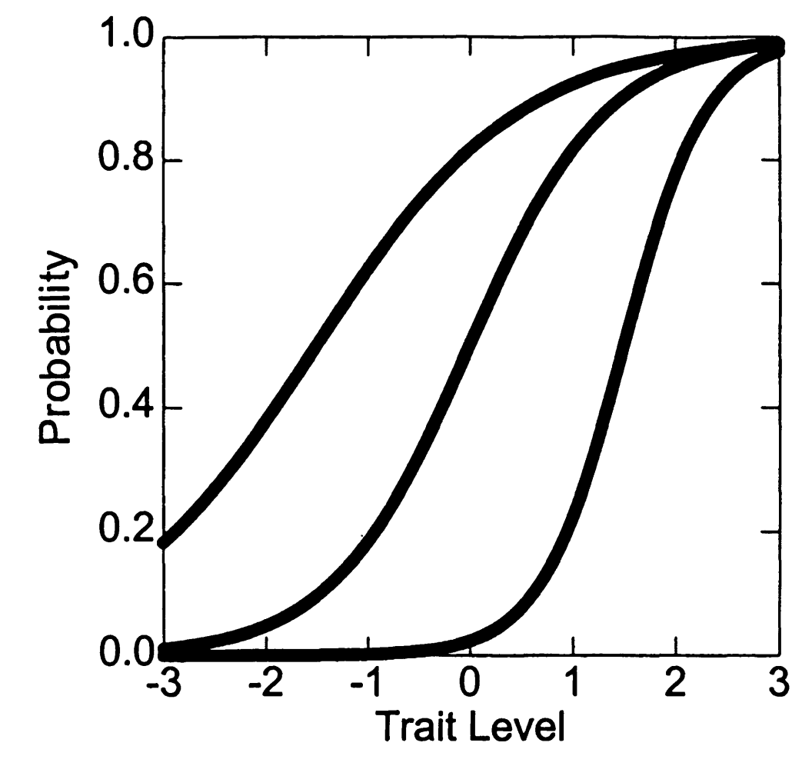
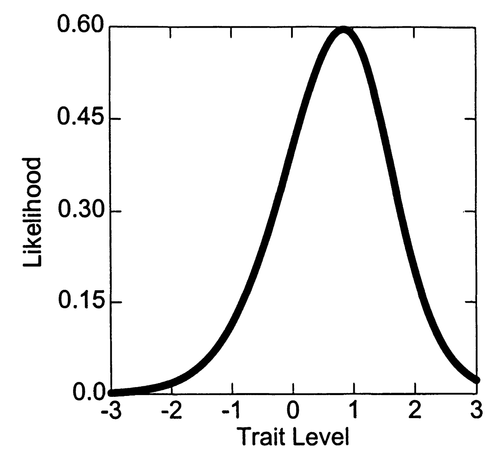
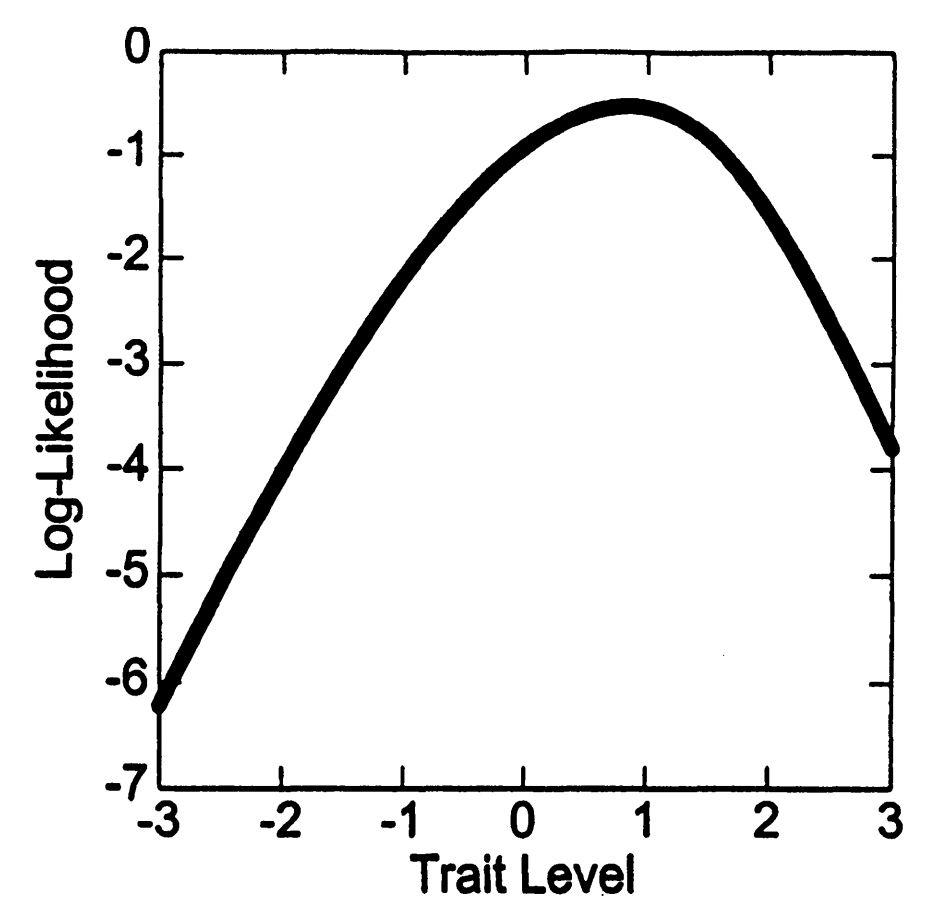
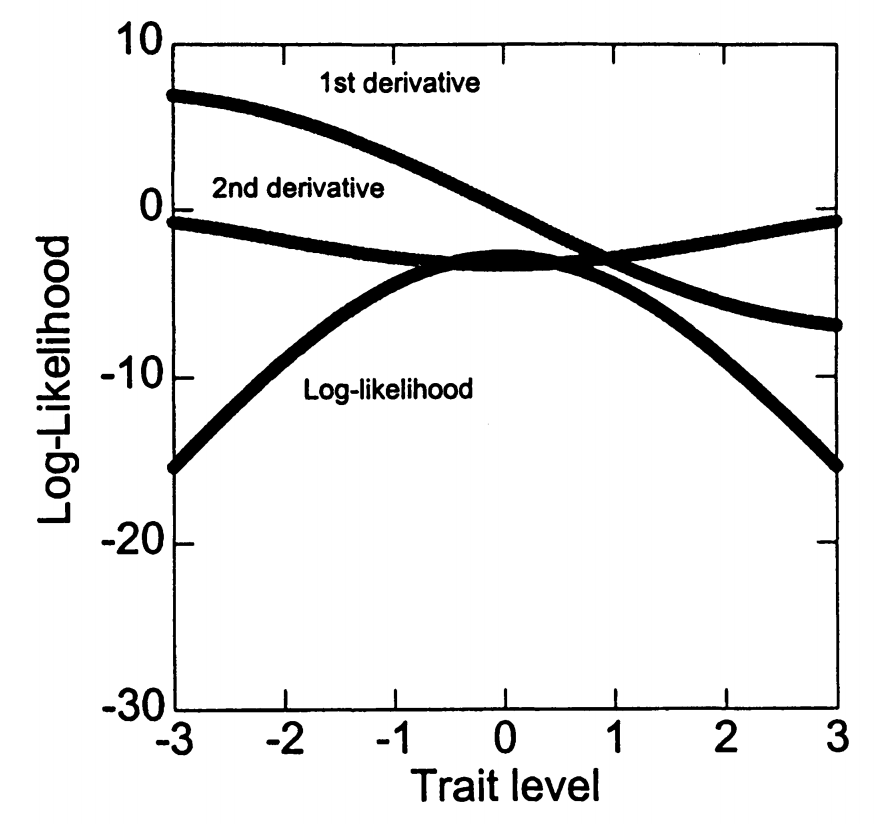
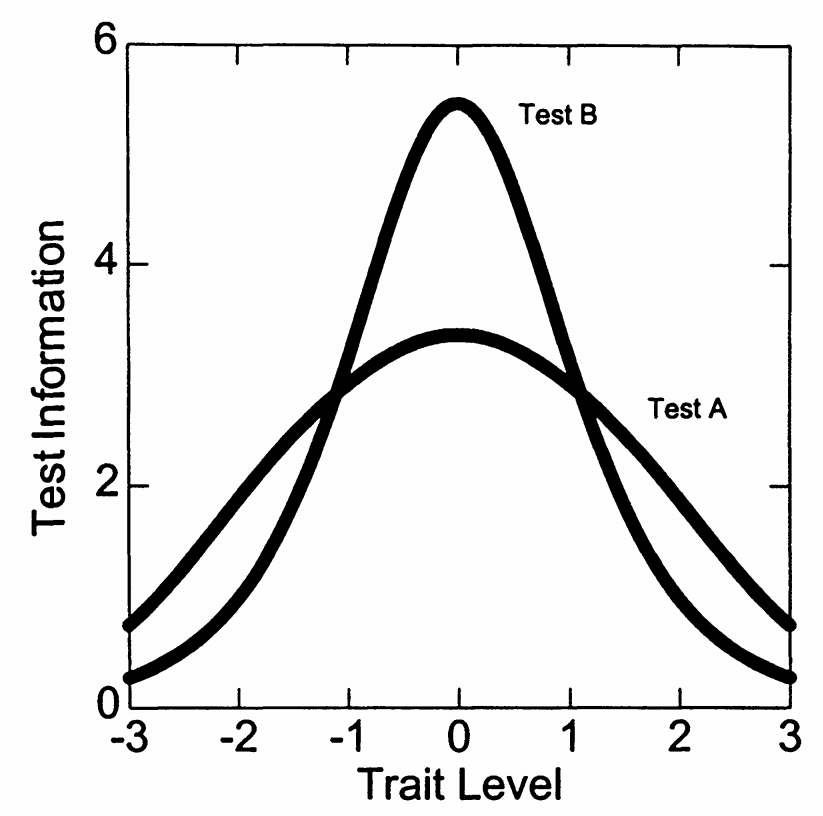
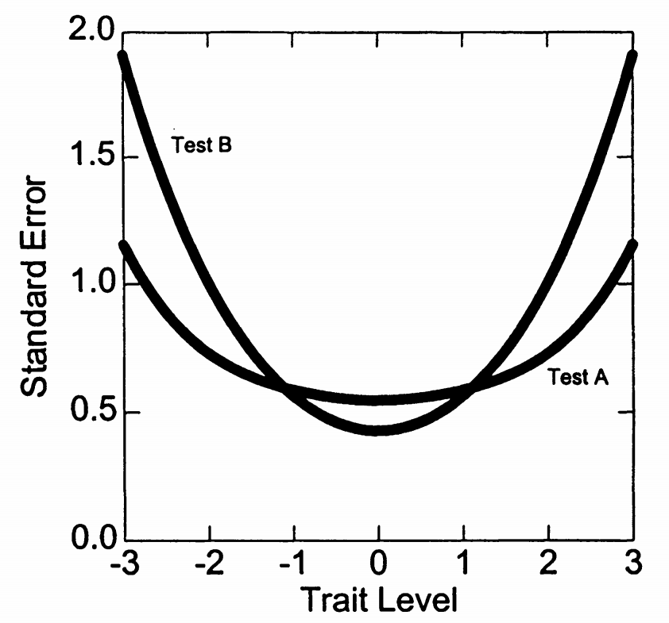
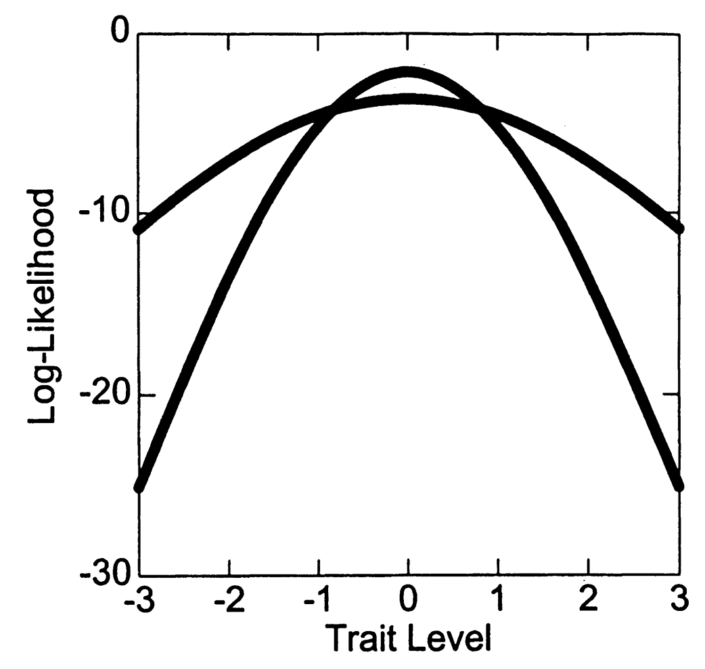

# 1. 最大似然评分

## 1.1 基本思想：寻找最可能的能力值

最大似然（Maximum Likelihood, ML）评分的核心思想可以用一个简单的问题来表达：

ML的核心问题

给定考生的反应模式（哪些题答对，哪些题答错）和已知的题目参数，什么样的能力值\(\theta\)最可能产生这种反应模式？

让我们通过一个日常生活的例子来理解这个思想：

投篮能力的类比

假设一个篮球运动员投了10次篮，进了7个。我们想估计他的投篮能力。

- 如果他的真实命中率是30%，那么10投7中的可能性很小
- 如果他的真实命中率是70%，那么10投7中的可能性很大
- 如果他的真实命中率是90%，那么10投7中的可能性又变小了

最大似然估计就是找到那个使"10投7中"这个结果最可能发生的命中率。

## 1.2 似然函数的构建

### 1.2.1 从单个题目到整体模式

让我们通过一个具体例子来理解似然函数的构建过程。

三题测验示例

考虑一个已在2PL模型下校准的三题测验。2PL模型的项目反应函数是：

\[P_i(u_i = 1|\theta) = \frac{1}{1 + \exp(-\alpha_i(\theta - \beta_i))}\]

其中：

- \(P_i\)：答对题目\(i\)的概率
- \(\theta\)：考生的能力参数
- \(\alpha_i\)：题目\(i\)的区分度参数
- \(\beta_i\)：题目\(i\)的难度参数

题目参数：

- 题目1：\(\alpha_1 = 1.0\)，\(\beta_1 = -1.5\)（容易题，区分度中等）
- 题目2：\(\alpha_2 = 1.5\)，\(\beta_2 = 0.0\)（中等题，区分度较高）
- 题目3：\(\alpha_3 = 2.0\)，\(\beta_3 = 1.5\)（困难题，区分度很高）

这些参数产生的项目反应曲线（IRC）如图7.1a所示：

理解项目反应曲线

项目反应曲线告诉我们：

- **横轴**：考生的能力水平\(\theta\)
- **纵轴**：答对该题的概率
- **曲线形状**：S形曲线，能力越高，答对概率越大
- **区分度影响**：区分度越高，曲线越陡峭
- **难度影响**：难度越高，曲线越往右移

### 1.2.2 计算特定反应的似然

在理解似然之前，我们需要澄清一个关键概念：

似然vs概率的关键区别

**概率（Probability）**：

- 事前计算：给定参数，预测结果
- 问题形式："如果考生能力是\(\theta = 1.0\)，他答对题目1的概率是多少？"
- 计算：

\[
P_1(\theta = 1.0)
= \frac{1}{1 + \exp[-1.0(1.0-(-1.5))]}
= \frac{1}{1 + \exp(-2.5)}
\approx 0.924
\]

**似然（Likelihood）**：

- 事后计算：给定结果，评估参数
- 问题形式："考生答对了题目1，那么\(\theta = 1.0\)的似然是多少？"
- 计算：

\[
L(\theta = 1.0 \mid u_1 = 1) = P_1(\theta = 1.0) = 0.924
\]

对于具体的反应模式，每个题目贡献的似然为：

单题似然计算

如果考生在题目\(i\)上的反应为\(u_i\)（1=答对，0=答错），则该题贡献的似然为：

\[L_i(\theta|u_i) = \begin{cases}
P_i(\theta) & \text{如果 } u_i = 1 \text{（答对）} \
1 - P_i(\theta) & \text{如果 } u_i = 0 \text{（答错）}
\end{cases}\]

这可以用一个更紧凑的表达式表示：

\[L_i(\theta|u_i) = P_i(\theta)^{u_i} \cdot [1-P_i(\theta)]^{1-u_i}\]

### 1.2.3 局部独立性与似然的乘积

IRT的一个核心假设是局部独立性（Local Independence）。这个概念需要仔细理解：

局部独立性的深入理解

**表面相关**：

- 在现实中，不同题目的得分通常是相关的
- 聪明的学生倾向于答对更多题目
- 这种相关性是因为他们共享一个潜在的能力因素

**条件独立**：

- 但是，如果我们已知学生的能力\(\theta\)
- 那么各题目的反应就变成独立的了
- 这就像知道了投篮能力后，每次投篮都是独立事件

**表达式**：

\[P(u_1, u_2, ..., u_I | \theta) = P(u_1|\theta) \times P(u_2|\theta) \times ... \times P(u_I|\theta)\]

因此，整个反应模式的似然是各题目似然的乘积：

完整反应模式的似然

对于反应向量\(\mathbf{u} = (u_1, u_2, ..., u_I)\)，总似然为：

\[L(\mathbf{u}|\theta) = \prod_{i=1}^I L_i(\theta|u_i) = \prod_{i=1}^I P_i(\theta)^{u_i} \cdot [1-P_i(\theta)]^{1-u_i}\]

为了方便，我们经常用\(Q_i(\theta) = 1 - P_i(\theta)\)表示答错的概率，所以：

\[L(\mathbf{u}|\theta) = \prod_{i=1}^I P_i(\theta)^{u_i} \cdot Q_i(\theta)^{1-u_i}\]

### 1.2.4 具体计算示例

让我们通过详细计算来理解似然函数的构建：

计算反应模式(1,1,0)的似然函数

考生反应：答对题目1和2，答错题目3，即\(\mathbf{u} = (1, 1, 0)\)

对于任意\(\theta\)值，似然为：

\[L(\theta|1,1,0) = P_1(\theta) \times P_2(\theta) \times [1-P_3(\theta)]\]

让我们计算几个具体的\(\theta\)值：

**步骤1：计算\(\theta = -1.0\)时的似然**

题目1（\(\alpha_1 = 1.0, \beta_1 = -1.5\)）：

\[P_1(-1.0) = \frac{1}{1+\exp(-1.0 \times (-1.0-(-1.5)))} = \frac{1}{1+\exp(-1.0 \times 0.5)} = \frac{1}{1+\exp(-0.5)}\]

计算 \(\exp(-0.5) = e^{-0.5} \approx 0.606\)，所以：

\[
P_1(-1.0) = \frac{1}{1+0.606} = \frac{1}{1.606} \approx 0.622
\]

题目2（\(\alpha_2 = 1.5, \beta_2 = 0.0\)）：

\[P_2(-1.0) = \frac{1}{1+\exp(-1.5 \times (-1.0-0.0))} = \frac{1}{1+\exp(1.5)} = \frac{1}{1+4.482} \approx 0.182\]

题目3（\(\alpha_3 = 2.0, \beta_3 = 1.5\)）：

\[P_3(-1.0) = \frac{1}{1+\exp(-2.0 \times (-1.0-1.5))} = \frac{1}{1+\exp(5.0)} = \frac{1}{1+148.4} \approx 0.007\]

因此：

\[L(-1.0|1,1,0) = 0.622 \times 0.182 \times (1-0.007) = 0.622 \times 0.182 \times 0.993 \approx 0.112\]

图7.1b展示了完整的似然函数：

从图中可以看出，似然函数在\(\theta \approx 0.90\)处达到最大值。这意味着，能力水平为0.90的考生最可能产生(1,1,0)这样的反应模式。

## 1.3 对数似然的使用

### 1.3.1 为什么使用对数似然？

在实际计算中，我们几乎总是使用对数似然而不是原始似然。这有深刻的计算原因：

数值计算的挑战

**问题1：数值下溢（Numerical Underflow）**

- 概率值都在0到1之间
- 多个小概率相乘会产生极小的数值
- 例子：
- 10个0.5相乘：\(0.5^{10} = 0.00098\)
- 20个0.5相乘：\(0.5^{20} = 0.00000095\)
- 50个0.5相乘：\(0.5^{50} = 8.88 \times 10^{-16}\)
- 计算机的浮点数精度有限，可能将极小值当作0

**问题2：优化困难**

- 求最大值需要计算导数
- 乘积的导数计算复杂：\((f \cdot g)' = f' \cdot g + f \cdot g'\)
- 多个函数乘积的导数会变得极其复杂

### 1.3.2 对数变换的优势

对数变换利用了对数的计算性质来解决上述问题：

对数变换的性质

**关键性质**：对数将乘法转换为加法

\[\log(a \times b) = \log(a) + \log(b)\]

**应用到似然函数**：

原始似然：

\[L(\mathbf{u}|\theta) = \prod_{i=1}^I P_i(\theta)^{u_i} \cdot Q_i(\theta)^{1-u_i}\]

取对数：

\[\log L(\mathbf{u}|\theta) = \log\left[\prod_{i=1}^I P_i(\theta)^{u_i} \cdot Q_i(\theta)^{1-u_i}\right]\]

利用对数性质展开：

\[\log L(\mathbf{u}|\theta) = \sum_{i=1}^I \log\left[P_i(\theta)^{u_i} \cdot Q_i(\theta)^{1-u_i}\right]\]

\[= \sum_{i=1}^I \left[u_i \log P_i(\theta) + (1-u_i)\log Q_i(\theta)\right]\]

**优势总结**：

1. 乘积变成求和，避免数值下溢
2. 导数计算大大简化：\((\sum f_i)' = \sum f_i'\)
3. 最重要的是：最大值位置不变！

\[
\arg\max_\theta L(\theta) = \arg\max_\theta \log L(\theta)
\]

### 1.3.3 对数似然的数值特性

理解对数似然的数值范围对解释结果很重要：

理解对数似然的数值

**数值范围的理解**：

- 由于\(0 < P < 1\)，所以\(\log P < 0\)（以自然对数为底）
- 对数似然总是负数
- 越接近0，似然越大（因为是负数）

**具体数值示例**：

- \(P = 0.9\)：\(\log(0.9) \approx -0.105\)（很高的概率）
- \(P = 0.5\)：\(\log(0.5) \approx -0.693\)（中等概率）
- \(P = 0.1\)：\(\log(0.1) \approx -2.303\)（很低的概率）

**解释示例**：

- \(\log L = -10\)：相对较高的似然（平均每题贡献约-1）
- \(\log L = -100\)：相对较低的似然（平均每题贡献约-10）
- \(\log L = -1000\)：极低的似然（几乎不可能）

图7.1c展示了对数似然函数：

注意它与原始似然函数具有相同的最大值位置，但数值范围和形状有所不同。

## 1.4 Newton-Raphson算法

现在我们知道了如何构建似然函数，下一步是找到使其最大的\(\theta\)值。Newton-Raphson算法是解决这个优化问题的经典方法。

### 1.4.1 算法的基本思想

寻找最大值的策略

**目标**：找到使对数似然函数最大的\(\theta\)值

**关键洞察**：在最大值处，函数的斜率（一阶导数）为零

这就像爬山找山顶：

- 如果斜率为正，说明还在上坡，继续向前
- 如果斜率为负，说明已经过了山顶，需要后退
- 当斜率为零时，我们就在山顶

**Newton-Raphson策略**：

1. 从一个初始猜测\(\theta_0\)开始
2. 计算当前位置的斜率（一阶导数）
3. 计算斜率的变化率（二阶导数）
4. 基于这两个信息，智能地调整位置
5. 重复直到斜率接近零

### 1.4.2 推导过程

让我们严格推导Newton-Raphson公式：

Newton-Raphson迭代公式推导

**目标**：找到\(\theta^*\)使得\(L'(\theta^*) = 0\)

**泰勒展开**：

在\(\theta_0\)附近，对\(L'(\theta)\)进行一阶泰勒展开：

\[L'(\theta) \approx L'(\theta_0) + L''(\theta_0)(\theta - \theta_0)\]

这个近似告诉我们，在\(\theta_0\)附近，一阶导数近似是线性的。

**求解零点**：

令\(L'(\theta) = 0\)，我们得到：

\[0 = L'(\theta_0) + L''(\theta_0)(\theta - \theta_0)\]

**解出\(\theta\)**：

\[L''(\theta_0)(\theta - \theta_0) = -L'(\theta_0)\]

\[\theta - \theta_0 = -\frac{L'(\theta_0)}{L''(\theta_0)}\]

\[\theta = \theta_0 - \frac{L'(\theta_0)}{L''(\theta_0)}\]

**迭代公式**：

\[\theta_{new} = \theta_{old} - \frac{L'(\theta_{old})}{L''(\theta_{old})}\]

这个公式的直觉：

- 分子\(L'(\theta)\)告诉我们离零点还有多远
- 分母\(L''(\theta)\)告诉我们函数变化的快慢
- 比值告诉我们应该移动多少

### 1.4.3 2PL模型的导数公式

要使用Newton-Raphson算法，我们需要计算对数似然函数的一阶和二阶导数。让我们详细推导这些公式：

2PL模型的导数推导

**对数似然函数**：

\[\log L(\theta) = \sum_{i=1}^I [u_i \log P_i(\theta) + (1-u_i)\log(1-P_i(\theta))]\]

**一阶导数（对\(\theta\)求导）**：

先求单项的导数：

\[\frac{\partial}{\partial\theta}[u_i \log P_i + (1-u_i)\log(1-P_i)]\]

使用链式法则：

\[= u_i \cdot \frac{1}{P_i} \cdot \frac{\partial P_i}{\partial\theta} + (1-u_i) \cdot \frac{1}{1-P_i} \cdot \frac{\partial(1-P_i)}{\partial\theta}\]

\[= u_i \cdot \frac{1}{P_i} \cdot \frac{\partial P_i}{\partial\theta} - (1-u_i) \cdot \frac{1}{1-P_i} \cdot \frac{\partial P_i}{\partial\theta}\]

现在需要计算\(\frac{\partial P_i}{\partial\theta}\)。对于2PL模型：

\[P_i(\theta) = \frac{1}{1 + \exp(-\alpha_i(\theta - \beta_i))}\]

使用链式法则：

\[\frac{\partial P_i}{\partial\theta} = \frac{\exp(-\alpha_i(\theta - \beta_i))}{[1 + \exp(-\alpha_i(\theta - \beta_i))]^2} \cdot \alpha_i\]

注意到：

\[\frac{\exp(-\alpha_i(\theta - \beta_i))}{[1 + \exp(-\alpha_i(\theta - \beta_i))]^2} = P_i(1-P_i)\]

因此：

\[\frac{\partial P_i}{\partial\theta} = \alpha_i P_i(1-P_i)\]

代入原式：

\[\frac{\partial}{\partial\theta}[u_i \log P_i + (1-u_i)\log(1-P_i)] = \left[\frac{u_i}{P_i} - \frac{1-u_i}{1-P_i}\right] \cdot \alpha_i P_i(1-P_i)\]

简化：

\[= \alpha_i(1-P_i)u_i - \alpha_i P_i(1-u_i) = \alpha_i[u_i - u_i P_i - P_i + u_i P_i] = \alpha_i(u_i - P_i)\]

**因此，一阶导数为**：

\[L'(\theta) = \sum_{i=1}^I \alpha_i(u_i - P_i(\theta))\]

**二阶导数（继续对\(\theta\)求导）**：

\[L''(\theta) = \frac{\partial}{\partial\theta}\left[\sum_{i=1}^I \alpha_i(u_i - P_i(\theta))\right]\]

\[= \sum_{i=1}^I \alpha_i \cdot \frac{\partial}{\partial\theta}(u_i - P_i(\theta))\]

\[= -\sum_{i=1}^I \alpha_i \cdot \frac{\partial P_i}{\partial\theta}\]

\[= -\sum_{i=1}^I \alpha_i \cdot \alpha_i P_i(1-P_i)\]

**因此，二阶导数为**：

\[L''(\theta) = -\sum_{i=1}^I \alpha_i^2 P_i(\theta)(1 - P_i(\theta))\]

**关键观察：**

- 一阶导数 \(L'(\theta)\) 的符号可以为正或负，取决于观察到的反应 \(u_i\) 与预测概率 \(P_i(\theta)\) 之间的差异：若 \(u_i > P_i(\theta)\)，导数为正，表示需提高 \(\theta\)；反之则为负。
- 二阶导数 \(L''(\theta)\) 始终为负值，原因如下：

\[
L''(\theta) = -\sum_{i=1}^I \alpha_i^2 P_i(\theta)(1 - P_i(\theta)) < 0
\]

因为 \(\alpha_i^2 > 0\) 且 \(P_i(\theta)(1 - P_i(\theta)) > 0\)（概率在 \((0,1)\) 内）。

- 负的二阶导数意味着对数似然函数是 **严格凹函数**，从而在定义域内保证具有唯一的最大值。
- 二阶导数的绝对值：

\[
\left| L''(\theta) \right| = \sum_{i=1}^I \alpha_i^2 P_i(\theta)(1 - P_i(\theta))
\]

等于该点的 **测验信息函数**，也称为 **Fisher 信息量**，衡量当前能力点的估计精度。

### 补充：Fisher信息量的严谨定义

在项目反应理论中，Fisher信息量定义为：

\[
I(\theta) = \mathbb{E}_{\mathbf{u}|\theta} \left[ -\frac{d^2}{d\theta^2} \log L(\theta) \right]
\]

对2PL模型，每一项的对数似然二阶导数恰好为一个常数表达式（不依赖 \( u_i \)）：

\[
-\frac{d^2}{d\theta^2} \log L_i(\theta) = \alpha_i^2 P_i(\theta)(1 - P_i(\theta))
\]

因此，总信息量为：

\[
I(\theta) = \sum_{i=1}^I \alpha_i^2 P_i(\theta)(1 - P_i(\theta))
\]

这个表达式本身就是**条件期望形式**，代表测验在给定能力水平下的测量精度。

### 1.4.4 算法步骤详解

现在我们可以给出Newton-Raphson算法的完整实现步骤：

Newton-Raphson 算法的具体步骤

**输入：**

- 反应向量：\(\mathbf{u} = (u_1, u_2, \dots, u_I)\)
- 题目参数：区分度 \(\alpha_i\)，难度 \(\beta_i\)，\(i = 1, 2, \dots, I\)
- 初始值：\(\theta_0\)（通常设为 0）
- 容差阈值：\(\epsilon = 0.001\)
- 最大迭代次数：\(N_{\mathrm{iter}} = 50\)（用于防止不收敛）

步骤 1：初始化

- 设置 \(\theta = \theta_0\)
- 设置迭代计数 \(k = 0\)

步骤 2：迭代过程

重复以下步骤直到满足收敛条件：

**a. 计算每题的答对概率：**

\[
P_i(\theta) = \frac{1}{1 + \exp(-\alpha_i(\theta - \beta_i))}
\]

**b. 计算一阶导数（梯度）：**

\[
L'(\theta) = \sum_{i=1}^I \alpha_i (u_i - P_i(\theta))
\]

**c. 计算二阶导数（曲率）：**

\[
L''(\theta) = -\sum_{i=1}^I \alpha_i^2 P_i(\theta)(1 - P_i(\theta))
\]

**d. 计算更新量：**

\[
\varepsilon = \frac{L'(\theta)}{L''(\theta)}
\]

**e. 更新能力估计：**

\[
\theta_{\text{new}} = \theta - \varepsilon
\]

**f. 检查收敛条件：**

- 若 \(|\varepsilon| < \epsilon\)，则认为收敛，退出循环
- 若 \(k \geq N_{\mathrm{iter}}\)，强制停止迭代（可能未收敛）

**g. 更新状态：**

- 设 \(\theta = \theta_{\text{new}}\)
- 迭代计数 \(k = k + 1\)

步骤 3：输出结果

- 最终能力估计 \(\hat{\theta}\)
- 收敛状态（是否成功收敛）
- 总迭代次数 \(k\)

### 1.4.5 具体计算示例

让我们通过一个详细的例子来理解这个过程。考虑测验A中的一个典型反应模式：

Newton-Raphson迭代过程详细示例

**设置**：

- 测验A：10个题目，所有题目区分度\(\alpha_i = 1.5\)
- 难度参数：\(\beta = [-2.0, -1.5, -1.0, -0.5, 0.0, 0.0, 0.5, 1.0, 1.5, 2.0]\)
- 反应模式：\((1,1,1,1,1,0,0,0,0,0)\)（前5题答对，后5题答错）
- 初始猜测：\(\theta_0 = -1.0\)

**迭代1**（\(\theta = -1.0\)）：

计算每题的\(P_i(-1.0)\)：

- 项目 1：

\[
P_1(-1.0)=\frac{1}{1+\exp[-1.5(-1.0-(-2.0))]}=0.818
\]

- 项目 2：

\[
P_2(-1.0)=\frac{1}{1+\exp[-1.5(-1.0-(-1.5))]}=0.679
\]

- 项目 3：

\[
P_3(-1.0)=\frac{1}{1+\exp[-1.5(-1.0-(-1.0))]}=0.500
\]

- 项目 4：

\[
P_4(-1.0)=\frac{1}{1+\exp[-1.5(-1.0-(-0.5))]}=0.321
\]

- 项目 5：

\[
P_5(-1.0)=\frac{1}{1+\exp[-1.5(-1.0-0.0)]}=0.182
\]

- \(P_6(-1.0) = 0.182\)（与\(P_5\)相同，因为\(\beta_6 = \beta_5 = 0.0\)）
- 项目 7：

\[
P_7(-1.0)=\frac{1}{1+\exp[-1.5(-1.0-0.5)]}=0.095
\]

- 项目 8：

\[
P_8(-1.0)=\frac{1}{1+\exp[-1.5(-1.0-1.0)]}=0.047
\]

- 项目 9：

\[
P_9(-1.0)=\frac{1}{1+\exp[-1.5(-1.0-1.5)]}=0.023
\]

- 项目 10：

\[
P_{10}(-1.0)=\frac{1}{1+\exp[-1.5(-1.0-2.0)]}=0.011
\]

计算一阶导数：

\[L'(-1.0) = 1.5 \times [(1-0.818) + (1-0.679) + (1-0.500) + (1-0.321) + (1-0.182)\]

\[+ (0-0.182) + (0-0.095) + (0-0.047) + (0-0.023) + (0-0.011)]\]

\[= 1.5 \times [0.182 + 0.321 + 0.500 + 0.679 + 0.818 - 0.182 - 0.095 - 0.047 - 0.023 - 0.011]\]

\[= 1.5 \times 2.142 = 3.213\]

计算二阶导数：

\[L''(-1.0) = -1.5^2 \times \sum_{i=1}^{10} P_i(1-P_i)\]

\[= -2.25 \times [0.818(0.182) + 0.679(0.321) + ... + 0.011(0.989)]\]

\[= -2.25 \times 1.298 = -2.920\]

更新量：

\[\varepsilon = \frac{3.213}{-2.920} = -1.100\]

新估计：

\[\theta_{new} = -1.0 - (-1.100) = 0.100\]

| 迭代 | \(\theta\) | 一阶导数\(L'(\theta)\) | 二阶导数\(L''(\theta)\) | 更新量\(\varepsilon\) | 新\(\theta\) |
| --- | --- | --- | --- | --- | --- |
| 1 | \(-1.000\) | \(3.213\) | \(-2.920\) | \(-1.100\) | \(0.100\) |
| 2 | \(0.100\) | \(-0.303\) | \(-3.364\) | \(0.090\) | \(0.010\) |
| 3 | \(0.010\) | \(-0.034\) | \(-3.368\) | \(0.010\) | \(0.000\) |
| 4 | \(0.000\) | \(0.000\) | \(-3.368\) | \(0.000\) | 停止 |

**收敛过程的理解**：

- 初始位置\(\theta = -1.0\)低估了真实能力
- 正的一阶导数（3.213）表明我们在最大值的左侧，需要向右移动
- 第一次迭代大幅调整（移动1.100），略微过调
- 后续迭代逐渐精细调整
- 经过4次迭代达到收敛（\(|\varepsilon| < 0.001\)）

图7.2直观地展示了这个过程：

### 1.4.6 从不同起点的收敛

Newton-Raphson算法的一个重要特性是其稳健性——从不同的起始点通常都能收敛到同一个解：

算法的稳健性验证

让我们测试同一个反应模式\((1,1,1,1,1,0,0,0,0,0)\)从不同起点的收敛情况：

**起点1：低估能力（\(\theta_0 = -2.0\)）**

| 迭代 | \(\theta\) | \(L'(\theta)\) | \(L''(\theta)\) | \(\varepsilon\) | 新\(\theta\) |
| --- | --- | --- | --- | --- | --- |
| 1 | \(-2.000\) | \(4.875\) | \(-2.055\) | \(-2.373\) | \(0.373\) |
| 2 | \(0.373\) | \(-1.224\) | \(-3.237\) | \(0.378\) | \(-0.005\) |
| 3 | \(-0.005\) | \(0.025\) | \(-3.368\) | \(-0.007\) | \(0.002\) |
| 4 | \(0.002\) | \(-0.007\) | \(-3.368\) | \(0.002\) | \(0.000\) |

**起点2：高估能力（\(\theta_0 = 1.5\)）**

| 迭代 | \(\theta\) | \(L'(\theta)\) | \(L''(\theta)\) | \(\varepsilon\) | 新\(\theta\) |
| --- | --- | --- | --- | --- | --- |
| 1 | \(1.500\) | \(-4.572\) | \(-2.445\) | \(1.870\) | \(-0.370\) |
| 2 | \(-0.370\) | \(1.200\) | \(-3.254\) | \(-0.369\) | \(-0.001\) |
| 3 | \(-0.001\) | \(0.003\) | \(-3.368\) | \(-0.001\) | \(0.000\) |

**起点3：极端高估（\(\theta_0 = 3.0\)）**

| 迭代 | \(\theta\) | \(L'(\theta)\) | \(L''(\theta)\) | \(\varepsilon\) | 新\(\theta\) |
| --- | --- | --- | --- | --- | --- |
| 1 | \(3.000\) | \(-6.867\) | \(-0.922\) | \(7.451\) | \(-4.451\) |
| 2 | \(-4.451\) | \(5.565\) | \(-0.691\) | \(-8.054\) | \(3.603\) |
| 3 | \(3.603\) | \(-7.160\) | \(-0.628\) | \(11.401\) | \(-7.798\) |
| ... | ... | ... | ... | ... | ... |

**观察结果**：

- 从合理的起点（-2.0到1.5），算法快速收敛（3-4次迭代）
- 从极端起点（3.0），可能出现振荡，需要更多迭代
- 但最终都收敛到同一个值：\(\theta = 0.0\)

**实践建议**：

- 通常使用\(\theta_0 = 0\)作为起始值（总体均值）
- 或使用原始分数的线性变换作为起始值
- 设置最大迭代次数，防止极端情况下的无限循环

## 1.5 ML估计的统计性质

理解ML估计的统计性质对于正确使用和解释结果至关重要。

### 1.5.1 渐近性质

ML估计具有一些优良的大样本性质，这些性质使其成为统计推断的黄金标准：

ML估计的三大渐近性质

**1. 渐近无偏性（Asymptotic Unbiasedness）**

当题目数量\(I \to \infty\)时：

\[E[\hat{\theta}_{ML}] = \theta_{true}\]

这意味着：

- ML估计的期望值等于真实参数值
- 平均而言，ML不会系统性地高估或低估能力
- 但注意：这是渐近性质，小样本可能有偏

**2. 渐近有效性（Asymptotic Efficiency）**

ML估计达到Cramér-Rao下界：

\[Var(\hat{\theta}_{ML}) = \frac{1}{I(\theta)}\]

其中\(I(\theta)\)是Fisher信息量。这意味着：

- 在所有渐近无偏估计中，ML估计的方差最小
- 没有其他估计方法能做得更好（在渐近意义下）
- ML估计充分利用了数据中的信息

**3. 渐近正态性（Asymptotic Normality）**

当\(I \to \infty\)时：

\[\hat{\theta}_{ML} \sim N\left(\theta_{true}, \frac{1}{I(\theta)}\right)\]

更精确地说：

\[\sqrt{I(\theta)}(\hat{\theta}_{ML} - \theta_{true}) \xrightarrow{d} N(0, 1)\]

这意味着：

- ML估计的分布接近正态分布
- 可以构建置信区间和假设检验
- 标准误可以从信息量直接计算

### 1.5.2 标准误的计算

标准误（Standard Error, SE）量化了估计的不确定性：

标准误的理论与计算

**理论公式（基于Fisher信息）**：

\[SE(\hat{\theta}) = \frac{1}{\sqrt{I(\theta)}}\]

其中Fisher信息定义为：

\[I(\theta) = -E\left[\frac{\partial^2 \log L}{\partial \theta^2}\right]\]

**实际计算（基于观察信息）**：

在实践中，我们使用观察到的信息：

\[SE(\hat{\theta}) = \frac{1}{\sqrt{-L''(\hat{\theta})}}\]

对于2PL模型：

\[SE(\hat{\theta}) = \frac{1}{\sqrt{\sum_{i=1}^I \alpha_i^2 P_i(\hat{\theta})[1 - P_i(\hat{\theta})]}}\]

**解释**：

- 二阶导数的绝对值越大，估计越精确
- 这反映了似然函数在最大值附近的"尖锐"程度
- 尖锐的峰意味着我们对最大值位置更有信心

**示例计算**：

对于前面的例子，在\(\hat{\theta} = 0.0\)处：

\[-L''(0.0) = 3.368\]

因此：

\[SE(\hat{\theta}) = \frac{1}{\sqrt{3.368}} = \frac{1}{1.835} = 0.545\]

### 1.5.3 ML估计的局限性

尽管ML估计有许多优良性质，但也存在一些重要的局限：

ML方法的主要问题

**1. 极端反应模式的问题**

对于某些反应模式，ML估计不存在有限值：

- **全部答对**：\(\mathbf{u} = (1,1,1,...,1)\)

  - 似然函数单调递增
  - \(\hat{\theta} = +\infty\)
  - 无法得到有限估计
- **全部答错**：\(\mathbf{u} = (0,0,0,...,0)\)

  - 似然函数单调递减
  - \(\hat{\theta} = -\infty\)
  - 无法得到有限估计

解释：

\[L'(\theta) = \sum_{i=1}^I \alpha_i(u_i - P_i(\theta))\]

当全部答对时，\(u_i = 1\)，而\(P_i(\theta) < 1\)，所以\(L'(\theta) > 0\)恒成立。

**2. 小样本偏差**

渐近性质需要大量题目才能实现：

- 题目数\(< 20\)：可能有明显偏差
- 题目数\(20-50\)：偏差减小但仍存在
- 题目数\(> 50\)：接近渐近性质

偏差的方向：

- 通常向中心收缩（向0偏）
- 极端能力的偏差更大

**3. 3PL模型的特殊问题**

当模型包含猜测参数时：

- 似然函数可能有多个局部最大值
- Newton-Raphson可能收敛到局部而非全局最大值
- 需要更谨慎的起始值选择

**4. 模型误设的影响**

如果真实模型不是2PL：

- ML估计可能有偏
- 标准误可能被低估
- 渐近性质可能不成立

## 1.6 ML评分的实例分析

让我们通过具体的例子来深入理解ML评分的特性。

### 1.6.1 Rasch型测验（测验A）的结果

首先看看当所有题目具有相同区分度时的情况：

测验A的ML评分结果

**测验设置**：

- 10个题目，所有题目区分度\(\alpha_i = 1.5\)
- 难度对称分布：\(\beta = [-2.0, -1.5, -1.0, -0.5, 0.0, 0.0, 0.5, 1.0, 1.5, 2.0]\)

**不同得分为5分的反应模式**：

| 考生 | 反应模式 | 原始分数 | \(\hat{\theta}\) | \(SE\) | 备注 |
| --- | --- | --- | --- | --- | --- |
| 1 | \(1111100000\) | 5 | \(0.00\) | \(0.54\) | 完美Guttman模式 |
| 2 | \(0111110000\) | 5 | \(0.00\) | \(0.54\) | 错过最易题 |
| 3 | \(0011111000\) | 5 | \(0.00\) | \(0.54\) | 中间5题 |
| 4 | \(0001111100\) | 5 | \(0.00\) | \(0.54\) | 中间5题 |
| 5 | \(0000111110\) | 5 | \(0.00\) | \(0.54\) | 中间5题 |
| 6 | \(0000011111\) | 5 | \(0.00\) | \(0.54\) | 答对最难5题 |

什么是完美 Guttman 模式？

Guttman 模式是指一种理想的反应结构：如果一个受试者在某道题上作答正确，则他也应该答对所有比它更容易的题；反之，如果一道题作答错误，则应错掉所有比它更难的题。

- 假设测验中的题目按难度从易到难编号为题1至题10
- 完美 Guttman 模式的例子是：`1111100000`
- 表示考生答对了前5道易题，答错了后5道难题

**在 IRT Rasch 模型下：**

- 所有总分为5分的考生，其能力估计 \(\hat{\theta}\) 是相同的
- 但 Guttman 模式具有逻辑一致性，完全符合难度排序
- 所以该模式被视为“理想反应模式”

**比较示例：**

| 考生 | 反应模式 | 总分 | 备注 |
| --- | --- | --- | --- |
| A | `1111100000` | 5 | 完美 Guttman 模式 ✅ |
| B | `0000011111` | 5 | 答对最难5题 ❗ |

尽管两位考生得分相同，但 A 的反应模式更符合“能力递增 → 答题成功”的逻辑。B 的反应结构则可能提示异常或误判。

Rasch模型的核心特性：充分统计量

**观察结果**：

- 所有得5分的考生获得完全相同的能力估计（\(\hat{\theta} = 0.00\)）
- 标准误也完全相同（\(SE = 0.54\)）
- 具体答对哪些题目完全不影响估计

**解释**：

在Rasch模型（等区分度模型）中，似然函数可以因子分解：

\[L(\theta|\mathbf{u}) = \frac{\exp(\theta \sum_{i=1}^I u_i) \prod_{i=1}^I \exp(-u_i\beta_i)}{\prod_{i=1}^I [1 + \exp(\theta - \beta_i)]}\]

取对数：

\[\log L(\theta|\mathbf{u}) = \theta \sum_{i=1}^I u_i - \sum_{i=1}^I u_i\beta_i - \sum_{i=1}^I \log[1 + \exp(\theta - \beta_i)]\]

注意：

- 第一项只依赖于总分\(\sum u_i\)
- 第二项不含\(\theta\)，对最大化无影响
- 第三项不依赖于具体的反应模式

因此，\(\sum u_i\)（原始总分）是\(\theta\)的充分统计量！

**实际意义**：

- 简化了评分过程（只需要总分）
- 支持了"题目可交换性"
- 使得适应性测验更容易实施

### 1.6.2 变区分度测验（测验B）的结果

在本节中，我们探讨当题目具有不同的区分度参数时，最大似然估计（MLE）如何区分能力水平。与之前区分度相同的测验A相比，测验B中各题目的区分度不同。

测验B的ML评分结果对比

**测验设置：**

- 10道题，题目难度均为 \(β_i = 0.0\)
- 区分度递增排列：\(α = [1.0, 1.0, 1.2, 1.3, 1.4, 1.5, 1.6, 1.7, 1.8, 1.9]\)

| 考生 | 反应模式 | 原始分数 | 测验A |  | 测验B |  |
| --- | --- | --- | --- | --- | --- | --- |
|  |  |  | \(\hat{\theta}\) | \(SE\) | \(\hat{\theta}\) | \(SE\) |
| 1 | \(1111100000\) | 5 | \(0.00\) | \(0.54\) | \(-0.23\) | \(0.43\) |
| 2 | \(0111110000\) | 5 | \(0.00\) | \(0.54\) | \(-0.13\) | \(0.43\) |
| 3 | \(0011111000\) | 5 | \(0.00\) | \(0.54\) | \(-0.04\) | \(0.42\) |
| 4 | \(0001111100\) | 5 | \(0.00\) | \(0.54\) | \(-0.04\) | \(0.42\) |
| 5 | \(0000111110\) | 5 | \(0.00\) | \(0.54\) | \(0.13\) | \(0.43\) |
| 6 | \(0000011111\) | 5 | \(0.00\) | \(0.54\) | \(0.23\) | \(0.43\) |

为什么在 2PL 模型下原始分数相同，能力估计却不同？

**从一阶导数出发：**

在 2PL 模型中，对数似然的导数为：

\[
L'(\theta) = \sum_{i=1}^I \alpha_i \bigl(u_i - P_i(\theta)\bigr)
\]

最优的能力估计 \(\hat{\theta}\) 满足 \(L'(\hat{\theta}) = 0\)，即

\[
\sum_{i=1}^I \alpha_i u_i \;=\;\sum_{i=1}^I \alpha_i P_i(\hat{\theta})
\]

左边是“实际加权得分”，右边是“模型预测加权得分”。

**数值示例：**

假设 10 道题的区分度参数为

α = [1.0, 1.0, 1.2, 1.3, 1.4, 1.5, 1.6, 1.7, 1.8, 1.9]

它们的总和 \(\sum α_i = 14.4\)。我们先看模型在不同 \(\theta\) 下的预测加权得分：

| θ | 定义 | Σα·P_i(θ) ≈ | 说明 |
| --- | --- | --- | --- |
| −1.0 | \(P_i(-1)=1/(1+e^{α_i})\)（非常低） | 2.74 | 预测得分偏低 |
| −0.5 | \(P_i(-0.5)=1/(1+e^{0.5α_i})\)（中等偏低） | 4.71 | 预测得分中等 |
| 0.0 | \(P_i(0)=1/2\)（相同基准） | 7.20 | 预测得分最高 |

再看两位学生的实际加权得分（均答对 3 题）：

- **学生 A** 答对 \(\alpha=[1.0,1.0,1.2]\)，实际加权总分

\[
T_A = 1.0 + 1.0 + 1.2 = 3.2
\]

- **学生 B** 答对 \(\alpha=[1.7,1.8,1.9]\)，实际加权总分

\[
T_B = 1.7 + 1.8 + 1.9 = 5.4
\]

由于 MLE 要解的方程是

\[
T = \sum \alpha_i P_i(\hat{\theta}),
\]

因此：

- 对于 A，需要 \(\sum \alpha_i P_i(\theta) = 3.2\)，这落在 [2.74, 4.71] 之间 ⇒ \(\hat{\theta}_A\in(-1.0,\,-0.5)\)
- 对于 B，需要 \(\sum \alpha_i P_i(\theta) = 5.4\)，这落在 [4.71, 7.20] 之间 ⇒ \(\hat{\theta}_B\in(-0.5,\,0.0)\)

**结论：** \(\hat{\theta}_B > \hat{\theta}_A\)，即便两人只答对了 3 题，但答对高区分度题的 B 得到了更高的能力估计。

**要点回顾：**

- **左边** \(\sum \alpha_i u_i\) 是已知的“观察加权得分”
- **右边** \(\sum \alpha_i P_i(\theta)\) 是关于 \(\theta\) 的单调递增函数
- 实际加权分越高，模型必须提高 \(\theta\) 才能平衡两边
- 这正说明了**答对高区分度题的价值更大**，所以能力估计也会更高

关于预测加权得分函数 \(f(\theta)\) 的统一性，在 2PL 模型的最大似然方程中：

- **预测加权得分函数**

\[
f(\theta) \;=\; \sum_{i=1}^I \alpha_i\,P_i(\theta)
\]

仅取决于该测试的 **全部 \(I\) 道题目的参数** \(\{\alpha_i,\beta_i\}\)，与具体哪位考生无关。

- **观察加权得分**

\[
T_{\text{person}} \;=\; \sum_{i=1}^I \alpha_i\,u_i
\]

反映某位考生在同一套题上的实际作答模式 \(\{u_i\}\)，因人而异。

最大似然估计 \(\hat\theta\) 由方程

\[
f(\hat\theta) \;=\; T_{\text{person}}
\]

确定：

1. 同一套测试，所有考生共用相同的曲线 \(f(\theta)\)。
2. 各人因 \(T\) 不同，解出的 \(\hat\theta\) 也不同。

**索引 \(i\) 的范围**

- \(i=1,2,\dots,I\) 表示测试中的第 \(1\) 至第 \(I\) 道题目。
- 例如测试 B 中 \(I=10\)，则 \(i\) 从 1 到 10。

**补充说明**

- 测验 A 与测验 B 的 \(f_A(\theta)\) 与 \(f_B(\theta)\) 曲线不同，因为它们的 \(\alpha_i\)（和/或 \(\beta_i\)）不一样。
- 但在同一个测验内部，这条曲线对所有考生都是一致的。

原始分数的悖论

在2PL模型中可能出现如下现象：原始分数更高的考生，估计能力反而更低。

| 考生 | 反应模式 | 原始分数 | \(\hat{\theta}\) | \(SE\) |
| --- | --- | --- | --- | --- |
| 14 | \(0000000111\) | 3 | \(-0.34\) | \(0.44\) |
| 18 | \(1111000000\) | 4 | \(-0.51\) | \(0.46\) |

**为什么会这样？**

- 考生14答对的是 \(\alpha = 1.7, 1.8, 1.9\)，加权得分 \(T = 5.4\)
- 考生18答对的是 \(\alpha = 1.0, 1.0, 1.2, 1.3\)，加权得分 \(T = 4.5\)

虽然考生18答对题数更多，但因为这些题对能力区分力较弱，其总体能力估计反而更低。

**总结：**

- 2PL评分不会只看“你做对几道题”，而是看“你做对了哪些题”
- 区分度越高，题目越能有效判断能力差异
- 最大似然估计会根据这些信息调整 \(\hat{\theta}\)，体现了 IRT 的优势

### 1.6.3 测验信息的作用

测验信息函数告诉我们在不同能力水平上测量的精确度：

信息函数的解读

**测验A（等区分度）**

- 所有题目区分度相同，信息函数呈较为宽平的钟形
- 最大信息约为 3.5 左右
- 信息在 \(\theta = 0\) 附近略有集中，但两侧衰减平缓
- 适合对不同能力水平均衡测量

**测验B（变区分度）**

- 题目区分度递增，信息函数峰更尖、更高
- 最大信息约为 5.5 左右
- 信息高度集中在 \(\theta = 0\) 附近，极端区域信息稀少
- 最适合对中等能力考生进行精细区分

**实际含义**

- 等区分度设计（测验A）：对广泛能力水平保持稳定精度
- 变区分度设计（测验B）：在平均能力区段提供更高测量精度
- 选择哪种取决于测试目标：要么均衡覆盖，要么聚焦中段

标准误曲线是信息曲线的"镜像"：

标准误的解释

**基本关系**：

\[SE(\theta) = \frac{1}{\sqrt{I(\theta)}}\]

**观察结果**：

- 信息高的地方，标准误低
- 两个测验在极端能力水平的标准误都很大
- 测验B在\(\theta = 0\)附近的标准误略小

**实际应用**：

- 如果主要关心区分平均能力附近的考生，选择测验B
- 如果需要在更广范围内精确测量，选择测验A

### 1.6.4 区分度参数的系统影响

为了更深入理解区分度的作用，让我们系统地改变测验A的区分度参数：

区分度参数的系统效应

保持测验A的难度参数不变，但改变所有题目的区分度：

| 考生 | 反应模式 | 原始分数 | \(\alpha = 1.0\) |  | \(\alpha = 2.0\) |  | \(\alpha = 2.5\) |  |
| --- | --- | --- | --- | --- | --- | --- | --- | --- |
|  |  |  | \(\hat{\theta}\) | \(SE\) | \(\hat{\theta}\) | \(SE\) | \(\hat{\theta}\) | \(SE\) |
| 19 | \(1111100000\) | 5 | \(0.00\) | \(0.73\) | \(0.00\) | \(0.45\) | \(0.00\) | \(0.39\) |
| 15 | \(0000000000\) | 0 | \(-2.73\) | \(1.11\) | \(-1.98\) | \(0.62\) | \(-1.88\) | \(0.52\) |
| 23 | \(1111111110\) | 9 | \(2.73\) | \(1.11\) | \(1.98\) | \(0.62\) | \(1.88\) | \(0.52\) |

区分度影响的规律总结

随着区分度增加：

1. **能力估计向中心收缩**

   - 当 \(\alpha = 1.0\) 时：范围是 \([-2.73, 2.73]\)
   - 当 \(\alpha = 2.5\) 时：范围是 \([-1.88, 1.88]\)
   - 原因：高区分度使题目在中等能力区域更敏感
2. **标准误普遍减小**

   - 原始分 5 分：SE 从 0.73 降到 0.39
   - 原始分 0 分：SE 从 1.11 降到 0.52
   - 原因：更多的测验信息
3. **似然函数变得更“尖锐”**

   - 图 7.5 展示了这种变化
   - 更尖锐意味着对能力位置更确定

区分度的深层含义

**测量学视角**：

- 区分度反映了题目区分不同能力考生的能力
- 高区分度题目是"好"题目
- 但过高的区分度可能使测量范围变窄

**统计学视角**：

- 区分度影响Fisher信息量
- 信息量与区分度的平方成正比
- 这解释了为什么高区分度降低标准误

**实践视角**：

- 需要在测量精度和测量范围间权衡
- 混合不同区分度的题目可能是最优策略
- 这正是计算机自适应测验的设计理念

## 1.7 ML评分的总结与展望

ML评分方法的核心要点

**优势**：

1. **理论基础坚实**：基于似然原理，有深厚的统计理论支撑
2. **渐近最优**：大样本下无偏、有效、正态
3. **计算成熟**：Newton-Raphson算法快速可靠
4. **广泛接受**：统计学界的"黄金标准"

**局限**：

1. **极端反应问题**：无法处理全对或全错
2. **小样本偏差**：需要足够多的题目
3. **模型依赖**：假设模型正确
4. **单点估计**：不反映估计的不确定性分布

**应用建议**：

- 题目数≥30时优先考虑ML
- 注意检查极端反应模式
- 始终报告标准误
- 考虑模型拟合检验

在下一节中，我们将介绍如何通过贝叶斯方法（MAP和EAP）来克服ML的一些局限性。
