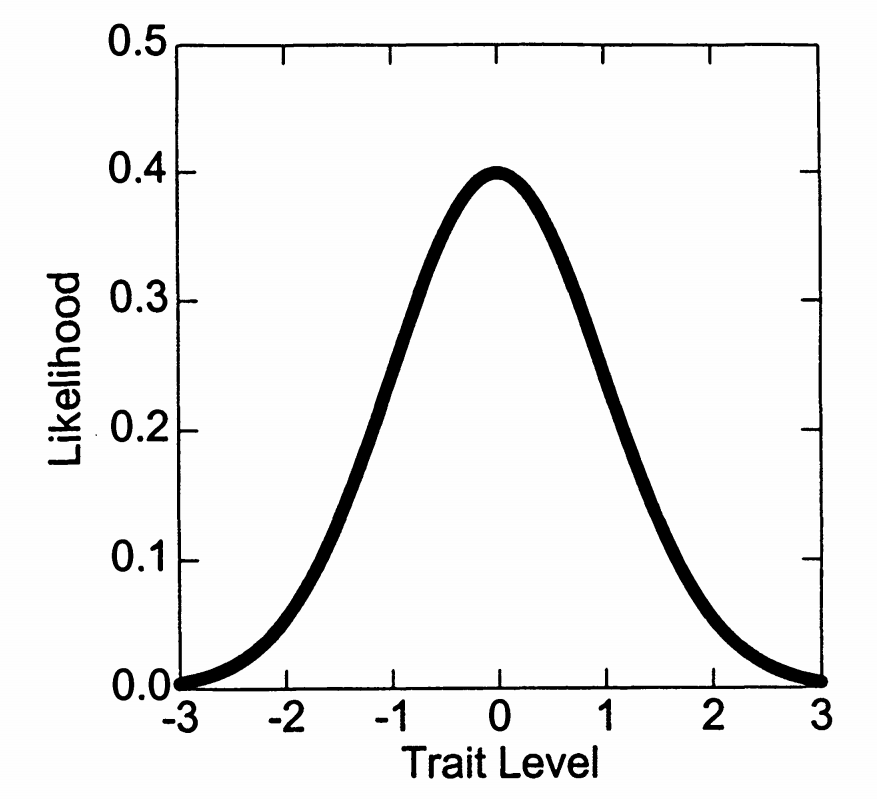
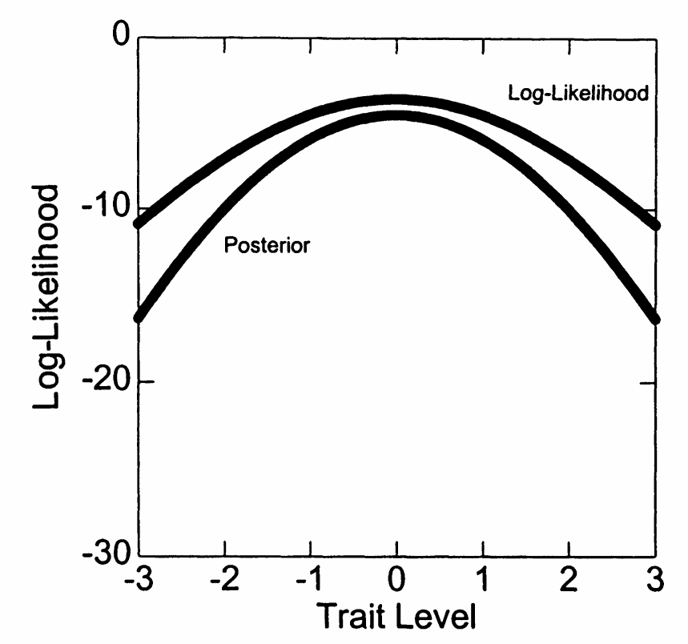
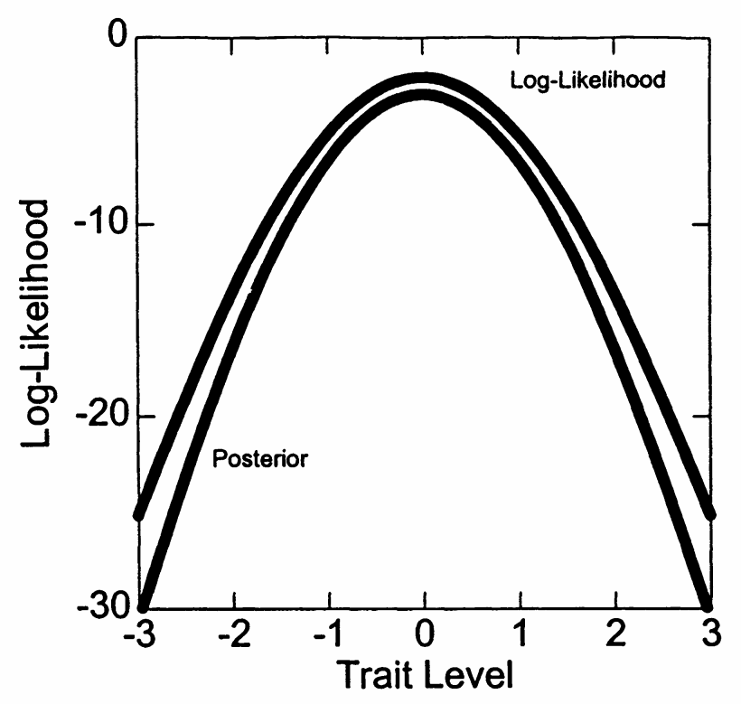

# 2. 最大后验概率（MAP）评分

## 2.1 贝叶斯方法的引入

### 2.1.1 ML方法的局限性回顾

ML评分的实际问题

**问题1：极端反应模式**

- 全对或全错无法估计
- 在实际测验中经常出现

**问题2：小样本性质**

- 短测验中估计可能不稳定
- 渐近性质未必成立

### 2.1.2 贝叶斯解决方案

贝叶斯方法的核心思想

**基本理念**：结合先验信息和数据信息

**贝叶斯公式**：

\[P(\theta|\mathbf{u}) \propto P(\mathbf{u}|\theta) \times P(\theta)\]

其中：

- \(P(\mathbf{u}|\theta)\)：似然函数
- \(P(\theta)\)：先验分布
- \(P(\theta|\mathbf{u})\)：后验分布

## 2.2 先验分布的选择

### 2.2.1 标准正态先验

最常用的先验分布

**标准正态分布**：

\[P(\theta) = \frac{1}{\sqrt{2\pi}} \exp\left(-\frac{\theta^2}{2}\right)\]

**选择理由**：

1. 计算上方便
2. 符合许多心理特质的分布
3. 与IRT标准化一致

图7.6展示了标准正态先验分布：

### 2.2.2 先验分布的作用

先验的影响机制

**拉向中心效应**：

- 极端的能力估计被拉向均值
- 效果大小取决于数据信息量

**收缩估计**：

\[\hat{\theta}_{MAP} = w\hat{\theta}_{ML} + (1-w)\mu_{prior}\]

其中\(w\)取决于数据的信息量

从贝叶斯角度推导 MAP 收缩估计

场景设定

我们希望估计一个人的能力值 \(\theta\)。我们知道两件事：

**似然函数（来自数据）**：

\[
\hat{\theta}_{ML} \sim \mathcal{N}(\theta, \sigma^2)
\]

表示：在真实 \(\theta\) 下，最大似然估计（基于答题数据）会有波动。

**先验分布（我们对能力的先验认识）**：

\[
\theta \sim \mathcal{N}(\mu_{\text{prior}}, \tau^2)
\]

步骤一：贝叶斯公式

根据贝叶斯规则：

\[
P(\theta \mid \hat{\theta}_{ML}) \propto P(\hat{\theta}_{ML} \mid \theta) \cdot P(\theta)
\]

- **似然项**：

\[
P(\hat{\theta}_{ML} \mid \theta) \propto \exp\left(-\frac{1}{2\sigma^2}(\hat{\theta}_{ML} - \theta)^2\right)
\]

- **先验项**：

\[
P(\theta) \propto \exp\left(-\frac{1}{2\tau^2}(\theta - \mu_{\text{prior}})^2\right)
\]

步骤二：构造对数后验函数

\[
\log P(\theta \mid \hat{\theta}_{ML}) = -\frac{1}{2\sigma^2}(\hat{\theta}_{ML} - \theta)^2 - \frac{1}{2\tau^2}(\theta - \mu_{\text{prior}})^2 + \text{常数}
\]

步骤三：求导并令导数为 0

\[
\frac{d}{d\theta} \log P(\theta \mid \hat{\theta}_{ML}) = \frac{1}{\sigma^2}(\hat{\theta}_{ML} - \theta) + \frac{1}{\tau^2}(\mu_{\text{prior}} - \theta)
\]

令其为 0，得到：

\[
\left(\frac{1}{\sigma^2} + \frac{1}{\tau^2}\right)\theta = \frac{\hat{\theta}_{ML}}{\sigma^2} + \frac{\mu_{\text{prior}}}{\tau^2}
\]

步骤四：解出 MAP 估计值

\[
\hat{\theta}_{MAP} = \frac{\frac{\hat{\theta}_{ML}}{\sigma^2} + \frac{\mu_{\text{prior}}}{\tau^2}}{\frac{1}{\sigma^2} + \frac{1}{\tau^2}}
\]

整理为加权平均形式：

\[
\hat{\theta}_{MAP} = w \cdot \hat{\theta}_{ML} + (1 - w) \cdot \mu_{\text{prior}}
\]

其中：

\[
w = \frac{1/\sigma^2}{1/\sigma^2 + 1/\tau^2} = \frac{\tau^2}{\sigma^2 + \tau^2}
\]

解释：为什么这叫“收缩估计”？

- 当数据很可靠（\(\sigma^2\) 小），\(w \to 1\)，主要依赖 \(\hat{\theta}_{ML}\)
- 当先验很强（\(\tau^2\) 小），\(w \to 0\)，主要依赖 \(\mu_{\text{prior}}\)
- 因此，MAP 会把极端的 \(\hat{\theta}_{ML}\) 往 \(\mu_{\text{prior}}\) “拉回来”

总结公式

\[
\boxed{
\hat{\theta}_{MAP} = \frac{\tau^2}{\sigma^2 + \tau^2} \cdot \hat{\theta}_{ML} + \frac{\sigma^2}{\sigma^2 + \tau^2} \cdot \mu_{\text{prior}}
}
\]

这就是 MAP 估计的本质结构：
**MLE 与先验之间的加权平均**，其中权重由两者的“信息量”决定。

## 2.3 MAP估计的推导

### 2.3.1 后验分布的构建

后验分布的形式

**贝叶斯原理回顾**：

\[
P(\theta \mid \mathbf{u}) \propto P(\mathbf{u} \mid \theta) \times P(\theta)
\]

取对数后可得对数后验分布：

\[
\log P(\theta \mid \mathbf{u}) = \log L(\mathbf{u} \mid \theta) + \log P(\theta) + \text{常数}
\]

**展开具体形式**（以2PL模型为例，设先验为标准正态）：

\[
\log P(\theta \mid \mathbf{u}) =
\sum_{i=1}^I \left[
u_i \log P_i(\theta) +
(1 - u_i) \log(1 - P_i(\theta))
\right]
- \frac{\theta^2}{2}
+ \text{常数}
\]

其中：

- \(P_i(\theta) = \dfrac{1}{1 + \exp(-\alpha_i(\theta - \beta_i))}\) 为第 \(i\) 题答对概率
- \(-\dfrac{\theta^2}{2}\) 来自标准正态先验 \(\mathcal{N}(0,1)\) 的对数形式

**推导过程说明：**

1. 似然函数部分来自 2PL 模型的联合概率：

\[
P(\mathbf{u} \mid \theta) = \prod_{i=1}^I P_i(\theta)^{u_i} \cdot (1 - P_i(\theta))^{1 - u_i}
\]

   取对数得到：

\[
\log P(\mathbf{u} \mid \theta) = \sum_{i=1}^I \left[ u_i \log P_i(\theta) + (1 - u_i) \log(1 - P_i(\theta)) \right]
\]

2. 先验为标准正态分布 \(\mathcal{N}(0, 1)\)：

\[
P(\theta) = \dfrac{1}{\sqrt{2\pi}} \exp\left(-\dfrac{\theta^2}{2}\right)
\]

   取对数后为：

\[
\log P(\theta) = -\dfrac{\theta^2}{2} + \text{常数}
\]

将两者相加即可得最终的对数后验表达式。

**解释：**

- 后验的主峰位置取决于数据的支持（似然函数）与先验分布的惩罚项之间的“平衡”。
- 后验分布在高数据支持处上升，但也被先验拉向中心（\(\theta = 0\)），体现了贝叶斯估计的“折中”思想。

### 2.3.2 修正的 Newton-Raphson 算法

MAP估计的迭代公式

为了得到最大后验估计 \(\hat{\theta}_{MAP}\)，我们最大化对数后验函数：

- **完整的 MAP 目标函数（对数后验）**：

\[
L_{\text{MAP}}(\theta) =
\sum_{i=1}^I \left[ u_i \log L_i(\theta) + (1 - u_i) \log (1 - L_i(\theta)) \right]
- \frac{1}{2} \theta^2
+ \text{常数}
\]

其中 \(L_i(\theta) = \frac{1}{1 + \exp(-\alpha_i(\theta - \beta_i))}\) 是第 \(i\) 题在能力为 \(\theta\) 时答对的预测概率。

- 第一项是对数似然项（Log-Likelihood），衡量当前 \(\theta\) 对应的应答概率；
- 第二项 \(-\frac{1}{2}\theta^2\) 来自正态先验 \(\theta \sim \mathcal{N}(0,1)\)，起到收缩作用。

**修正后的一阶导数为**：

\[
L'_{\text{MAP}}(\theta) =
\sum_{i=1}^I \alpha_i \left(u_i - L_i(\theta)\right)
- \theta
\]

**修正后的二阶导数为**：

\[
L''_{\text{MAP}}(\theta) =
- \sum_{i=1}^I \alpha_i^2 L_i(\theta)(1 - L_i(\theta))
- 1
\]

**迭代更新公式（修正 Newton-Raphson）**：

\[
\theta_{\text{new}} = \theta_{\text{old}} - \frac{L'_{\text{MAP}}(\theta_{\text{old}})}{L''_{\text{MAP}}(\theta_{\text{old}})}
\]

**理解要点**：

- 当数据提供的信息较多（信息函数大），似然项主导，MAP 估计接近 MLE；
- 当数据稀疏或答题极端（如全对/全错），先验项对目标函数的影响增强，\(\hat{\theta}_{MAP}\) 向 0 收缩；
- 这种收缩是贝叶斯估计天然具备的正则化效应，有助于提升小样本稳定性。

MAP估计的性质推导：收缩与主导机制

**目标函数回顾**：

\[
L_{\text{MAP}}(\theta) =
\underbrace{\sum_{i=1}^I \left[ u_i \log L_i(\theta) + (1 - u_i) \log (1 - L_i(\theta)) \right]}_{\text{似然项}}
\ - \ \underbrace{\frac{1}{2} \theta^2}_{\text{先验惩罚}}
+ \text{常数}
\]

**1. 当样本信息量大时：MLE \(\approx\) MAP**

- 对于每一题，信息量定义为：

\[
I_i(\theta) = \alpha_i^2 L_i(\theta)(1 - L_i(\theta))
\]

- 总 Fisher 信息：

\[
I(\theta) = \sum_{i=1}^I I_i(\theta)
\]

- 当 \(I(\theta)\) 很大（题多、区分度大、回答集中于中间区域），似然函数非常尖锐：
- 其主峰远比先验项影响大
- 后验峰值几乎与对数似然峰值重合
- 此时：

\[
\hat{\theta}_{MAP} \approx \hat{\theta}_{MLE}
\]

**2. 收缩估计推导（近似线性形式）**

- 假设 MLE \(\hat{\theta}_{MLE}\) 服从近似正态：

\[
\hat{\theta}_{MLE} \sim \mathcal{N}(\theta, \sigma^2)
\]

- 先验 \(\theta \sim \mathcal{N}(0, 1)\)
- 后验由贝叶斯规则近似为：

\[
\theta \mid \hat{\theta}_{MLE} \sim \mathcal{N}\left( \frac{1}{1+\sigma^2} \hat{\theta}_{MLE}, \frac{\sigma^2}{1+\sigma^2} \right)
\]

- 得到 MAP 估计：

\[
\hat{\theta}_{MAP} = \frac{1}{1 + \sigma^2} \hat{\theta}_{MLE}
\]

- 说明什么？
- 当 \(\sigma^2\) 较小（数据多、MLE稳定），\(\hat{\theta}_{MAP} \to \hat{\theta}_{MLE}\)
- 当 \(\sigma^2\) 较大（数据稀疏），\(\hat{\theta}_{MAP} \to 0\)

**3. 全对/全错极端情况**

- **设 \(u_i = 1\) 对所有 \(i\)（全对）**，此时：

\[
L_{\text{MAP}}(\theta) = \sum_{i=1}^I \log L_i(\theta) - \frac{1}{2} \theta^2
\]

- 因为 \(L_i(\theta) = \frac{1}{1 + e^{-\alpha_i(\theta - \beta_i)}} \to 1\) 随着 \(\theta \to \infty\)，所以对数似然趋向 0：

\[
\sum \log L_i(\theta) \to 0 \quad \text{而} \quad -\frac{1}{2}\theta^2 \to -\infty
\]

- 因此整体目标函数有**最大值**，不会无限增大（相比 MLE 的发散）
- 同理，**全错情况 \(\theta \to -\infty\) 被阻止**
- MAP 估计始终存在并收敛到有限值

**结论总结：**

- 先验对 MAP 的作用等价于在最大化问题中添加正则化项 \(-\frac{1}{2}\theta^2\)
- 当似然提供较少信息时（如全对/全错），先验提供“软约束”
- MAP = “似然 × 收缩”，是对极端估计的自然调和器

## 2.4 MAP评分的实例分析

### 2.4.1 与ML估计的比较

表7.3展示了MAP评分结果：

| 考生 | 反应模式 | ML估计 |  | MAP估计 |  |
| --- | --- | --- | --- | --- | --- |
|  |  | \(\hat{\theta}\) | \(SE\) | \(\hat{\theta}\) | \(SE\) |
| 1 | \(1111100000\) | \(0.00\) | \(0.54\) | \(0.00\) | \(0.47\) |
| 15 | \(0000000000\) | \(-\infty\) | - | \(-1.48\) | \(0.53\) |
| 23 | \(1111111110\) | \(2.20\) | \(0.78\) | \(1.48\) | \(0.53\) |

MAP vs ML的关键差异

**1. 极端反应的处理**：

- ML：无法估计全对/全错
- MAP：给出有限估计

**2. 收缩效应**：

- 所有估计向0收缩
- 极端值收缩更多

**3. 标准误**：

- MAP标准误通常更小
- 反映了先验信息的贡献

### 2.4.2 先验影响的可视化

图7.7和7.8展示了不同区分度下先验的影响：

先验影响的规律

**低区分度（信息少）**：

- 先验影响大
- 后验接近先验

**高区分度（信息多）**：

- 数据主导
- 后验接近似然

## 2.5 MAP方法的优缺点

MAP方法总结

**优点**：

1. 处理所有反应模式
2. 小样本性质更好
3. 减少极端估计

**缺点**：

1. 有偏估计（向先验均值偏）
2. 依赖先验选择
3. 可能掩盖真实的极端能力

为什么MAP是有偏估计？

**问题背景**：

MLE 是一致的、渐近无偏估计量，而 MAP 引入了先验，导致对参数估计产生系统性偏移。

我们假设：

- **先验分布**：\(\theta \sim \mathcal{N}(0, 1)\)
- **似然近似**：\(\hat{\theta}_{\text{MLE}} \sim \mathcal{N}(\theta, \sigma^2)\)，其中 \(\sigma^2\) 是 \(\hat{\theta}_{\text{MLE}}\) 的方差（由信息函数决定）
- **关键假设**：\(\hat{\theta}_{\text{MLE}}\) 是对 \(\theta\) 的无偏估计量，即：

\[
\mathbb{E}[\hat{\theta}_{\text{MLE}}] = \theta
\]

这个假设是推导 MAP 偏差的基础，如果 MLE 本身偏差较大（比如在小样本或极端反应模式下），那么我们下面的推导就只是一个**近似结论**。

**1. 简化假设（线性近似分析）**

- 假设 \(\hat{\theta}_{MLE}\) 在某种条件下服从近似正态分布：

\[
\hat{\theta}_{MLE} \sim \mathcal{N}(\theta, \sigma^2)
\]

- 设先验为标准正态分布：

\[
\theta \sim \mathcal{N}(0, 1)
\]

- 后验分布是两个正态分布的乘积，仍为正态：

\[
\theta \mid \hat{\theta}_{MLE} \sim \mathcal{N} \left( \mu_{\text{post}}, \sigma^2_{\text{post}} \right)
\]

其中：

- 平均数为：

\[
\mu_{\text{post}} = \frac{1}{1 + \sigma^2} \hat{\theta}_{MLE}
\]

- 方差为：

\[
\sigma^2_{\text{post}} = \frac{\sigma^2}{1 + \sigma^2}
\]

**2. 得到 MAP 估计**

\[
\hat{\theta}_{MAP} = \mu_{\text{post}} = \frac{1}{1 + \sigma^2} \hat{\theta}_{MLE}
\]

这是对 \(\hat{\theta}_{MLE}\) 的一种加权“收缩”。

**3. 偏差的来源**

我们来计算 \(\hat{\theta}_{MAP}\) 关于真实参数 \(\theta\) 的期望：

\[
\mathbb{E}_{\hat{\theta}_{MLE} \sim \mathcal{N}(\theta, \sigma^2)}[\hat{\theta}_{MAP}]
= \mathbb{E} \left[ \frac{1}{1 + \sigma^2} \hat{\theta}_{MLE} \right]
= \frac{1}{1 + \sigma^2} \cdot \mathbb{E}[\hat{\theta}_{MLE}]
= \frac{1}{1 + \sigma^2} \cdot \theta
\]

所以其偏差为：

\[
\text{Bias}(\hat{\theta}_{MAP}) = \mathbb{E}[\hat{\theta}_{MAP}] - \theta
= \left( \frac{1}{1 + \sigma^2} - 1 \right) \theta
= -\frac{\sigma^2}{1 + \sigma^2} \cdot \theta
\]

**4. 偏差特征总结**

- MAP 向 **先验均值**（本例中为 0）收缩
- 越极端的 \(\theta\)，偏差越大
- 偏差方向总是“反向拉回”到先验中心

**结论**

MAP 的偏差来源于先验对后验的“牵引力”。其估计量是：

\[
\hat{\theta}_{MAP} = w \cdot \hat{\theta}_{MLE} + (1 - w) \cdot \mu_{\text{prior}}
\]

由于 \(w < 1\)，\(\hat{\theta}_{MAP}\) 向 \(\mu_{\text{prior}}\) 偏移，因而不是无偏估计。
